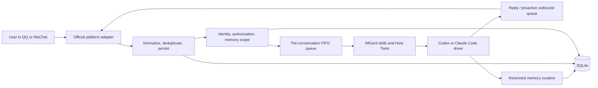
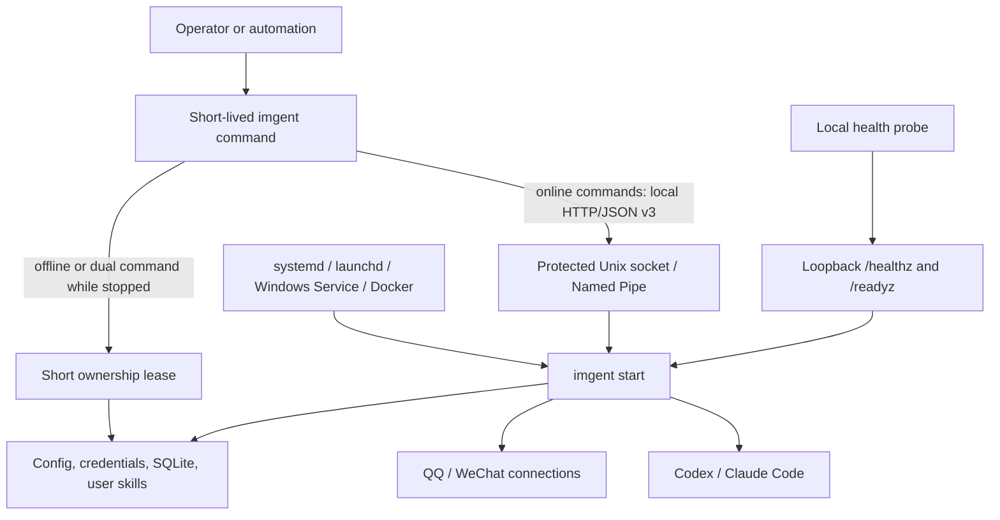

# IMGent

[English](README.md) | [简体中文](README.zh-CN.md)

IMGent is a self-hosted bridge that lets people use a local Codex or Claude Code agent from an
official QQ bot or a WeChat iLink bot, without giving up local control of workspaces, identities,
approvals, conversations, or memory.

This README has three parts:

1. [Meet IMGent](#1-meet-imgent) — what it does, how it works, and where its boundaries are.
2. [Use IMGent](#2-use-imgent) — installation, complete workflows, commands, and outputs.
3. [Develop and maintain IMGent](#3-develop-and-maintain-imgent) — repository structure,
   validation, deployment, and releases.

## 1. Meet IMGent

### What IMGent is

IMGent runs next to the workspaces and Agent CLIs you already control. It receives an IM message,
maps the sender to a local identity, loads only the memory and skills allowed in that conversation,
runs the selected local Agent, handles approvals or questions, and sends the result back.

It is designed for individual developers and small teams managed by one operator:

- The **operator** installs IMGent, logs in to Codex or Claude Code, selects workspaces and
  permission limits, configures bots, and owns backups and upgrades.
- A **paired user** can ask the Agent to work from an authorized direct message or QQ group.
- A **paired administrator** can authorize a discovered QQ group. Enabling full QQ group
  ingestion additionally requires a platform-verifiable owner or administrator.

IMGent is one npm package and one `imgent` executable. `imgent start` is the foreground resident
service; every other invocation is a short-lived management CLI.

### Supported capabilities

| Capability                                          | QQ official bot                                   | WeChat iLink                                             |
| --------------------------------------------------- | ------------------------------------------------- | -------------------------------------------------------- |
| Direct conversations                                | Yes                                               | Yes                                                      |
| Group conversations                                 | Yes                                               | No; group-like events are rejected safely                |
| Default group ingestion                             | `triggered`: mentions, replies, and commands only | Not applicable                                           |
| Optional full group ingestion                       | Yes, after pairing and verified QQ admin approval | No                                                       |
| Reply to an inbound message                         | Yes                                               | Yes, while its `context_token` is valid                  |
| Proactive delivery without a recent inbound message | Yes                                               | No                                                       |
| Scheduled Agent tasks                               | Yes                                               | No; creation/resume is rejected before Agent work starts |
| Local Agent drivers                                 | Codex or Claude Code                              | Codex or Claude Code                                     |
| Cross-platform identity binding                     | Explicit, user-confirmed binding only             | Explicit, user-confirmed binding only                    |

The two Agent drivers expose the same IMGent-level semantics but keep their real protocol
differences. Codex uses its local app-server protocol; Claude Code uses its local Agent SDK and CLI
authentication. IMGent does not ask for, export, or proxy the Agent vendor's login credentials.

Inbound text, images, audio, video, and files are normalized into one message contract. QQ
attachment URLs and securely materialized WeChat media are passed to the selected driver when that
driver supports the media type; unsupported types remain explicit attachment context instead of
silently becoming text. Agent results, approvals, and questions use text when a platform has no
shared rich-interaction mapping.

### What happens to a message



Important behavior along this path:

- Platform events are acknowledged independently from long-running Agent work.
- Duplicate delivery is deduplicated before another task is created.
- One conversation runs one turn at a time; later messages wait in FIFO order. Other conversations
  can run concurrently.
- Private memory, QQ group-shared memory, and per-member group profiles are separate scopes. Group
  turns never load a member's direct-message memory.
- A risky Host Tool request returns an approval request to the original conversation. Only the
  authorized originating Principal can allow, deny, or answer it.
- A process restart invalidates an unresolved approval instead of guessing whether a side effect
  already happened.
- Safe transient work uses bounded retries. Unknown or dangerous side effects are not replayed
  automatically.

### Process and data ownership



The resident service is the only online owner of SQLite, credentials, adapters, drivers, queues,
scheduled work, and the immutable skill snapshot. Online CLI commands use a protected Unix socket
or user-scoped Windows Named Pipe. Health endpoints bind to loopback and expose only
`/healthz` and `/readyz`; they are not a management API.

IMGent deliberately does **not** provide:

- a public or remote management API;
- a second daemon binary or `start --daemon`;
- dynamic third-party adapter/driver loading or a plugin marketplace;
- multi-node scheduling, a distributed queue, or a database cluster;
- a cloud memory service, vector database, or external embedding API;
- automatic identity merging based on names, phone numbers, or message content;
- personal QQ/WeChat client emulation, WeChat groups, Enterprise WeChat, channels, or public
  accounts;
- automatic migration from legacy SQLite schemas or backup formats.

For the full product and security contract, see
[Product design](docs/imgent-product-design.md). For the process model and local control protocol,
see [CLI and resident service architecture](docs/cli-service-architecture.md).

## 2. Use IMGent

### Requirements

- Node.js **24.18.0 or newer**.
- A locally installed and logged-in `codex` CLI. Install and log in to `claude` as well when using
  the Claude Code driver.
- QQ official bot credentials, or a WeChat account that can complete the iLink QR authorization
  flow.
- A dedicated local user and protected data directory are recommended for long-running
  deployments.

The examples below use Unix paths. Replace them with absolute paths appropriate for your system:

| Placeholder used below      | Meaning                                             |
| --------------------------- | --------------------------------------------------- |
| `/srv/imgent/imgent.json`   | The selected IMGent configuration file              |
| `/srv/imgent/state`         | The data directory resolved from that configuration |
| `/srv/workspaces/main`      | The only workspace this example profile may use     |
| `main`                      | AgentProfile ID                                     |
| `qq-main` / `wechat-main`   | BotInstance IDs                                     |
| `principal_01`              | A paired IMGent Principal ID                        |
| `conversation_qq_direct_01` | A discovered ConversationSpace ID                   |
| `schedule_01`               | A schedule ID returned by IMGent                    |

Values in output samples—including IDs, timestamps, counts, and sizes—are illustrative, but the
field names and outer response shapes match the current CLI. Secrets, tokens, local control
endpoints, and real user identifiers are never shown.

### Install

Install the long-running CLI globally:

```bash
npm install --global imgent
imgent --version
```

For a temporary help lookup without installing globally:

```bash
npx imgent --help
```

### Understand command modes first

Management commands declare how they may access state:

| Mode      | When it works                                                                   | Commands                                                                                      |
| --------- | ------------------------------------------------------------------------------- | --------------------------------------------------------------------------------------------- |
| `offline` | Only while `imgent start` for the same data directory is stopped                | `init`, `profile add`, `bot add`, `bot authorize`, `skills init`, `restore`                   |
| `online`  | Only while the resident service is running; always uses the local control plane | `pair`, `group authorize`, `conversation list`, every `schedule` subcommand                   |
| `dual`    | Uses the service when running, otherwise takes a short offline ownership lease  | `doctor`, `status`, `identity list`, `group list`, `skills list`, `skills validate`, `backup` |

`imgent start` is the resident process itself. An offline command returns
`RUNTIME_SERVICE_MUST_STOP` if the service is active. An online command returns
`RUNTIME_SERVICE_NOT_RUNNING` if it is stopped. If a control endpoint exists but cannot complete a
safe handshake, IMGent reports that error and does not silently open SQLite.

### End-to-end setup

#### 1. Initialize config and add an Agent profile

```bash
imgent --config /srv/imgent/imgent.json init \
  --workspace /srv/workspaces/main \
  --data-dir ./state

imgent --config /srv/imgent/imgent.json profile add main \
  --driver codex \
  --workspace /srv/workspaces/main \
  --max-mode ask
```

Use `--driver claude-code` for Claude Code. `deny`, `ask`, and `allow` are permission ceilings:
an Agent or skill cannot raise the configured ceiling.

#### 2. Optionally create local operating instructions

```bash
imgent --config /srv/imgent/imgent.json skills init project-conventions \
  --description "Apply this workspace's build, test, and review conventions"
imgent --config /srv/imgent/imgent.json skills validate
```

Edit `/srv/imgent/state/skills/project-conventions/SKILL.md`, validate again, and restart IMGent
after later changes. Built-in skills and operator-defined skills are IMGent-hosted instructions;
they work with either Agent driver and cannot widen Host Tool permissions.

#### 3A. Add a QQ bot

Keep the QQ AppSecret out of command history. `bot add` reads it from the named environment
variable, encrypts it into the data directory, and writes no secret to `imgent.json`.

```bash
export IMGENT_QQ_APP_ID='123456789'
export IMGENT_QQ_APP_SECRET='<qq-app-secret>'

imgent --config /srv/imgent/imgent.json bot add qq qq-main \
  --profile main \
  --app-id-env IMGENT_QQ_APP_ID \
  --app-secret-env IMGENT_QQ_APP_SECRET

unset IMGENT_QQ_APP_SECRET
```

Keep `IMGENT_QQ_APP_ID` available to the supervisor that starts IMGent, or use
`--app-id 123456789` to store the non-secret AppID directly in the config.

#### 3B. Or add and authorize a WeChat iLink bot

```bash
imgent --config /srv/imgent/imgent.json bot add wechat-ilink wechat-main \
  --profile main
imgent --config /srv/imgent/imgent.json bot authorize wechat-main
```

The second command displays a QR code, may ask for a WeChat verification code, and stores the
returned bot token encrypted. Both commands are offline: stop the service before reauthorizing.

#### 4. Diagnose, then start

```bash
imgent --config /srv/imgent/imgent.json doctor
imgent --config /srv/imgent/imgent.json start
```

`doctor` performs explicit Node, SQLite, platform credential, Agent command, version, and login
checks. `start` stays in the foreground and emits one JSON log object per line. Use
systemd, launchd, Windows Service, or Docker to supervise it.

#### 5. Pair a user

The first direct message returns a one-time pairing code. Keep `imgent start` running and confirm
the code from another terminal:

```bash
imgent --config /srv/imgent/imgent.json pair ABCD-EFGH
```

The code is single-use, and confirming it is idempotent. Once paired, the user can run Agent turns.

#### 6. Authorize a QQ group

Send one triggering message in the group so IMGent can discover it, then inspect local IDs and
authorize the group with a paired Principal:

```bash
imgent --config /srv/imgent/imgent.json identity list
imgent --config /srv/imgent/imgent.json group list
imgent --config /srv/imgent/imgent.json group authorize conversation_qq_group_01 \
  --principal principal_01
```

The group remains in `triggered` mode until a paired, platform-verifiable QQ owner or administrator
sends `/imgent group full` in that group.

#### 7. Run an Agent turn from chat

In a paired direct message, send a normal request. In a QQ group using the default `triggered`
mode, mention the bot, reply to it, or send an `/imgent` command:

```text
User: Check the current repository status and summarize anything that needs attention.
Agent: The working tree is clean. The current branch is main and it matches origin/main.
```

The response is produced by the selected local Agent in the configured workspace. If the Agent
needs a risky Host Tool or more information, IMGent sends a request ID back to the same
conversation; answer it with `/imgent allow`, `/imgent deny`, or `/imgent answer` as documented
below. Send `/imgent cancel` or `取消` to cancel active and queued work for that conversation.

#### 8. Create an optional scheduled task

Schedules require the service to be running and the target Adapter to support proactive delivery.
Discover a target first:

```bash
imgent --config /srv/imgent/imgent.json conversation list
imgent --config /srv/imgent/imgent.json schedule add morning-report \
  --conversation conversation_qq_direct_01 \
  --prompt "Inspect the workspace and send a concise status report." \
  --cron "0 9 * * 1-5" \
  --timezone Asia/Shanghai \
  --context fresh
```

`fresh` creates a new ephemeral Agent session on every run. `series` reuses only the schedule's own
session; it never reuses or blocks the target IM conversation's normal Agent session.

### Global CLI options and output contract

Put global options before the command for predictable shell scripts:

```text
imgent [--config <path>] [--locale zh-CN|en-US] [--json] <command>
imgent --help
imgent --version
```

| Option                | Behavior                                                        |
| --------------------- | --------------------------------------------------------------- |
| `-c, --config <path>` | Selects a config file; defaults to `./imgent.json`              |
| `--locale <locale>`   | Selects `zh-CN` or `en-US` for errors and readiness diagnostics |
| `--json`              | Wraps success or failure in a stable machine-readable envelope  |
| `--help`              | Prints Commander help for the selected command                  |
| `--version`           | Prints the IMGent package version                               |

Successful commands normally print pretty JSON directly:

```json
{
  "mode": "offline",
  "skills": []
}
```

With `--json`, success is written to stdout as:

```json
{
  "ok": true,
  "locale": "en-US",
  "result": {
    "mode": "offline",
    "skills": []
  }
}
```

Without `--json`, failures write localized safe text to stderr:

```text
The IMGent service is not running.
Run imgent start first.
```

With `--json`, failures write a stable envelope to stdout and do not expose causes, stacks, SQL,
local paths, message bodies, tokens, or raw platform responses:

```json
{
  "ok": false,
  "locale": "en-US",
  "error": {
    "code": "RUNTIME_SERVICE_NOT_RUNNING",
    "message": "The IMGent service is not running.",
    "action": "Run imgent start first.",
    "retry": {
      "strategy": "after_user_action",
      "replay": "safe"
    }
  }
}
```

Automation should branch on `error.code`, not translated text. Exit classes are stable:

| Exit code | Meaning                                                                       |
| --------- | ----------------------------------------------------------------------------- |
| `0`       | Success                                                                       |
| `1`       | Internal or otherwise unclassified operational failure                        |
| `2`       | Invalid input/config, not found, conflict, or cancellation                    |
| `3`       | Authentication, authorization, compatibility, or another required user action |
| `4`       | Rate limit, timeout, transient failure, or bounded backoff condition          |

### Complete command reference

The examples below show the direct success output. Add `--json` when an Agent or script needs the
stable envelope described above. To stay readable, later online examples may show only the
command-relevant `service` or schedule fields; the complete object shapes appear under `pair` and
`schedule add`, and consumers should tolerate additional fields.

#### `init` — create the minimum config and data directory

**Mode:** offline.
**Required input:** an existing or creatable workspace; `--force` only when intentionally replacing
an existing config file.

```bash
imgent --config /srv/imgent/imgent.json init \
  --workspace /srv/workspaces/main \
  --data-dir ./state
```

```json
{
  "result": "initialized",
  "configPath": "/srv/imgent/imgent.json",
  "workspace": "/srv/workspaces/main",
  "dataDir": "/srv/imgent/state"
}
```

The generated config contains no BotInstance or AgentProfile. Relative `dataDir` and workspace
entries are resolved from the config file's directory. `--force` does not bypass the running
service check.

#### `profile add` — add a Codex or Claude Code profile

**Mode:** offline.
**Required input:** a unique profile ID, `--driver codex|claude-code`, and an allowed workspace.

```bash
imgent --config /srv/imgent/imgent.json profile add main \
  --driver codex \
  --workspace /srv/workspaces/main \
  --max-mode ask
```

```json
{
  "result": "profile-added",
  "profile": {
    "id": "main",
    "driver": "codex",
    "command": "codex",
    "workspace": "../workspaces/main",
    "skills": ["*"],
    "permissions": {
      "maxMode": "ask"
    },
    "memory": {
      "enabled": true
    }
  }
}
```

Options:

- `--command <path>` overrides the default `codex` or `claude` executable.
- `--max-mode deny|ask|allow` sets the Host Tool permission ceiling; default is `ask`.
- `--no-memory` disables IMGent long-term memory and hides the built-in memory skill for this
  profile.
- Every new profile starts with `skills: ["*"]`. Edit `imgent.json` while stopped to select
  explicit skill names.

#### `skills init` — create an operator-owned skill package

**Mode:** offline.
**Required input:** a lowercase kebab-case name up to 63 characters.

```bash
imgent --config /srv/imgent/imgent.json skills init project-conventions \
  --description "Apply this workspace's build, test, and review conventions"
```

```json
{
  "result": "skill-initialized",
  "name": "project-conventions",
  "path": "/srv/imgent/state/skills/project-conventions",
  "restartRequired": true
}
```

The command creates `SKILL.md` with strict `name` and `description` frontmatter. A user skill with
the same name as a built-in skill overrides it at the next service start.

#### `skills list` — inspect the effective skill catalog

**Mode:** dual.
Online output describes the service's immutable startup snapshot; offline output reads the current
disk state.

```bash
imgent --config /srv/imgent/imgent.json skills list
```

```json
{
  "mode": "offline",
  "skills": [
    {
      "name": "imgent-conversation",
      "description": "Guide every user-facing IMGent conversation across direct messages and groups.",
      "source": "builtin",
      "files": 1,
      "bytes": 2048
    },
    {
      "name": "project-conventions",
      "description": "Apply this workspace's build, test, and review conventions",
      "source": "user",
      "files": 1,
      "bytes": 312
    }
  ]
}
```

Online output additionally contains `service` metadata and `configDrift`.

#### `skills validate` — validate packages and profile references

**Mode:** dual.

```bash
imgent --config /srv/imgent/imgent.json skills validate
```

```json
{
  "mode": "offline",
  "result": "valid",
  "skills": 3,
  "profiles": [
    {
      "profileId": "main",
      "skills": ["imgent-conversation", "imgent-memory", "project-conventions"]
    }
  ],
  "restartRequiredAfterChanges": true
}
```

Validation rejects symlinks, unsafe package entries, invalid frontmatter, oversized packages,
missing required built-ins, and missing AgentProfile references.

#### `bot add qq` — add a QQ official bot

**Mode:** offline.
**Required input:** a unique BotInstance ID, an existing profile, an AppID or AppID environment
variable, and an AppSecret environment variable.

```bash
export IMGENT_QQ_APP_ID='123456789'
export IMGENT_QQ_APP_SECRET='<qq-app-secret>'
imgent --config /srv/imgent/imgent.json bot add qq qq-main \
  --profile main \
  --app-id-env IMGENT_QQ_APP_ID \
  --app-secret-env IMGENT_QQ_APP_SECRET
unset IMGENT_QQ_APP_SECRET
```

```json
{
  "result": "bot-added",
  "bot": {
    "id": "qq-main",
    "adapter": "qq",
    "transport": "websocket",
    "platformBotIdEnv": "IMGENT_QQ_APP_ID",
    "credentialRef": "qq-main",
    "groupIngestionDefault": "triggered",
    "enabled": true
  }
}
```

`--app-secret-env` defaults to `IMGENT_QQ_APP_SECRET`. The secret must exist when the command runs.
Use exactly one of `--app-id <id>` and `--app-id-env <name>` in normal deployments.

#### `bot add wechat-ilink` — add a WeChat iLink bot

**Mode:** offline.

```bash
imgent --config /srv/imgent/imgent.json bot add wechat-ilink wechat-main \
  --profile main
```

```json
{
  "result": "bot-added",
  "bot": {
    "id": "wechat-main",
    "adapter": "wechat-ilink",
    "credentialRef": "wechat-main",
    "enabled": true
  }
}
```

Adding the BotInstance does not authorize it. Run `bot authorize` next.

#### `bot authorize` — authorize a WeChat iLink bot

**Mode:** offline.
**Required input:** an existing `wechat-ilink` BotInstance. `--base-url <url>` is only for an
explicitly selected compatible iLink endpoint.

```bash
imgent --config /srv/imgent/imgent.json bot authorize wechat-main
```

During the command, the terminal displays a QR code and authorization status and may prompt for a
verification code. Final output:

```json
{
  "result": "wechat-authorized",
  "botInstanceId": "wechat-main",
  "platformBotId": "ilink_bot_01",
  "authorizingPlatformUserId": "ilink_user_01"
}
```

The bot token is encrypted locally and never appears in this output.

#### `doctor` — perform explicit deep diagnostics

**Mode:** dual.
Offline diagnostics inspect the local environment without starting platform adapters. Online
diagnostics ask the resident service to refresh its platform, account, and model checks.

```bash
imgent --locale en-US --config /srv/imgent/imgent.json doctor
```

Representative offline output:

```json
{
  "mode": "offline",
  "checks": [
    {
      "check": "node",
      "ok": true,
      "details": "24.18.0"
    },
    {
      "check": "runtime",
      "ok": true,
      "details": {
        "mode": "offline",
        "service": {
          "state": "stopped"
        },
        "database": {},
        "skills": {
          "result": "valid",
          "skills": 3,
          "profiles": [
            {
              "profileId": "main",
              "skills": ["imgent-conversation", "imgent-memory", "project-conventions"]
            }
          ],
          "restartRequiredAfterChanges": true
        },
        "environmentReadiness": {
          "ready": true,
          "depth": "diagnostic",
          "locale": "en-US",
          "issues": [],
          "bots": {
            "qq-main": {
              "ready": true,
              "issues": []
            }
          },
          "profiles": {
            "main": {
              "ready": true,
              "issues": []
            }
          }
        },
        "liveReadinessAvailable": false
      }
    }
  ]
}
```

The command may return a non-zero exit code while still printing all checks. Use
`imgent --json doctor` and inspect both `result.checks` and the process exit code.

#### `status` — read cached runtime or persisted state

**Mode:** dual.
Unlike `doctor`, `status` never performs vendor network or model probes.

```bash
imgent --config /srv/imgent/imgent.json status
```

Representative stopped-service output:

```json
{
  "mode": "offline",
  "service": {
    "state": "stopped"
  },
  "database": {
    "pending_approvals": 0,
    "memory_outbox": 0,
    "dead_letters": 0
  },
  "transports": [],
  "lastInboundByBot": [],
  "groups": [],
  "oldestWaitingTask": null,
  "schedules": [],
  "nextSchedule": null,
  "readiness": null,
  "liveReadinessAvailable": false
}
```

Online output contains `mode: "online"`, `service`, `configDrift`, database/task summaries, and a
localized cached `readiness` projection.

#### `start` — run the resident service

**Mode:** foreground resident process.
**Required input:** a valid config, a supported Node version, and a data directory not owned by
another IMGent process or offline lease.

```bash
imgent --config /srv/imgent/imgent.json start
```

Representative JSON Lines output:

```jsonl
{"timestamp":"2026-07-25T01:00:00.000Z","level":"info","component":"application","eventType":"adapter.started","botInstanceId":"qq-main"}
{"timestamp":"2026-07-25T01:00:00.100Z","level":"info","component":"application","eventType":"application.started","bots":1,"profiles":1}
{"timestamp":"2026-07-25T01:00:00.200Z","level":"info","component":"service","eventType":"service.started","instanceId":"<uuid>","state":"ready","bots":1,"profiles":1}
```

`ready` means at least one configured route is usable. Platform or Agent dependency failures can
leave the process in `degraded` so that `status` and `doctor` remain available. `SIGINT` and
`SIGTERM` trigger an ordered shutdown; IMGent does not background itself.

#### `pair` — confirm a direct-message pairing code

**Mode:** online.
**Required input:** the current one-time code returned to an unpaired direct-message user.

```bash
imgent --config /srv/imgent/imgent.json pair ABCD-EFGH
```

```json
{
  "mode": "online",
  "service": {
    "protocolVersion": 3,
    "appVersion": "0.1.0",
    "instanceId": "<uuid>",
    "instanceKey": "<stable-hash>",
    "state": "ready",
    "startedAt": "2026-07-25T01:00:00.000Z",
    "configHash": "<sha256>"
  },
  "configDrift": false,
  "result": "paired",
  "platformIdentityId": "platform_identity_01",
  "principalId": "principal_01"
}
```

`appVersion` follows the installed package. Repeating a successfully consumed code returns the same
Principal while the pairing remains valid.

#### `identity list` — list platform identities and Principals

**Mode:** dual.

```bash
imgent --config /srv/imgent/imgent.json identity list
```

```json
{
  "mode": "online",
  "service": {
    "state": "ready",
    "instanceId": "<uuid>"
  },
  "configDrift": false,
  "identities": [
    {
      "platformIdentityId": "platform_identity_01",
      "agentProfileId": "main",
      "platform": "qq",
      "botInstanceId": "qq-main",
      "platformUserId": "qq_user_01",
      "principalId": "principal_01",
      "displayName": "Example user",
      "paired": 1
    }
  ]
}
```

Offline output omits `service` and `configDrift` but retains `mode` and persisted identities.

#### `group list` — list discovered QQ groups

**Mode:** dual.

```bash
imgent --config /srv/imgent/imgent.json group list
```

```json
{
  "mode": "online",
  "service": {
    "state": "ready",
    "instanceId": "<uuid>"
  },
  "configDrift": false,
  "groups": [
    {
      "conversationSpaceId": "conversation_qq_group_01",
      "agentProfileId": "main",
      "botInstanceId": "qq-main",
      "platformConversationId": "qq_group_01",
      "mode": "triggered",
      "platformFullCapability": 1,
      "authorized": 0
    }
  ]
}
```

A group appears only after IMGent has received an event that discovers it.

#### `group authorize` — authorize a discovered QQ group

**Mode:** online.
**Required input:** a discovered group ConversationSpace and a paired Principal authorized for the
same AgentProfile.

```bash
imgent --config /srv/imgent/imgent.json group authorize conversation_qq_group_01 \
  --principal principal_01
```

```json
{
  "mode": "online",
  "service": {
    "state": "ready",
    "instanceId": "<uuid>"
  },
  "configDrift": false,
  "result": "group-authorized",
  "conversationSpaceId": "conversation_qq_group_01",
  "principalId": "principal_01"
}
```

This authorizes use of the group; it does not enable full ingestion.

#### `conversation list` — discover proactive delivery targets

**Mode:** online.

```bash
imgent --config /srv/imgent/imgent.json conversation list
```

```json
{
  "mode": "online",
  "service": {
    "state": "ready",
    "instanceId": "<uuid>"
  },
  "configDrift": false,
  "conversations": [
    {
      "id": "conversation_qq_direct_01",
      "agentProfileId": "main",
      "platform": "qq",
      "botInstanceId": "qq-main",
      "kind": "direct",
      "platformConversationId": "qq_user_01",
      "principals": [
        {
          "principalId": "principal_01",
          "displayName": "Example user"
        }
      ],
      "supportsProactiveSend": true
    }
  ]
}
```

Use the `id` as `--conversation`. A group with multiple eligible Principals also requires
`--principal`. Do not schedule to a target whose `supportsProactiveSend` is `false`.

#### `schedule add` — create a one-time or cron task

**Mode:** online.
**Required input:** exactly one of `--prompt`/`--prompt-file` and exactly one of `--at`/`--cron`.
`--at` must be a future RFC 3339 timestamp with `Z` or an explicit offset. Cron uses five fields
and an IANA timezone.

One-time example:

```bash
imgent --config /srv/imgent/imgent.json schedule add release-check \
  --conversation conversation_qq_direct_01 \
  --prompt-file ./release-check.md \
  --at 2026-08-01T10:00:00+08:00 \
  --context series
```

Cron example:

```bash
imgent --config /srv/imgent/imgent.json schedule add morning-report \
  --conversation conversation_qq_direct_01 \
  --prompt "Inspect the workspace and send a concise status report." \
  --cron "0 9 * * 1-5" \
  --timezone Asia/Shanghai \
  --context fresh
```

```json
{
  "mode": "online",
  "service": {
    "state": "ready",
    "instanceId": "<uuid>"
  },
  "configDrift": false,
  "schedule": {
    "id": "schedule_01",
    "name": "morning-report",
    "prompt": "Inspect the workspace and send a concise status report.",
    "conversationSpaceId": "conversation_qq_direct_01",
    "principalId": "principal_01",
    "agentProfileId": "main",
    "scheduleKind": "cron",
    "scheduleExpression": "0 9 * * 1-5",
    "timezone": "Asia/Shanghai",
    "contextMode": "fresh",
    "status": "active",
    "nextRunAt": "2026-07-27T01:00:00.000Z",
    "skippedRunCount": 0,
    "createdAt": "2026-07-25T02:00:00.000Z",
    "updatedAt": "2026-07-25T02:00:00.000Z"
  }
}
```

This is the complete schedule object shape. Later examples show only fields relevant to the
action. Missed cron occurrences coalesce to one catch-up; overlapping runs are skipped rather than
queued indefinitely.

#### `schedule list` — list active, paused, completed, or blocked schedules

**Mode:** online.

```bash
imgent --config /srv/imgent/imgent.json schedule list
```

```json
{
  "mode": "online",
  "schedules": [
    {
      "id": "schedule_01",
      "name": "morning-report",
      "prompt": "Inspect the workspace and send a concise status report.",
      "conversationSpaceId": "conversation_qq_direct_01",
      "principalId": "principal_01",
      "agentProfileId": "main",
      "scheduleKind": "cron",
      "scheduleExpression": "0 9 * * 1-5",
      "timezone": "Asia/Shanghai",
      "contextMode": "fresh",
      "status": "active",
      "nextRunAt": "2026-07-27T01:00:00.000Z",
      "skippedRunCount": 0,
      "createdAt": "2026-07-25T02:00:00.000Z",
      "updatedAt": "2026-07-25T02:00:00.000Z"
    }
  ]
}
```

Soft-removed schedules do not appear here, but their history remains queryable by ID.

#### `schedule update` — change schedule content or timing

**Mode:** online.
Provide at least one changed field. `--prompt` and `--prompt-file` are mutually exclusive. Providing
new timing reactivates the schedule and recalculates `nextRunAt`; changing only name, prompt, or
context preserves its current status.

```bash
imgent --config /srv/imgent/imgent.json schedule update schedule_01 \
  --name weekday-report \
  --cron "30 9 * * 1-5" \
  --timezone Asia/Shanghai \
  --context series
```

```json
{
  "mode": "online",
  "schedule": {
    "id": "schedule_01",
    "name": "weekday-report",
    "scheduleKind": "cron",
    "scheduleExpression": "30 9 * * 1-5",
    "timezone": "Asia/Shanghai",
    "contextMode": "series",
    "status": "active",
    "nextRunAt": "2026-07-27T01:30:00.000Z"
  }
}
```

The actual `schedule` value includes the complete schedule object shown under `schedule add`.

#### `schedule pause` and `schedule resume`

**Mode:** online.

```bash
imgent --config /srv/imgent/imgent.json schedule pause schedule_01
```

```json
{
  "mode": "online",
  "result": {
    "id": "schedule_01",
    "status": "paused",
    "nextRunAt": "2026-07-27T01:30:00.000Z"
  }
}
```

Pausing prevents future triggers but does not cancel an already running task.

```bash
imgent --config /srv/imgent/imgent.json schedule resume schedule_01
```

```json
{
  "mode": "online",
  "result": {
    "id": "schedule_01",
    "status": "active",
    "nextRunAt": "2026-07-27T01:30:00.000Z"
  }
}
```

Resume revalidates proactive delivery and recomputes the next time. Both `result` values contain
the complete schedule object.

#### `schedule run` — enqueue one manual run

**Mode:** online.

```bash
imgent --config /srv/imgent/imgent.json schedule run schedule_01
```

```json
{
  "mode": "online",
  "result": {
    "result": "schedule-enqueued",
    "id": "schedule_01",
    "taskId": "task_01"
  }
}
```

IMGent rejects the request if the schedule is blocked, cannot deliver proactively, or already has
pending work.

#### `schedule reset-context` — clear a series session

**Mode:** online.

```bash
imgent --config /srv/imgent/imgent.json schedule reset-context schedule_01
```

```json
{
  "mode": "online",
  "result": {
    "id": "schedule_01",
    "contextMode": "series",
    "status": "active"
  }
}
```

The actual `result` is the complete schedule object. Reset is rejected while that schedule has
queued, active, retrying, or approval-waiting work.

#### `schedule history` — inspect runs and delivery

**Mode:** online.

```bash
imgent --config /srv/imgent/imgent.json schedule history schedule_01
```

```json
{
  "mode": "online",
  "history": [
    {
      "runId": "schedule_run_01",
      "scheduledFor": "2026-07-25T01:30:00.000Z",
      "enqueuedAt": "2026-07-25T01:30:00.100Z",
      "taskId": "task_01",
      "status": "completed",
      "finalText": "Workspace checks passed.",
      "error": null,
      "outboundStatus": "sent",
      "sendMode": "proactive"
    }
  ]
}
```

History remains available after `schedule remove`.

#### `schedule remove` — stop and soft-delete a schedule

**Mode:** online.

```bash
imgent --config /srv/imgent/imgent.json schedule remove schedule_01
```

```json
{
  "mode": "online",
  "result": {
    "result": "schedule-removed",
    "id": "schedule_01"
  }
}
```

Existing task and run audit data are retained.

#### `backup` — create a consistent sensitive archive

**Mode:** dual.
Use `--output <file>` to avoid the timestamp-based default name.

```bash
imgent --config /srv/imgent/imgent.json backup \
  --output /srv/backups/imgent-2026-07-25.backup
```

```json
{
  "mode": "online",
  "service": {
    "state": "ready",
    "instanceId": "<uuid>"
  },
  "configDrift": false,
  "path": "/srv/backups/imgent-2026-07-25.backup",
  "files": 6,
  "bytes": 131072
}
```

The `imgent-backup/v2` archive contains the config, encrypted platform credentials, encryption key,
SQLite snapshot, and user skills. It does **not** contain Codex or Claude authentication
directories. Treat the archive as a secret; IMGent writes it with mode `0600`.

#### `restore` — verify and restore an archive

**Mode:** offline.
**Required input:** a v2 archive, a target data directory, and the config path selected by the
global `--config` option.

```bash
imgent --config /srv/imgent-restored/imgent.json \
  restore /srv/backups/imgent-2026-07-25.backup \
  --data-dir /srv/imgent-restored/state
```

```json
{
  "dataDir": "/srv/imgent-restored/state",
  "configPath": "/srv/imgent-restored/imgent.json",
  "files": 6
}
```

The target must be empty and the target config must not exist. `--force` explicitly allows
overwriting target files, but it never bypasses the service-stop/ownership check. Restore verifies
the manifest, checksums, paths, permissions, schema version, and final SQLite integrity. Legacy
backup v1 is rejected.

### Commands inside an IM conversation

Send `/imgent` or `/imgent help` to display the current command list. An unrecognized
`/imgent ...` action also returns help.

| Input                               | Where / who                                          | Current reply or result                                                                         |
| ----------------------------------- | ---------------------------------------------------- | ----------------------------------------------------------------------------------------------- |
| `/imgent cancel` or `取消`          | Current authorized conversation                      | `已取消：运行中 <n> 个，排队中 <n> 个。`                                                        |
| `/imgent bind`                      | Paired direct message                                | Returns `绑定码：<code>` and instructs the other identity to consume it                         |
| `/imgent bind <code>`               | The other direct-message identity, same AgentProfile | Binds both platform identities to one Principal; their Agent sessions remain separate           |
| `/imgent unbind`                    | A bound direct-message identity                      | Creates a separate Principal for this identity; historical merged memory is not copied or split |
| `/imgent allow <requestId>`         | Original authorized requester                        | `已允许该请求。`                                                                                |
| `/imgent deny <requestId>`          | Original authorized requester                        | `已拒绝该请求。`                                                                                |
| `/imgent answer <requestId> <text>` | Original authorized requester                        | `已提交回答。`                                                                                  |
| `/imgent group full`                | Authorized QQ group; paired verified owner/admin     | Enables full ingestion and announces the seven-day raw-message retention rule                   |
| `/imgent group triggered`           | Authorized QQ group                                  | Stops persisting new ordinary messages; triggers still run the Agent                            |
| `/imgent language zh-CN`            | Any recognized Principal                             | `错误与诊断信息将使用简体中文。`                                                                |
| `/imgent language en-US`            | Any recognized Principal                             | `Errors and diagnostics will use English.`                                                      |

Help output:

```text
/imgent cancel
/imgent bind [绑定码]
/imgent unbind
/imgent allow <requestId>
/imgent deny <requestId>
/imgent answer <requestId> <内容>
/imgent group full|triggered
/imgent language zh-CN|en-US
```

Approval and question IDs are one-time, belong to the original Principal and conversation, and can
expire. Binding is explicit: one paired identity creates a short-lived code and the other identity
confirms by submitting it. IMGent never merges people automatically.

### Operations and recovery

The generated config binds health checks to `127.0.0.1:8787`:

```bash
curl http://127.0.0.1:8787/healthz
curl -H 'Accept-Language: en-US' http://127.0.0.1:8787/readyz
```

```json
{ "status": "ok", "started": true, "state": "ready" }
```

`/readyz` returns the cached localized readiness object with HTTP 200 when ready and HTTP 503 when
degraded.

- Run `status` for a cheap cached view; run `doctor` only when a fresh dependency check is needed.
- A `degraded` service is intentionally left running for diagnosis. Inspect safe JSON Lines logs,
  fix the reported platform or Agent condition, and rerun `doctor`.
- Never open or modify `imgent.sqlite` while the service or an offline CLI lease owns the data
  directory.
- Configuration and user skills are startup snapshots. Stop the service before changing them,
  validate, then start it again.
- `/healthz` means the process is alive. `/readyz` reflects cached readiness and supports
  `Accept-Language: zh-CN|en-US`; neither endpoint performs a deep probe.
- Back up before upgrading. The current SQLite schema is created only in an empty data directory;
  incompatible legacy schemas are rejected without mutation.
- QQ full ingestion retains untriggered raw group messages for seven days by default. Curated
  group-shared memory follows memory correction/deletion rules instead.

## 3. Develop and maintain IMGent

### Repository structure

```text
packages/
  contracts/                    # Shared IM, Agent, config, and error contracts
  im-adapters/
    qq/                         # QQ Gateway WebSocket adapter
    wechat-ilink/               # WeChat iLink long-polling adapter
  agent-drivers/
    codex/                      # Codex app-server driver
    claude-code/                # Claude Code Agent SDK driver
skills/
  imgent-conversation/          # Always-active conversation instructions
  imgent-memory/                # Interactive and background memory instructions
src/
  cli/                          # Commander program and local control client
  service/                      # Composition, lifecycle, readiness, admin services
  control/ health/              # Local management protocol and loopback health surface
  config/ runtime/ queue/ schedule/ storage/
  identity/ approvals/ memory/ skills/ security/ backup/
tests/                          # Contract, integration, two-process, and smoke-oriented tests
```

The packages preserve boundaries with real alternate implementations. They still build into one
runtime, one SQLite database, and one data directory. TypeScript project references use `tsc -b`.
Before npm publication, esbuild bundles internal `@imgent/*` workspace packages into
`dist/src/cli/main.js`; third-party runtime dependencies remain normal npm dependencies.

### Set up a source checkout

The repository requires Node.js 24.18.0+ and pnpm 11.16.0:

```bash
corepack enable
pnpm install --frozen-lockfile
pnpm build
pnpm link --global
```

Useful source commands:

```bash
pnpm imgent --help
pnpm dev -- --config /absolute/path/to/imgent.json status
pnpm start
```

Use `pnpm imgent --help` for the root-package binary smoke; `pnpm exec imgent` does not reliably
resolve the root package's own bin in every pnpm layout.

### Validate a change

Run the full local boundary:

```bash
pnpm lint
pnpm format:check
pnpm typecheck
pnpm test
pnpm verify:package
```

For a machine with a real logged-in Codex CLI:

```bash
pnpm verify:codex
```

The automated suite covers configuration, SQLite transactions and schema rejection, FIFO,
scheduled tasks, proactive capability checks, session isolation, outbound retry/dead letters,
identity binding, group authorization, approvals, skill snapshots, memory scopes and Chinese FTS5,
backup/restore, IM normalization, control-plane ownership, and both driver contracts.

Validation boundaries must be reported accurately:

- `verify:codex` is a real local Codex app-server smoke: initialize, login status, new thread, turn,
  and final output.
- Claude Code is covered by build and mock/contract tests. `doctor` performs a real local
  authentication/protocol diagnostic, but the automated suite does not make a real Claude model
  call.
- Linux CI does not prove Windows Named Pipe ACLs or Windows Service identity. Those remain Windows
  release gates.
- Results produced with Node 22 are not supported-environment evidence; repeat validation on
  Node 24.18.0 or newer.

Installing dependencies enables Husky. Pre-commit hooks check and format staged files; commit
messages follow Conventional Commits, for example:

```text
feat(codex): support host tools
docs: rewrite bilingual readme
```

### Run under a supervisor or Docker

`imgent start` always stays in the foreground. Let systemd, launchd, Windows Service, or Docker own
backgrounding, restart policy, environment variables, signals, and log collection.

A container must provide:

- the IMGent config and persistent data directory;
- every allowed workspace;
- a compatible `codex` and/or `claude` executable;
- only the Agent authentication directories that the operator explicitly chooses to mount.

The Docker image does not install or manage Agent logins. Do not expose the local control socket or
pipe as a public TCP API. Expose a loopback health endpoint only through a deliberate container
health check.

### Keep design and implementation in sync

- [Product design](docs/imgent-product-design.md) defines capabilities, security, identity, memory,
  adapters, drivers, persistence, and acceptance criteria.
- [CLI and resident service architecture](docs/cli-service-architecture.md) defines lifecycle,
  online/offline ownership, local protocol, health/readiness, and deployment.
- [Implementation status](docs/implementation-status.md) records the currently delivered baseline
  and validation limits.
- [Hosted skills](docs/imgent-skills.md) defines skill package format, overrides, profile
  selection, and immutable snapshots.
- [Architecture audit](docs/architecture-audit.md) records deliberate simplifications and remaining
  complexity.

When behavior changes, update code, tests, these design documents, both READMEs, and implementation
status in the same change. Treat the implementation-status snapshot as an index, not proof by
itself.

### Release

User-facing changes use [Changesets](https://github.com/changesets/changesets). Do not manually
edit versions or create tags:

```bash
pnpm changeset
git add .changeset/*.md
git commit -m "docs: add release changeset"
```

After a changeset PR reaches `main`, the publish workflow runs validation and npm installation
smoke tests, then creates or updates the `ci: release imgent` Release PR. Merging that Release PR
updates the changelog, creates the tag and GitHub Release, and publishes to npm.

The workflow can use `PAT_TOKEN` for a dedicated release identity and needs `NPM_TOKEN` for the
first publication. After the package exists, configure the repository workflow as an npm Trusted
Publisher and remove the long-lived write token when possible.

### License

IMGent is licensed under the [Apache License 2.0](LICENSE).
