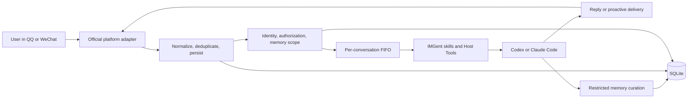
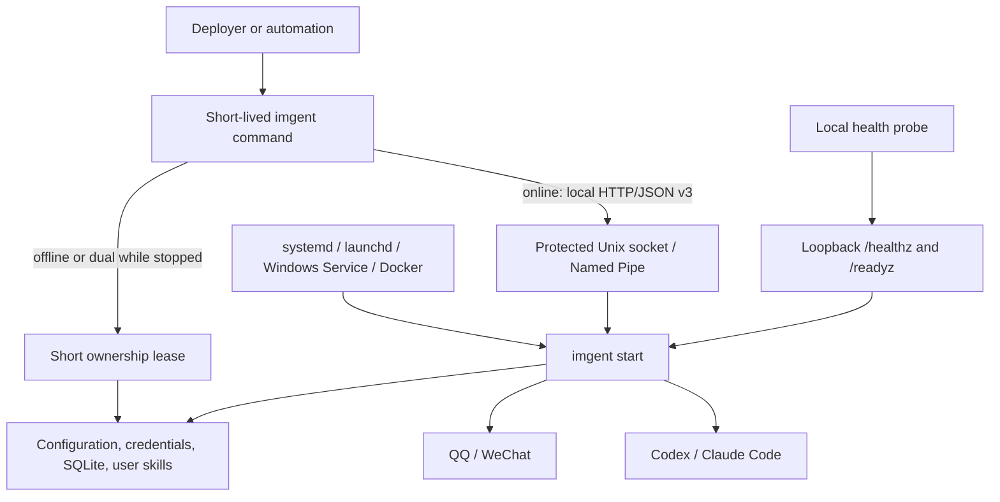

# IMGent

[English](README.md) | [简体中文](README.zh-CN.md)

IMGent is a self-hosted bridge from QQ and WeChat iLink to local Codex and Claude Code agents. It
routes each chat to an authorized workspace and brings results, approvals, and follow-up questions
back to the same conversation. Code, credentials, sessions, skills, and memory stay on your
machine.

> **Alpha:** IMGent is experimental and is not ready for production. APIs, configuration, database
> schemas, backup formats, and runtime behavior may change without backward compatibility.

- [From chat to workspace](#from-chat-to-workspace)
- [How it works](#how-it-works)
- [Get started](#get-started)
- [Command guide](#command-guide)
- [Operations](#operations)
- [Development](#development)

For a first install, follow [Get started](#get-started) from top to bottom. If IMGent is already
running, use [Command guide](#command-guide) for CLI syntax and [Operations](#operations) for health,
backup, and deployment.

## From chat to workspace

Once paired, you can ask the Agent to read a repository, investigate a failure, change files, or run
tests from an authorized direct conversation or QQ group. Longer tasks can continue across several
turns. Approvals and questions return to the same chat, and IMGent loads only the memory available
to that conversation.

The deployer decides which Agent Profile each bot uses, which workspaces users can reach, the
maximum permission level, and the available local skills. QQ groups need local authorization. Full
group ingestion also requires a group owner or administrator that QQ can verify.

### Capabilities

| Capability                      | QQ official bot                              | WeChat iLink                      |
| ------------------------------- | -------------------------------------------- | --------------------------------- |
| Direct conversations            | Supported                                    | Supported                         |
| Group conversations             | Supported                                    | Rejected safely                   |
| Default group ingestion         | `triggered`: mentions, replies, and commands | Unsupported                       |
| Optional full group ingestion   | Paired, verifiable QQ admin approval         | Unsupported                       |
| Reply to inbound messages       | Supported                                    | Requires a valid `context_token`  |
| Proactive delivery              | Supported                                    | Unsupported                       |
| Scheduled Agent tasks           | Supported                                    | Rejected before Agent work starts |
| Local Agent drivers             | Codex or Claude Code                         | Codex or Claude Code              |
| Cross-platform identity binding | User confirmation required                   | User confirmation required        |

IMGent normalizes inbound text, images, audio, video, and files into one message format. It passes QQ
attachment URLs and safely materialized WeChat media to drivers that support those media types.
Unsupported attachments still appear in the Agent context.

Codex uses the local app-server protocol. Claude Code uses the local Agent SDK and CLI
authentication. Both drivers use the login that is already available on the machine. IMGent does
not collect or proxy vendor login tokens.

### Boundaries

The npm package installs one command: `imgent`. `imgent start` runs the resident service in the
foreground. Every other command starts, performs one management action, and exits.

IMGent manages:

- local workspaces and local Agent authentication;
- official QQ bots and WeChat iLink direct conversations;
- one resident service, one SQLite database, and one data directory;
- local skills, scoped long-term memory, approvals, queues, and scheduled tasks;
- a protected local control socket or Windows Named Pipe.

The service does not provide a remote management API, multi-node scheduling, cloud memory, a vector
database, dynamic adapter loading, personal-client simulation, WeChat groups, or automatic identity
matching. It rejects incompatible databases and backup archives without changing them.

See [Product design](docs/imgent-product-design.md) for the complete product and security contract.

## How it works

### Message path



Within a conversation, IMGent runs one Agent turn at a time and queues later messages in FIFO order.
Other conversations can run at the same time. It acknowledges platform events separately from long
Agent work and removes duplicate events before they create another task.

IMGent starts every Agent turn with a host-generated `[IMGent Context]` JSON line. The line contains
stable, pseudonymous references for the conversation and speaker. Group members can share an Agent
session, while each message retains its own speaker attribution.

Memory stays within its scope:

- direct memory belongs to a Principal;
- a QQ group has shared group memory;
- member profiles stay within that member and group;
- a group turn cannot load direct memory or another member's profile.

When a Host Tool asks to perform a risky operation, IMGent sends the approval request back to the
original conversation. Only the authorized Principal for that request can allow, deny, or answer
it. A process restart expires unfinished requests. IMGent retries safe transient failures a limited
number of times and stops when replaying an operation could duplicate a side effect.

### Runtime ownership



While it is running, the resident service owns SQLite, credentials, adapters, drivers, queues,
schedules, and the skill snapshot. Management commands reach it through the protected local control
endpoint. The health server binds to loopback and reports only liveness and readiness.

IMGent reads configuration and user skills at startup. Stop the service before an offline change,
validate the skills, and restart to load the new snapshot.

See [CLI and resident service architecture](docs/cli-service-architecture.md) for lifecycle,
ownership, and protocol details.

## Get started

### Requirements

- Node.js **24.18.0 or newer**.
- A locally installed and authenticated `codex` CLI.
- A locally installed and authenticated `claude` CLI when using the Claude Code driver.
- QQ official bot credentials or a WeChat account that can complete iLink QR authorization.
- Absolute workspace paths and a protected data directory for long-running deployments.

The examples use these placeholders:

| Value                       | Meaning                                                                     |
| --------------------------- | --------------------------------------------------------------------------- |
| `/srv/imgent/imgent.json`   | IMGent configuration file                                                   |
| `/srv/imgent/state`         | Data directory resolved from that configuration                             |
| `/srv/workspaces/main`      | Workspace that the Agent may use                                            |
| `main`                      | AgentProfile that selects the driver, default workspace, skills, and limits |
| `qq-main`, `wechat-main`    | BotInstance connections for QQ and WeChat                                   |
| `principal_01`              | Local Principal that represents a paired user                               |
| `conversation_qq_direct_01` | ConversationSpace that represents a direct chat or group                    |
| `schedule_01`               | Scheduled task created by IMGent                                            |

### 1. Install

Install the alpha channel globally:

```bash
npm install --global imgent@alpha
imgent --version
```

Inspect the CLI without a global install:

```bash
npx --package imgent@alpha imgent --help
```

### 2. Initialize a Profile

```bash
imgent --config /srv/imgent/imgent.json init \
  --workspace /srv/workspaces/main \
  --data-dir ./state

imgent --config /srv/imgent/imgent.json profile add main \
  --driver codex \
  --agent-user-home /srv/workspaces \
  --workspace /srv/workspaces/main \
  --max-mode ask
```

Use `--driver claude-code` for Claude Code. `deny`, `ask`, and `allow` set the Profile permission
ceiling. Agent instructions and skills cannot raise that ceiling. Add `--no-memory` to disable
long-term memory for the Profile.

`--agent-user-home` is the Profile's default and implicit allowed workspace root. It does not
change the operating-system user or `HOME`.

### 3. Add optional local instructions

IMGent includes built-in conversation and memory skills. A deployer can add project-specific
instructions:

```bash
imgent --config /srv/imgent/imgent.json skills init project-conventions \
  --description "Apply this workspace's build, test, and review conventions"

# Edit /srv/imgent/state/skills/project-conventions/SKILL.md
imgent --config /srv/imgent/imgent.json skills validate
```

Skill changes take effect after the next service start. Skills work with both Agent drivers and
stay within the Profile permission ceiling.

### 4. Connect a bot

Choose QQ, WeChat iLink, or configure both.

#### QQ official bot

Keep the AppSecret out of shell history. `bot add` reads it from an environment variable and
stores it encrypted in the data directory.

```bash
export IMGENT_QQ_APP_ID='123456789'
export IMGENT_QQ_APP_SECRET='<qq-app-secret>'

imgent --config /srv/imgent/imgent.json bot add qq qq-main \
  --profile main \
  --app-id-env IMGENT_QQ_APP_ID \
  --app-secret-env IMGENT_QQ_APP_SECRET

unset IMGENT_QQ_APP_SECRET
```

The supervisor that later starts IMGent must still provide `IMGENT_QQ_APP_ID`. You can use
`--app-id 123456789` to store the non-secret AppID in the configuration.

#### WeChat iLink

```bash
imgent --config /srv/imgent/imgent.json bot add wechat-ilink wechat-main \
  --profile main

imgent --config /srv/imgent/imgent.json bot authorize wechat-main
```

Authorization displays a QR code and may request a WeChat verification code. The returned bot token
is encrypted in the data directory. Stop the service before reauthorization.

### 5. Diagnose and start

```bash
imgent --config /srv/imgent/imgent.json doctor
imgent --config /srv/imgent/imgent.json start
```

`start` remains in the foreground and handles `SIGINT` and `SIGTERM`. Keep it running in one
terminal while using online commands from another. Use a service manager for unattended operation.

### 6. Pair a user

Send a direct message to the bot. IMGent replies with a one-time pairing code. Confirm it locally:

```bash
imgent --config /srv/imgent/imgent.json pair PAIR-7Q2M9K \
  --workspace /srv/workspaces/main
```

The command returns the Principal ID. Omitting `--workspace` uses the selected Profile's
`agentUserHome`. A Principal workspace controls direct turns; an authorized QQ group uses the
authorizing Principal's workspace.

Change a paired Principal's workspace later with:

```bash
imgent --config /srv/imgent/imgent.json \
  identity workspace set principal_01 /srv/workspaces/another-project
```

Changing the workspace resets the affected Agent sessions.

### 7. Authorize an optional QQ group

Trigger the bot once in the group. IMGent sends pairing guidance or a `GRP-...` authorization code
to the author in direct chat. A paired Principal can authorize it:

```bash
imgent --config /srv/imgent/imgent.json \
  group authorize-code GRP-8F12A4B9C0DE \
  --principal principal_01
```

The code identifies a group that this IMGent instance has already discovered. The local control
plane checks the paired Principal and commits the authorization. IMGent then announces in the group
that Agent turns are enabled. If the Adapter is temporarily unavailable, the authorization remains
valid and the failed notification appears in the operator audit data.

Local IDs provide an alternative flow:

```bash
imgent --config /srv/imgent/imgent.json identity list
imgent --config /srv/imgent/imgent.json group list
imgent --config /srv/imgent/imgent.json \
  group authorize conversation_qq_group_01 \
  --principal principal_01
```

The default `triggered` mode processes mentions, replies, and commands. A platform-verifiable group
owner or administrator can enable full ingestion from the group with `/imgent group full`.

### 8. Run an Agent turn

Send a request in a paired direct conversation or authorized QQ group:

```text
Check this repository, run the relevant tests, and summarize any failures.
```

Before sending the request to the Agent, IMGent adds stable references for the speaker and
conversation. A normal Agent answer has no prefix. IMGent adds a localized `[IMGent: Status]` first
line to its own pairing, queue, approval, question, error, command, and schedule messages.

### 9. Add an optional schedule

Only QQ currently supports the proactive delivery required by schedules:

```bash
imgent --config /srv/imgent/imgent.json conversation list

imgent --config /srv/imgent/imgent.json schedule add morning-report \
  --conversation conversation_qq_direct_01 \
  --prompt "Review the workspace and send a concise status report." \
  --cron "0 9 * * 1-5" \
  --timezone Asia/Shanghai \
  --context fresh
```

Use `--at 2026-07-27T09:00:00+08:00` for a one-time run. Group schedules also require
`--principal <id>` to select the execution identity.

With the default `fresh` mode, every run gets an isolated session. IMGent archives a Codex session
when the run finishes and does not persist a Claude Code session. `series` keeps one session for
that schedule. Both modes keep scheduled work separate from the target conversation's interactive
session.

When you create, update, pause, resume, or remove a schedule, IMGent sends a short notice to the
target when the Adapter is available. A delivery failure is recorded but does not undo the schedule
change. Scheduled answers start with `[IMGent: Scheduled task]`. Approvals, questions, and errors
use their own status and include the schedule name and due time.

## Command guide

### Global options

```text
imgent [--config <path>] [--locale zh-CN|en-US] [--json] <command>
```

| Option                  | Purpose                                         |
| ----------------------- | ----------------------------------------------- |
| `-c, --config <path>`   | Configuration file; defaults to `./imgent.json` |
| `--locale zh-CN\|en-US` | Locale for this CLI invocation                  |
| `--json`                | Stable success/error envelope for automation    |
| `--help`, `--version`   | Command help and package version                |

The default output is meant for a terminal. Use `--json` in scripts. A successful command returns
`{"ok":true,"result":...}`; a failure returns `{"ok":false,"error":...}`. Errors include a stable
code, localized message and action, retry policy, and optional incident reference. IMGent removes
secrets, local control endpoints, stacks, SQL, raw platform identities, and vendor payloads from
this output.

Use command-specific help for every available option:

```bash
imgent profile add --help
imgent memory list --help
imgent schedule add --help
```

### Access modes

| Mode      | Service state                                                              | Commands                                                                                                                   |
| --------- | -------------------------------------------------------------------------- | -------------------------------------------------------------------------------------------------------------------------- |
| `offline` | The service for this data directory is stopped                             | `init`, `profile add`, `bot add`, `bot authorize`, `skills init`, `restore`                                                |
| `online`  | The resident service is running                                            | `pair`, `identity workspace set`, `group authorize`, `group authorize-code`, `conversation list`, every `schedule` command |
| `dual`    | Uses local control while running and a short ownership lease while stopped | `doctor`, `status`, `identity list`, `group list`, `memory status/list/show`, `skills list/validate`, `backup`             |

An offline command returns `RUNTIME_SERVICE_MUST_STOP` while the service owns the data directory. An
online command returns `RUNTIME_SERVICE_NOT_RUNNING` while it is stopped. If endpoint discovery
finds an unsafe or incompatible control service, the command stops without opening SQLite.

### Setup and runtime

| Command                                                   | Purpose                                                                        |
| --------------------------------------------------------- | ------------------------------------------------------------------------------ |
| `init [--workspace <path>] [--data-dir <path>] [--force]` | Create the minimum configuration and data directory                            |
| `profile add <id> --driver codex\|claude-code [...]`      | Add an Agent Profile, workspace, permission ceiling, skills, and memory policy |
| `bot add qq\|wechat-ilink <id> --profile <id> [...]`      | Add a BotInstance and route it to a Profile                                    |
| `bot authorize <id> [--base-url <url>]`                   | Run the WeChat iLink QR authorization flow                                     |
| `doctor`                                                  | Run explicit Node, SQLite, platform, and Agent diagnostics                     |
| `status`                                                  | Read cached runtime readiness and persistent backlog state                     |
| `start`                                                   | Start the foreground resident service                                          |

### Skills, identities, and groups

| Command                                                    | Purpose                                                                   |
| ---------------------------------------------------------- | ------------------------------------------------------------------------- |
| `skills init <name> [--description <text>]`                | Create `dataDir/skills/<name>/SKILL.md`                                   |
| `skills list`                                              | List built-in and local skills in the effective startup snapshot          |
| `skills validate`                                          | Validate skill packages and Profile references                            |
| `pair <code> [--workspace <path>]`                         | Confirm a direct-message pairing code                                     |
| `identity list`                                            | List platform identities and their Principals                             |
| `identity workspace set <principal-id> <path>`             | Change a Principal workspace and reset related sessions                   |
| `group list`                                               | List discovered QQ groups and authorization state                         |
| `group authorize-code <code> --principal <id>`             | Authorize the group represented by a `GRP-...` code                       |
| `group authorize <conversation-space-id> --principal <id>` | Authorize a discovered group by local ID                                  |
| `conversation list`                                        | List delivery targets, eligible Principals, and proactive-send capability |

### Memory

| Command                   | Purpose                                                                       |
| ------------------------- | ----------------------------------------------------------------------------- |
| `memory status`           | Show record counts and background curation state                              |
| `memory list [filters]`   | Page through records by scope, Principal, conversation, origin, and lifecycle |
| `memory show <memory-id>` | Show one record with its scope, source, content, and lifecycle                |

`memory list` accepts `--scope`, `--principal`, `--conversation`, `--origin`, `--status`, `--limit
1..100`, and the opaque `--cursor` from the previous page. Only a local operator can use these audit
commands. Memory cannot be administered from chat.

### Schedules

| Command                                       | Purpose                                                      |
| --------------------------------------------- | ------------------------------------------------------------ |
| `schedule add <name> --conversation <id> ...` | Create a one-time or five-field cron schedule                |
| `schedule list`                               | List active, paused, completed, and blocked schedules        |
| `schedule update <id> [...]`                  | Change name, prompt, timing, timezone, or context mode       |
| `schedule pause <id>`                         | Stop future triggers                                         |
| `schedule resume <id>`                        | Resume and calculate the next occurrence                     |
| `schedule run <id>`                           | Queue an immediate manual run                                |
| `schedule reset-context <id>`                 | Clear the dedicated `series` Agent session                   |
| `schedule history <id>`                       | Show run and delivery history                                |
| `schedule remove <id>`                        | Soft-remove the schedule and retain existing task audit data |

Exactly one of `--at` or `--cron` is required when adding a schedule. Cron uses five fields and
accepts an IANA `--timezone`; the host timezone is the default. Provide one of `--prompt` or
`--prompt-file`. Missed cron occurrences coalesce into one catch-up run; overlaps are skipped and
counted.

### Backup and restore

```bash
imgent --config /srv/imgent/imgent.json backup \
  --output /srv/backups/imgent.backup

imgent --config /srv/imgent/restored.json restore \
  /srv/backups/imgent.backup \
  --data-dir /srv/imgent/restored-state
```

You can run `backup` while the service is online or while an offline command holds a short ownership
lease. Stop the service before `restore` and use an empty target directory. `--force` allows the
command to replace an existing target. An `imgent-backup/v2` archive contains the configuration,
encrypted platform credentials, a consistent SQLite snapshot, and user skills. It does not include
Codex or Claude authentication directories.

### Commands in chat

Send `/imgent` or `/imgent help` to display the list. Unknown `/imgent ...` actions also return
help.

| Input                               | Where it works                               | Result                                                              |
| ----------------------------------- | -------------------------------------------- | ------------------------------------------------------------------- |
| `/imgent cancel` or `取消`          | Current authorized conversation              | Cancel active and queued turns                                      |
| `/imgent bind`                      | Paired direct conversation                   | Create a short-lived cross-platform binding code                    |
| `/imgent bind <code>`               | Another direct identity on the same Profile  | Bind both identities to one Principal; Agent sessions stay separate |
| `/imgent unbind`                    | Bound direct identity                        | Create an independent Principal for future memory                   |
| `/imgent allow <requestId>`         | Original authorized requester                | Allow a pending Host Tool request                                   |
| `/imgent deny <requestId>`          | Original authorized requester                | Deny a pending request                                              |
| `/imgent answer <requestId> <text>` | Original authorized requester                | Answer an Agent question                                            |
| `/imgent group full`                | Authorized QQ group; paired verifiable admin | Enable full ingestion and announce seven-day raw retention          |
| `/imgent group triggered`           | Authorized QQ group                          | Return to mention, reply, and command triggers                      |
| `/imgent language zh-CN`            | Recognized Principal                         | Use Simplified Chinese for errors and diagnostics                   |
| `/imgent language en-US`            | Recognized Principal                         | Use English for errors and diagnostics                              |

An approval or question ID belongs to its original Principal and conversation. It can be used once
and may expire. To bind identities, create a code from one identity and submit it from the other.

## Operations

### Health and diagnostics

The generated configuration binds health checks to `127.0.0.1:8787`:

```bash
curl http://127.0.0.1:8787/healthz
curl -H 'Accept-Language: en-US' http://127.0.0.1:8787/readyz
```

`/healthz` reports whether the process is alive. `/readyz` returns cached, localized readiness with
HTTP 200 when ready and HTTP 503 when degraded. Neither endpoint contacts a vendor, checks an
account, or probes a model.

Use `status` for a quick operational view. Run `doctor` when you need fresh dependency and
authentication checks. A degraded service keeps running, which lets an operator inspect redacted
JSON Lines logs and repair the environment.

### Data and recovery

- SQLite schema **v7** is created only in an empty data directory. Other schema versions are
  rejected without mutation.
- Backup format **`imgent-backup/v2`** validates its manifest, checksums, and schema version before
  restore.
- The service or an offline CLI lease owns the data directory exclusively. Avoid opening or
  modifying `imgent.sqlite` while either owner is active.
- Default QQ group mode stores triggered messages. Full mode retains ordinary raw group text for
  seven days by default.
- Recall combines a small scope-safe baseline, SQLite FTS5 matches, and recent episodes. Chinese
  and mixed-language search uses generated bigrams.
- Outbound work uses bounded retry and dead-letter handling. Operations with uncertain side
  effects fail closed.

Back up before every upgrade. Alpha releases may reject older storage or archives and do not
perform automatic migrations.

### Run under a supervisor

`imgent start` stays in the foreground. Use systemd, launchd, Windows Service, or Docker to run it in
the background, restart it after failure, provide environment variables, forward signals, and
collect logs.

A container needs:

- the IMGent configuration and persistent data directory;
- every allowed workspace;
- compatible `codex` and/or `claude` executables;
- only the Agent authentication directories the deployer chooses to mount.

Keep the local control socket or pipe private. Expose the loopback health endpoints only when the
container health check needs them.

## Development

### Repository layout

```text
packages/
  contracts/                    # Shared messaging, Agent, configuration, and error contracts
  im-adapters/
    qq/                         # QQ Gateway WebSocket adapter
    wechat-ilink/               # WeChat iLink long-polling adapter
  agent-drivers/
    codex/                      # Codex app-server driver
    claude-code/                # Claude Code Agent SDK driver
skills/
  imgent-conversation/          # Always-active conversation instructions
  imgent-memory/                # Interactive and background memory instructions
src/
  cli/ service/ control/ health/
  config/ runtime/ queue/ schedule/ storage/
  identity/ approvals/ memory/ skills/ security/ backup/
tests/
```

The repository uses separate workspace packages where QQ and WeChat, or Codex and Claude Code, have
different implementations. The published npm package bundles them into one runtime with one
executable and one SQLite owner.

### Set up a checkout

The repository requires Node.js 24.18.0+ and pnpm 11.16.0:

```bash
corepack enable
pnpm install --frozen-lockfile
pnpm build
pnpm link --global
```

Useful source commands:

```bash
pnpm imgent --help
pnpm dev -- --config /absolute/path/to/imgent.json status
pnpm start
```

Use `pnpm imgent --help` for the root package binary smoke. `pnpm exec imgent` can resolve
differently across pnpm layouts.

### Validate a change

```bash
pnpm lint
pnpm format:check
pnpm typecheck
pnpm test
pnpm verify:package
```

Run the real Codex app-server smoke on a machine with an authenticated Codex CLI:

```bash
pnpm verify:codex
```

The standard suite covers configuration and storage, queues and schedules, identity and approvals,
skills and memory, backup and restore, both adapters and drivers, local control ownership, and
two-process behavior.

`verify:codex` opens a real local Codex app-server session. Claude Code has build and mock/contract
coverage, while `doctor` checks local authentication and the live protocol. Linux CI cannot verify
Windows Named Pipe ACLs or Windows Service identity.

### Design references

- [Product design](docs/imgent-product-design.md): capabilities, security, identity, memory,
  persistence, and acceptance criteria.
- [CLI and resident service architecture](docs/cli-service-architecture.md): process lifecycle,
  control protocol, ownership, health, and deployment.
- [Implementation status](docs/implementation-status.md): delivered baseline and validation
  boundaries.
- [Managed skills](docs/imgent-skills.md): package format, selection, overrides, and snapshots.
- [Architecture audit](docs/architecture-audit.md): deliberate simplifications and remaining
  complexity.

When behavior changes, update the code, tests, design documents, both READMEs, and implementation
status together.

### Release

User-facing changes use [Changesets](https://github.com/changesets/changesets):

```bash
pnpm changeset
git add .changeset/*.md
git commit -m "docs: describe the change"
```

The repository uses the Changesets `alpha` prerelease channel. The release workflow checks the
source and package, maintains the Release PR, publishes to npm, corrects dist-tags, and installs the
published version for one final package smoke. Install experimental releases with `imgent@alpha`.

### License

Copyright © 2026 Morilence.

Licensed under the [Apache License 2.0](LICENSE). Distribution attribution is in [NOTICE](NOTICE).
