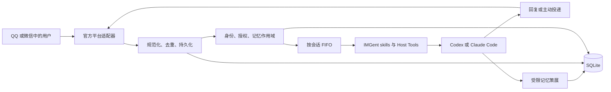
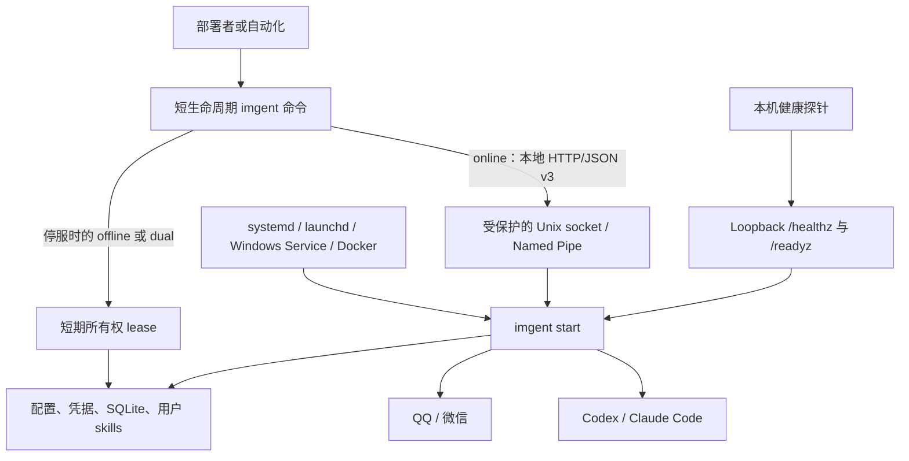

# IMGent

[English](README.md) | [简体中文](README.zh-CN.md)

IMGent 是一个自托管桥接器，让你通过 QQ 官方机器人或微信 iLink 使用本机的 Codex 和
Claude Code Agent。它把每个会话路由到已授权工作区，并将结果、审批和追问送回原会话；代码、
凭据、会话、skills 和记忆都留在本机。

> **Alpha：**IMGent 仍处于实验阶段，尚不适合生产环境。API、配置、数据库 schema、备份格式
> 和运行行为可能发生不向后兼容的变化。

- [从聊天到工作区](#从聊天到工作区)
- [如何工作](#如何工作)
- [快速开始](#快速开始)
- [命令速查](#命令速查)
- [运行与恢复](#运行与恢复)
- [开发与发布](#开发与发布)

第一次安装时，按顺序完成[快速开始](#快速开始)即可。服务已经跑起来后，可以在
[命令速查](#命令速查)中查 CLI 用法，在[运行与恢复](#运行与恢复)中查健康检查、备份和部署。

## 从聊天到工作区

配对完成后，你可以在已授权私聊或 QQ 群中让 Agent 阅读仓库、排查故障、修改文件或运行测试。
较长的任务可以分多轮继续。审批和追问会回到同一个聊天，IMGent 只加载该会话有权使用的记忆。

部署者决定每个机器人使用哪个 Agent Profile、用户能访问哪些工作区、权限上限是多少，以及
Agent 可以加载哪些本地 skills。QQ 群需要在本机授权。开启全量群采集时，QQ 还必须能确认
发起者是群主或管理员。

### 能力概览

| 能力            | QQ 官方机器人                        | 微信 iLink                  |
| --------------- | ------------------------------------ | --------------------------- |
| 私聊            | 支持                                 | 支持                        |
| 群聊            | 支持                                 | 安全拒绝                    |
| 默认群采集      | `triggered`：@、回复和命令           | 不支持                      |
| 可选全量群采集  | 由已配对、平台可验证的 QQ 管理员批准 | 不支持                      |
| 回复入站消息    | 支持                                 | 要求 `context_token` 仍有效 |
| 主动投递        | 支持                                 | 不支持                      |
| 定时 Agent 任务 | 支持                                 | 在 Agent 工作开始前拒绝     |
| 本地 Agent 驱动 | Codex 或 Claude Code                 | Codex 或 Claude Code        |
| 跨平台身份绑定  | 需要用户手动确认                     | 需要用户手动确认            |

IMGent 会把收到的文本、图片、音频、视频和文件整理成统一消息格式。如果驱动支持对应媒体类型，
QQ 附件 URL 和安全物化后的微信媒体会直接传给它；其余附件仍会出现在 Agent 上下文中。

Codex 使用本地 app-server 协议。Claude Code 使用本地 Agent SDK 和 CLI 认证。IMGent 直接使用
机器上已有的登录状态，不会收集或代理 Agent 厂商的登录 token。

### 当前边界

这个 npm 包只安装一个命令：`imgent`。`imgent start` 在前台运行常驻服务；其他命令完成一次
管理操作后就会退出。

IMGent 负责管理：

- 本地工作区和本地 Agent 登录；
- QQ 官方机器人和微信 iLink 私聊；
- 一个常驻服务、一个 SQLite 数据库和一个数据目录；
- 本地 skills、分作用域长期记忆、审批、队列和定时任务；
- 受保护的本地控制 socket 或 Windows Named Pipe。

它不提供远程管理 API、多节点调度、云端记忆、向量数据库、动态适配器加载、个人客户端模拟、
微信群或自动身份匹配。遇到不兼容的数据库和备份归档时，IMGent 会保持原文件不变并拒绝打开。

完整产品与安全契约见[产品设计](docs/imgent-product-design.md)。

## 如何工作

### 消息链路



同一会话一次只运行一个 Agent turn，后续消息按 FIFO 排队；不同会话可以同时工作。IMGent
单独确认平台事件，不让耗时的 Agent 工作阻塞确认流程。重复事件会在创建第二个任务前被过滤。

IMGent 会在每个 Agent turn 开头加入一行宿主生成的 `[IMGent Context]` JSON，其中包含稳定、
匿名化的会话和发言者引用。群成员可以共享 Agent session，每条消息仍能对应到具体发言者。

记忆不会跨越自己的作用域：

- 私聊记忆属于 Principal；
- QQ 群拥有群共享记忆；
- 成员档案只用于该成员所在的当前群；
- 群聊 turn 无法加载私聊记忆或其他成员档案。

Host Tool 请求执行高风险操作时，IMGent 会把审批送回原会话。只有该请求对应的已授权 Principal
可以允许、拒绝或回答。进程重启后，未完成请求会失效。安全的瞬时失败会有限重试；如果重放操作
可能产生重复副作用，IMGent 会停止执行。

### 运行时所有权



常驻服务运行期间会独占 SQLite、凭据、适配器、驱动、队列、定时任务和 skill 快照。管理命令
通过受保护的本地控制端点访问它。健康服务只绑定 loopback，只报告存活和就绪状态。

IMGent 会在启动时读取配置和用户 skills。离线修改前先停止服务，校验 skills，再重启加载新的
快照。

生命周期、所有权和协议细节见
[CLI 与常驻服务架构](docs/cli-service-architecture.md)。

## 快速开始

### 环境要求

- Node.js **24.18.0 或更高版本**。
- 本机已经安装并登录 `codex` CLI。
- 使用 Claude Code 驱动时，本机已经安装并登录 `claude` CLI。
- QQ 官方机器人凭据，或能够完成 iLink QR 授权的微信账号。
- 长期运行时使用绝对工作区路径和受保护的数据目录。

下文使用这些占位值：

| 值                          | 含义                                                   |
| --------------------------- | ------------------------------------------------------ |
| `/srv/imgent/imgent.json`   | IMGent 配置文件                                        |
| `/srv/imgent/state`         | 根据该配置解析出的数据目录                             |
| `/srv/workspaces/main`      | Agent 可以使用的工作区                                 |
| `main`                      | 选择驱动、默认工作区、skills 和权限边界的 AgentProfile |
| `qq-main`、`wechat-main`    | 分别连接 QQ 和微信的 BotInstance                       |
| `principal_01`              | 在本机代表一名已配对用户的 Principal                   |
| `conversation_qq_direct_01` | 在本机代表一个私聊或群聊的 ConversationSpace           |
| `schedule_01`               | IMGent 创建的定时任务                                  |

### 1. 安装

全局安装 alpha 版本：

```bash
npm install --global imgent@alpha
imgent --version
```

不做全局安装，直接查看 CLI：

```bash
npx --package imgent@alpha imgent --help
```

### 2. 初始化 Profile

```bash
imgent --config /srv/imgent/imgent.json init \
  --workspace /srv/workspaces/main \
  --data-dir ./state

imgent --config /srv/imgent/imgent.json profile add main \
  --driver codex \
  --agent-user-home /srv/workspaces \
  --workspace /srv/workspaces/main \
  --max-mode ask
```

Claude Code 使用 `--driver claude-code`。`deny`、`ask`、`allow` 设置 Profile 权限上限，
Agent 指令和 skills 无法提高该上限。添加 `--no-memory` 可以关闭此 Profile 的长期记忆。

`--agent-user-home` 是 Profile 的默认工作区和隐式允许根目录，不会修改操作系统用户或 `HOME`。

### 3. 添加可选本地指令

IMGent 内置会话和记忆 skills。部署者可以添加项目指令：

```bash
imgent --config /srv/imgent/imgent.json skills init project-conventions \
  --description "Apply this workspace's build, test, and review conventions"

# 编辑 /srv/imgent/state/skills/project-conventions/SKILL.md
imgent --config /srv/imgent/imgent.json skills validate
```

skill 修改会在下次服务启动后生效。两种 Agent 驱动共用这些 skills，并继续受 Profile 权限上限
约束。

### 4. 接入机器人

可以选择 QQ、微信 iLink，也可以同时配置。

#### QQ 官方机器人

避免把 AppSecret 写入命令历史。`bot add` 会从环境变量读取并加密保存到数据目录。

```bash
export IMGENT_QQ_APP_ID='123456789'
export IMGENT_QQ_APP_SECRET='<qq-app-secret>'

imgent --config /srv/imgent/imgent.json bot add qq qq-main \
  --profile main \
  --app-id-env IMGENT_QQ_APP_ID \
  --app-secret-env IMGENT_QQ_APP_SECRET

unset IMGENT_QQ_APP_SECRET
```

后续启动 IMGent 的 supervisor 仍需提供 `IMGENT_QQ_APP_ID`。也可以使用
`--app-id 123456789` 把非敏感 AppID 写入配置。

#### 微信 iLink

```bash
imgent --config /srv/imgent/imgent.json bot add wechat-ilink wechat-main \
  --profile main

imgent --config /srv/imgent/imgent.json bot authorize wechat-main
```

授权过程会显示 QR 码，必要时要求输入微信验证码。返回的 bot token 会加密保存在数据目录。
重新授权前先停止服务。

### 5. 诊断并启动

```bash
imgent --config /srv/imgent/imgent.json doctor
imgent --config /srv/imgent/imgent.json start
```

`start` 保持前台运行并处理 `SIGINT` 和 `SIGTERM`。在一个终端保持服务运行，在另一个终端使用
online 命令。无人值守时交给服务管理器。

### 6. 配对用户

先向机器人发送私聊消息。IMGent 会返回一次性配对码，然后在本机确认：

```bash
imgent --config /srv/imgent/imgent.json pair PAIR-7Q2M9K \
  --workspace /srv/workspaces/main
```

命令会返回 Principal ID。省略 `--workspace` 时使用所选 Profile 的 `agentUserHome`。Principal
工作区用于私聊 turn；已授权 QQ 群使用授权 Principal 的工作区。

后续可以修改工作区：

```bash
imgent --config /srv/imgent/imgent.json \
  identity workspace set principal_01 /srv/workspaces/another-project
```

修改工作区会重置受影响的 Agent session。

### 7. 授权可选 QQ 群

先在群内触发一次机器人。IMGent 会向发起者私聊发送配对指引或 `GRP-...` 授权码。已配对
Principal 可以完成授权：

```bash
imgent --config /srv/imgent/imgent.json \
  group authorize-code GRP-8F12A4B9C0DE \
  --principal principal_01
```

该代码对应这个 IMGent 实例已经发现的群。本地控制面会检查已配对 Principal 并提交授权，然后
IMGent 会在群里告知成员已经可以运行 Agent。如果 Adapter 暂时不可用，群授权仍然有效，失败的
通知会出现在运维审计数据中。

也可以使用本地 ID：

```bash
imgent --config /srv/imgent/imgent.json identity list
imgent --config /srv/imgent/imgent.json group list
imgent --config /srv/imgent/imgent.json \
  group authorize conversation_qq_group_01 \
  --principal principal_01
```

默认 `triggered` 模式处理 @、回复和命令。平台可验证的群主或管理员可以在群内发送
`/imgent group full` 开启全量采集。

### 8. 运行 Agent turn

在已配对私聊或已授权 QQ 群中直接发送任务：

```text
检查这个仓库，运行相关测试，并简要说明失败项。
```

IMGent 会先为请求添加稳定的发言者和会话引用，再把它交给 Agent。普通 Agent 回答没有前缀。
IMGent 自己发送的配对、排队、审批、询问、错误、命令回执和计划状态消息会以本地化
`[IMGent: 状态]` 开头。

### 9. 添加可选定时任务

定时任务需要主动投递，目前只有 QQ 支持：

```bash
imgent --config /srv/imgent/imgent.json conversation list

imgent --config /srv/imgent/imgent.json schedule add morning-report \
  --conversation conversation_qq_direct_01 \
  --prompt "Review the workspace and send a concise status report." \
  --cron "0 9 * * 1-5" \
  --timezone Asia/Shanghai \
  --context fresh
```

一次性任务使用 `--at 2026-07-27T09:00:00+08:00`。群计划还要通过 `--principal <id>` 选择
执行身份。

默认的 `fresh` 模式会为每次运行创建隔离 session。运行结束后，IMGent 会归档 Codex session，
也不会持久化 Claude Code session。`series` 会为该计划保留一个专用 session。两种模式都让
定时任务与目标会话的交互式 session 保持分离。

创建、修改、暂停、恢复或删除计划时，只要 Adapter 可用，IMGent 就会向目标发送一条简短通知。
投递失败会被记录，但不会撤销计划变更。定时回答以 `[IMGent: 定时任务]` 开头；审批、询问和
错误使用各自的状态，并附上计划名称和计划时间。

## 命令速查

### 全局参数

```text
imgent [--config <path>] [--locale zh-CN|en-US] [--json] <command>
```

| 参数                    | 用途                               |
| ----------------------- | ---------------------------------- |
| `-c, --config <path>`   | 配置文件，默认为 `./imgent.json`   |
| `--locale zh-CN\|en-US` | 本次 CLI 调用的输出语言            |
| `--json`                | 面向自动化的稳定成功/错误 envelope |
| `--help`、`--version`   | 命令帮助和包版本                   |

默认输出适合在终端中阅读，脚本应使用 `--json`。命令成功时返回
`{"ok":true,"result":...}`，失败时返回 `{"ok":false,"error":...}`。错误中包含稳定错误码、
本地化消息和操作建议、重试策略及可选事件编号。IMGent 会从输出中移除 secret、本地控制端点、
堆栈、SQL、平台原始身份和厂商响应。

每个命令的完整参数以对应帮助为准：

```bash
imgent profile add --help
imgent memory list --help
imgent schedule add --help
```

### 访问模式

| 模式      | 服务状态                                             | 命令                                                                                                                   |
| --------- | ---------------------------------------------------- | ---------------------------------------------------------------------------------------------------------------------- |
| `offline` | 此数据目录的服务已经停止                             | `init`、`profile add`、`bot add`、`bot authorize`、`skills init`、`restore`                                            |
| `online`  | 常驻服务正在运行                                     | `pair`、`identity workspace set`、`group authorize`、`group authorize-code`、`conversation list`、所有 `schedule` 命令 |
| `dual`    | 运行时使用本地控制面，停服时获取短期 ownership lease | `doctor`、`status`、`identity list`、`group list`、`memory status/list/show`、`skills list/validate`、`backup`         |

服务占有数据目录时，offline 命令返回 `RUNTIME_SERVICE_MUST_STOP`。服务停止时，online 命令返回
`RUNTIME_SERVICE_NOT_RUNNING`。如果发现不安全或版本不兼容的控制服务，命令会停止，也不会
打开 SQLite。

### 配置与运行

| 命令                                                      | 用途                                                    |
| --------------------------------------------------------- | ------------------------------------------------------- |
| `init [--workspace <path>] [--data-dir <path>] [--force]` | 创建最小配置和数据目录                                  |
| `profile add <id> --driver codex\|claude-code [...]`      | 添加 Agent Profile、工作区、权限上限、skills 和记忆策略 |
| `bot add qq\|wechat-ilink <id> --profile <id> [...]`      | 添加 BotInstance 并路由到 Profile                       |
| `bot authorize <id> [--base-url <url>]`                   | 运行微信 iLink QR 授权                                  |
| `doctor`                                                  | 执行 Node、SQLite、平台和 Agent 深度诊断                |
| `status`                                                  | 读取缓存 readiness 和持久化积压状态                     |
| `start`                                                   | 启动前台常驻服务                                        |

### Skills、身份与群

| 命令                                                       | 用途                                        |
| ---------------------------------------------------------- | ------------------------------------------- |
| `skills init <name> [--description <text>]`                | 创建 `dataDir/skills/<name>/SKILL.md`       |
| `skills list`                                              | 列出当前启动快照中的内置和本地 skills       |
| `skills validate`                                          | 校验 skill 包和 Profile 引用                |
| `pair <code> [--workspace <path>]`                         | 确认私聊配对码                              |
| `identity list`                                            | 列出平台身份及其 Principal                  |
| `identity workspace set <principal-id> <path>`             | 修改 Principal 工作区并重置相关 session     |
| `group list`                                               | 列出已发现 QQ 群和授权状态                  |
| `group authorize-code <code> --principal <id>`             | 授权 `GRP-...` 代码所代表的群               |
| `group authorize <conversation-space-id> --principal <id>` | 使用本地 ID 授权已发现群                    |
| `conversation list`                                        | 列出投递目标、可用 Principal 和主动发送能力 |

### 记忆

| 命令                      | 用途                                          |
| ------------------------- | --------------------------------------------- |
| `memory status`           | 显示记忆数量和后台策展状态                    |
| `memory list [filters]`   | 按作用域、Principal、会话、来源和生命周期分页 |
| `memory show <memory-id>` | 显示一条记录的作用域、来源、内容和生命周期    |

`memory list` 支持 `--scope`、`--principal`、`--conversation`、`--origin`、`--status`、
`--limit 1..100` 和上一页返回的不透明 `--cursor`。这些审计命令只能由本机部署者使用，聊天中
无法管理记忆。

### 定时任务

| 命令                                          | 用途                                           |
| --------------------------------------------- | ---------------------------------------------- |
| `schedule add <name> --conversation <id> ...` | 创建一次性或五字段 cron 计划                   |
| `schedule list`                               | 列出 active、paused、completed 和 blocked 计划 |
| `schedule update <id> [...]`                  | 修改名称、prompt、时间、时区或上下文模式       |
| `schedule pause <id>`                         | 暂停未来触发                                   |
| `schedule resume <id>`                        | 恢复计划并计算下次时间                         |
| `schedule run <id>`                           | 立即排队运行一次                               |
| `schedule reset-context <id>`                 | 清除专用 `series` Agent session                |
| `schedule history <id>`                       | 显示运行和投递历史                             |
| `schedule remove <id>`                        | 软删除计划并保留已有任务审计数据               |

添加计划时必须在 `--at` 和 `--cron` 中选择一个。Cron 使用五字段表达式，`--timezone` 接受
IANA 时区并默认采用宿主机时区。prompt 通过 `--prompt` 或 `--prompt-file` 提供。错过多个 cron
时间点时只补跑一次；重叠运行会被跳过并计数。

### 备份与恢复

```bash
imgent --config /srv/imgent/imgent.json backup \
  --output /srv/backups/imgent.backup

imgent --config /srv/imgent/restored.json restore \
  /srv/backups/imgent.backup \
  --data-dir /srv/imgent/restored-state
```

服务运行时可以通过常驻服务执行 `backup`，停服后也可以在短期所有权 lease 下执行。运行
`restore` 前要停止服务并准备空目标目录；`--force` 允许替换已有目标。`imgent-backup/v2`
归档包含配置、加密平台凭据、一致性 SQLite 快照和用户 skills，不包含 Codex 或 Claude 的认证
目录。

### 会话内命令

发送 `/imgent` 或 `/imgent help` 可以查看列表。无法识别的 `/imgent ...` 操作也会返回帮助。

| 输入                                | 使用位置                                 | 结果                                                   |
| ----------------------------------- | ---------------------------------------- | ------------------------------------------------------ |
| `/imgent cancel` 或 `取消`          | 当前已授权会话                           | 取消运行中和排队中的 turn                              |
| `/imgent bind`                      | 已配对私聊                               | 创建短期跨平台绑定码                                   |
| `/imgent bind <code>`               | 同一 Profile 下的另一个私聊身份          | 把两个身份绑定到同一 Principal；Agent session 保持分离 |
| `/imgent unbind`                    | 已绑定私聊身份                           | 为后续记忆创建独立 Principal                           |
| `/imgent allow <requestId>`         | 原始已授权请求人                         | 允许待处理 Host Tool 请求                              |
| `/imgent deny <requestId>`          | 原始已授权请求人                         | 拒绝待处理请求                                         |
| `/imgent answer <requestId> <内容>` | 原始已授权请求人                         | 回答 Agent 问题                                        |
| `/imgent group full`                | 已授权 QQ 群；已配对且平台可验证的管理员 | 开启全量采集并公布七天原文保留规则                     |
| `/imgent group triggered`           | 已授权 QQ 群                             | 恢复 @、回复和命令触发                                 |
| `/imgent language zh-CN`            | 已识别 Principal                         | 错误和诊断使用简体中文                                 |
| `/imgent language en-US`            | 已识别 Principal                         | 错误和诊断使用英文                                     |

审批或问题 ID 属于原 Principal 和原会话，只能使用一次，也可能过期。绑定身份时，先用一个身份
创建代码，再从另一个身份提交。

## 运行与恢复

### 健康与诊断

初始化配置默认把健康检查绑定到 `127.0.0.1:8787`：

```bash
curl http://127.0.0.1:8787/healthz
curl -H 'Accept-Language: zh-CN' http://127.0.0.1:8787/readyz
```

`/healthz` 表示进程是否存活。`/readyz` 返回缓存、本地化的 readiness；ready 时使用 HTTP
200，degraded 时使用 HTTP 503。两个端点都不会联系厂商、检查账号或探测模型。

使用 `status` 快速查看运行状态。需要重新检查依赖和认证时，运行 `doctor`。degraded 服务会
继续运行，部署者仍能查看脱敏 JSON Lines 日志并修复环境。

### 数据与恢复

- SQLite schema **v7** 只会在空数据目录创建，其他版本会保持原样并被拒绝。
- 备份格式 **`imgent-backup/v2`** 会在恢复前校验 manifest、checksum 和 schema 版本。
- 服务或 offline CLI lease 会独占数据目录。所有者运行时不要直接打开或修改
  `imgent.sqlite`。
- QQ 群默认只保存触发消息。full 模式下，普通群聊原文默认保留七天。
- 自动召回组合少量作用域安全的基础记录、SQLite FTS5 结果和近期 episode。中文与混合语言搜索
  使用生成的 bigram。
- 出站任务使用有界重试和死信处理。副作用不明确的操作会安全终止。

每次升级前先备份。Alpha 版本可能拒绝旧存储或归档，也不会自动迁移。

### 交给 supervisor

`imgent start` 保持前台运行。使用 systemd、launchd、Windows Service 或 Docker 在后台运行
它，并负责故障重启、环境变量、信号转发和日志收集。

容器需要：

- IMGent 配置和持久化数据目录；
- 所有允许使用的工作区；
- 兼容的 `codex` 和/或 `claude` 可执行文件；
- 仅挂载部署者明确选择的 Agent 认证目录。

本地控制 socket 或 pipe 应保持私有。只有容器健康检查需要时才暴露 loopback 健康端点。

## 开发与发布

### 仓库结构

```text
packages/
  contracts/                    # 共享消息、Agent、配置和错误契约
  im-adapters/
    qq/                         # QQ Gateway WebSocket 适配器
    wechat-ilink/               # 微信 iLink 长轮询适配器
  agent-drivers/
    codex/                      # Codex app-server 驱动
    claude-code/                # Claude Code Agent SDK 驱动
skills/
  imgent-conversation/          # 始终激活的会话指令
  imgent-memory/                # 交互和后台记忆指令
src/
  cli/ service/ control/ health/
  config/ runtime/ queue/ schedule/ storage/
  identity/ approvals/ memory/ skills/ security/ backup/
tests/
```

QQ 与微信、Codex 与 Claude Code 各有不同实现，因此仓库把这些部分拆成独立 workspace 包。
发布到 npm 时，它们会打包成一个 runtime、一个可执行文件和一个 SQLite 所有者。

### 配置源码工作区

仓库要求 Node.js 24.18.0+ 和 pnpm 11.16.0：

```bash
corepack enable
pnpm install --frozen-lockfile
pnpm build
pnpm link --global
```

常用源码命令：

```bash
pnpm imgent --help
pnpm dev -- --config /absolute/path/to/imgent.json status
pnpm start
```

根包二进制 smoke 使用 `pnpm imgent --help`。不同 pnpm 布局下，`pnpm exec imgent` 可能解析到
其他入口。

### 验证变更

```bash
pnpm lint
pnpm format:check
pnpm typecheck
pnpm test
pnpm verify:package
```

本机已经登录 Codex CLI 时，运行真实 app-server smoke：

```bash
pnpm verify:codex
```

标准测试覆盖配置与存储、队列与定时任务、身份与审批、skills 与记忆、备份恢复、两种适配器和
驱动、本地控制所有权及双进程行为。

`verify:codex` 会打开真实的本机 Codex app-server session。Claude Code 由构建和
mock/contract 测试覆盖，`doctor` 会检查本机认证和实时协议。Linux CI 无法验证 Windows Named
Pipe ACL 或 Windows Service 身份。

### 设计资料

- [产品设计](docs/imgent-product-design.md)：能力、安全、身份、记忆、持久化和验收标准。
- [CLI 与常驻服务架构](docs/cli-service-architecture.md)：进程生命周期、控制协议、所有权、
  健康检查和部署。
- [实现状态](docs/implementation-status.md)：已交付基线和验证边界。
- [托管 skills](docs/imgent-skills.md)：包格式、选择、覆盖和快照。
- [架构审计](docs/architecture-audit.md)：刻意简化和剩余复杂度。

行为发生变化时，在同一个变更中更新代码、测试、设计文档、两份 README 和实现状态。

### 发布

面向用户的变更使用 [Changesets](https://github.com/changesets/changesets)：

```bash
pnpm changeset
git add .changeset/*.md
git commit -m "docs: describe the change"
```

仓库使用 Changesets `alpha` 预发布通道。发布 workflow 会检查源码和包产物、维护 Release PR、
发布 npm、校正 dist-tags，并从 registry 安装已发布版本执行最后一次包级 smoke。安装实验版本
时使用 `imgent@alpha`。

### 许可证

Copyright © 2026 Morilence.

项目使用 [Apache License 2.0](LICENSE)，分发归属信息见 [NOTICE](NOTICE)。
