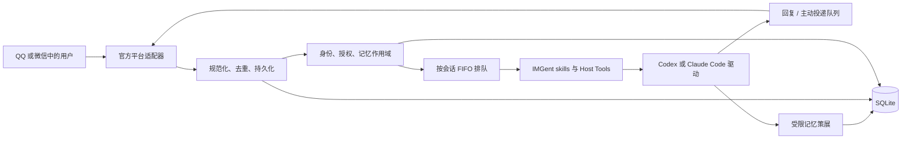
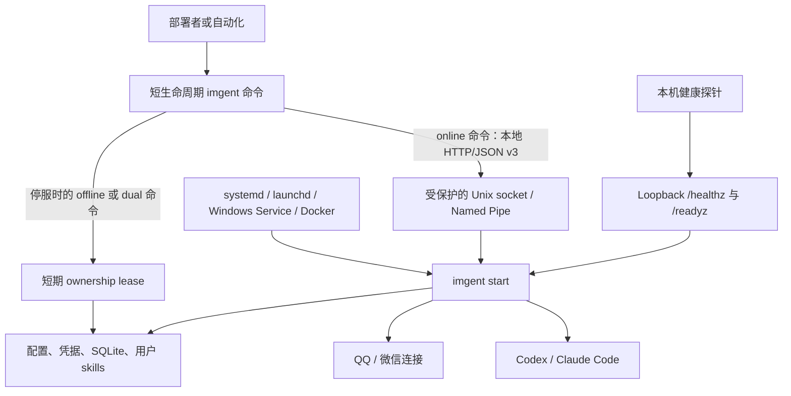

# IMGent

[English](README.md) | [简体中文](README.zh-CN.md)

IMGent 是一个自托管桥接器，让用户可以通过 QQ 官方机器人或微信 iLink 机器人使用本地
Codex 或 Claude Code Agent，同时继续在本机掌控工作区、身份、审批、会话和记忆。

本文分为三个部分：

1. [认识 IMGent](#1-认识-imgent)：IMGent 能做什么、如何工作，以及能力边界。
2. [使用 IMGent](#2-使用-imgent)：安装、完整工作流、命令和输出。
3. [开发与维护 IMGent](#3-开发与维护-imgent)：仓库结构、验证、部署和发布。

## 1. 认识 IMGent

### IMGent 是什么

IMGent 与你已经掌控的工作区和 Agent CLI 运行在同一环境中。它接收 IM 消息，将发送者映射到本地
身份，只加载当前会话允许使用的记忆和 skills，运行选定的本地 Agent，处理审批或问题，再把结果
发回原会话。

它面向个人开发者和由一名部署者管理的小团队：

- **部署者**安装 IMGent，登录 Codex 或 Claude Code，选择工作区和权限上限，配置机器人，并负责
  备份和升级。
- **已配对用户**可以在已授权的私聊或 QQ 群中要求 Agent 工作。
- **已配对管理员**可以授权已发现的 QQ 群。开启 QQ 群全量采集还要求发起者是平台可验证的群主或
  管理员。

IMGent 只有一个 npm 包和一个 `imgent` 可执行入口。`imgent start` 是前台常驻服务，其他每次调用
都是短生命周期管理 CLI。

### 支持的能力

| 能力                       | QQ 官方机器人                              | 微信 iLink                                    |
| -------------------------- | ------------------------------------------ | --------------------------------------------- |
| 私聊                       | 支持                                       | 支持                                          |
| 群聊                       | 支持                                       | 不支持；疑似群事件会被安全拒绝                |
| 默认群采集                 | `triggered`：只处理 @、回复和命令          | 不适用                                        |
| 可选全量群采集             | 支持，但需要配对并由可验证的 QQ 管理员批准 | 不支持                                        |
| 回复入站消息               | 支持                                       | 支持，但要求 `context_token` 仍有效           |
| 没有近期入站消息时主动投递 | 支持                                       | 不支持                                        |
| 定时 Agent 任务            | 支持                                       | 不支持；创建或恢复会在 Agent 工作开始前被拒绝 |
| 本地 Agent 驱动            | Codex 或 Claude Code                       | Codex 或 Claude Code                          |
| 跨平台身份绑定             | 只允许用户显式确认绑定                     | 只允许用户显式确认绑定                        |

两个 Agent 驱动对外提供相同的 IMGent 层语义，但保留真实协议差异。Codex 使用本地 app-server
协议；Claude Code 使用本地 Agent SDK 和 CLI 认证。IMGent 不会索取、导出或代理 Agent
厂商的登录凭据。

入站文本、图片、音频、视频和文件都会规范化成统一消息契约。QQ 附件 URL 和安全物化后的微信
媒体会在驱动支持对应类型时传给选定驱动；不支持的类型仍会作为明确的附件上下文，而不是静默
变成文本。平台之间没有统一富交互映射时，Agent 结果、审批和问题使用文本。

### 一条消息如何被处理



这条链路上的重要行为：

- 平台事件确认与耗时较长的 Agent 工作相互独立。
- 重复投递会在创建第二个任务前被去重。
- 一个会话同一时间只运行一个 turn，后续消息按 FIFO 等待；不同会话可以并发。
- 私聊记忆、QQ 群共享记忆和群成员档案是独立作用域。群聊 turn 永远不会加载成员的私聊记忆。
- 高风险 Host Tool 请求会把审批发回原会话。只有原请求对应的已授权 Principal 可以允许、
  拒绝或回答。
- 进程重启会让未完成审批失效，而不是猜测某个副作用是否已经发生。
- 安全的瞬时失败使用有界重试；未知或危险副作用不会被自动重放。

### 进程与数据所有权



常驻服务是 SQLite、凭据、适配器、驱动、队列、定时任务和不可变 skill 快照的唯一在线
所有者。在线 CLI 命令使用受保护的 Unix socket 或用户范围 Windows Named Pipe。健康端点只绑定
loopback，只提供 `/healthz` 和 `/readyz`，不是管理 API。

IMGent 明确**不提供**：

- 公开或远程管理 API；
- 第二个 daemon 二进制或 `start --daemon`；
- 动态第三方适配器/驱动加载或插件市场；
- 多节点调度、分布式队列或数据库集群；
- 云端记忆服务、向量数据库或外部 embedding API；
- 根据姓名、手机号或消息内容自动合并身份；
- 个人 QQ/微信客户端模拟、微信群、企业微信、视频号或公众号；
- 旧 SQLite schema 或备份格式的自动迁移。

完整产品与安全契约见[产品设计](docs/imgent-product-design.md)。进程模型和本地控制协议见
[CLI 与常驻服务架构](docs/cli-service-architecture.md)。

## 2. 使用 IMGent

### 环境要求

- Node.js **24.18.0 或更高版本**。
- 已在本机安装并登录 `codex` CLI。使用 Claude Code 驱动时还需安装并登录 `claude`。
- QQ 官方机器人凭据，或能够完成 iLink QR 授权的微信账号。
- 长期部署建议使用专用本机用户和受保护的数据目录。

以下示例使用 Unix 路径，请替换为适合当前系统的绝对路径：

| 下文占位值                  | 含义                              |
| --------------------------- | --------------------------------- |
| `/srv/imgent/imgent.json`   | 选定的 IMGent 配置文件            |
| `/srv/imgent/state`         | 根据该配置解析出的数据目录        |
| `/srv/workspaces/main`      | 示例 Profile 唯一允许使用的工作区 |
| `main`                      | AgentProfile ID                   |
| `qq-main` / `wechat-main`   | BotInstance ID                    |
| `principal_01`              | 已配对的 IMGent Principal ID      |
| `conversation_qq_direct_01` | 已发现的 ConversationSpace ID     |
| `schedule_01`               | IMGent 返回的计划 ID              |

输出示例中的值（包括 ID、时间、计数和大小）是说明性数据，但字段名和外层响应结构与当前 CLI
一致。示例不会展示 secret、token、本地控制 endpoint 或真实用户标识。

### 安装

全局安装长期运行的 CLI：

```bash
npm install --global imgent
imgent --version
```

只想临时查看帮助而不做全局安装：

```bash
npx imgent --help
```

### 先理解命令运行模式

每个管理命令都会声明自己如何访问状态：

| 模式      | 可运行条件                                         | 命令                                                                                          |
| --------- | -------------------------------------------------- | --------------------------------------------------------------------------------------------- |
| `offline` | 同一数据目录的 `imgent start` 已停止               | `init`、`profile add`、`bot add`、`bot authorize`、`skills init`、`restore`                   |
| `online`  | 常驻服务正在运行；始终走本地控制面                 | `pair`、`group authorize`、`conversation list`、所有 `schedule` 子命令                        |
| `dual`    | 运行时访问服务，停服时取得短期离线 ownership lease | `doctor`、`status`、`identity list`、`group list`、`skills list`、`skills validate`、`backup` |

`imgent start` 本身是常驻进程。服务运行时执行 offline 命令会返回
`RUNTIME_SERVICE_MUST_STOP`；服务停止时执行 online 命令会返回
`RUNTIME_SERVICE_NOT_RUNNING`。如果控制 endpoint 存在但无法安全握手，IMGent 会报告错误，
不会静默打开 SQLite。

### 端到端配置

#### 1. 初始化配置并添加 Agent Profile

```bash
imgent --config /srv/imgent/imgent.json init \
  --workspace /srv/workspaces/main \
  --data-dir ./state

imgent --config /srv/imgent/imgent.json profile add main \
  --driver codex \
  --workspace /srv/workspaces/main \
  --max-mode ask
```

使用 Claude Code 时传入 `--driver claude-code`。`deny`、`ask`、`allow` 是权限上限，Agent
或 skill 无法提高已配置的上限。

#### 2. 可选：创建本机操作指令

```bash
imgent --config /srv/imgent/imgent.json skills init project-conventions \
  --description "Apply this workspace's build, test, and review conventions"
imgent --config /srv/imgent/imgent.json skills validate
```

编辑 `/srv/imgent/state/skills/project-conventions/SKILL.md`；后续修改需要再次校验并重启
IMGent。内置和部署者自定义的 skills 都是 IMGent 托管指令，可供两种 Agent 驱动使用，但无法扩大
Host Tool 权限。

#### 3A. 添加 QQ 机器人

不要把 QQ AppSecret 写入命令历史。`bot add` 会从指定环境变量读取 secret，加密写入数据目录，
不会把 secret 写入 `imgent.json`。

```bash
export IMGENT_QQ_APP_ID='123456789'
export IMGENT_QQ_APP_SECRET='<qq-app-secret>'

imgent --config /srv/imgent/imgent.json bot add qq qq-main \
  --profile main \
  --app-id-env IMGENT_QQ_APP_ID \
  --app-secret-env IMGENT_QQ_APP_SECRET

unset IMGENT_QQ_APP_SECRET
```

确保启动 IMGent 的 supervisor 仍能取得 `IMGENT_QQ_APP_ID`，也可以用
`--app-id 123456789` 把非敏感 AppID 直接写入配置。

#### 3B. 或添加并授权微信 iLink 机器人

```bash
imgent --config /srv/imgent/imgent.json bot add wechat-ilink wechat-main \
  --profile main
imgent --config /srv/imgent/imgent.json bot authorize wechat-main
```

第二条命令会显示 QR 码，必要时要求输入微信验证码，并加密保存返回的 bot token。两条命令都是
offline；重新授权前必须停止服务。

#### 4. 诊断并启动

```bash
imgent --config /srv/imgent/imgent.json doctor
imgent --config /srv/imgent/imgent.json start
```

`doctor` 会显式检查 Node、SQLite、平台凭据、Agent 命令、版本和登录状态。`start` 保持在前台
运行，每行输出一个 JSON 日志对象。请使用 systemd、launchd、Windows Service 或 Docker
托管它。

#### 5. 配对用户

第一次私聊会返回一次性配对码。保持 `imgent start` 运行，在另一个终端确认：

```bash
imgent --config /srv/imgent/imgent.json pair ABCD-EFGH
```

配对码只使用一次，重复确认成功使用过的码是幂等的。完成配对后，用户才可以运行 Agent turn。

#### 6. 授权 QQ 群

先在群里发送一条触发消息，让 IMGent 发现该群，然后查看本地 ID，并使用已配对 Principal 授权：

```bash
imgent --config /srv/imgent/imgent.json identity list
imgent --config /srv/imgent/imgent.json group list
imgent --config /srv/imgent/imgent.json group authorize conversation_qq_group_01 \
  --principal principal_01
```

该群会保持 `triggered` 模式，直到已配对、且平台可验证为 QQ 群主或管理员的用户在群中发送
`/imgent group full`。

#### 7. 在聊天中运行 Agent turn

在已配对私聊中直接发送普通请求。QQ 群使用默认 `triggered` 模式时，需要 @机器人、回复机器人，
或发送 `/imgent` 命令：

```text
用户：检查当前仓库状态，并总结需要注意的事项。
Agent：工作树干净；当前分支是 main，并且与 origin/main 一致。
```

回复由选定的本地 Agent 在已配置工作区中生成。如果 Agent 需要高风险 Host Tool 或补充信息，
IMGent 会把 request ID 发回同一会话；按下文说明使用 `/imgent allow`、`/imgent deny` 或
`/imgent answer` 回答。发送 `/imgent cancel` 或“取消”可以取消该会话运行中和排队中的工作。

#### 8. 可选：创建定时任务

计划要求服务正在运行，且目标 Adapter 支持主动投递。先发现目标：

```bash
imgent --config /srv/imgent/imgent.json conversation list
imgent --config /srv/imgent/imgent.json schedule add morning-report \
  --conversation conversation_qq_direct_01 \
  --prompt "Inspect the workspace and send a concise status report." \
  --cron "0 9 * * 1-5" \
  --timezone Asia/Shanghai \
  --context fresh
```

`fresh` 每次运行都创建新的临时 Agent session。`series` 只复用该计划自己的 session，永远
不会复用或阻塞目标 IM 会话的普通 Agent session。

### 全局 CLI 参数与输出契约

为了让 shell 脚本行为清晰，建议把全局参数放在命令前：

```text
imgent [--config <path>] [--locale zh-CN|en-US] [--json] <command>
imgent --help
imgent --version
```

| 参数                  | 行为                                           |
| --------------------- | ---------------------------------------------- |
| `-c, --config <path>` | 选择配置文件，默认 `./imgent.json`             |
| `--locale <locale>`   | 为错误和 readiness 诊断选择 `zh-CN` 或 `en-US` |
| `--json`              | 用稳定、机器可读的 envelope 包装成功或失败     |
| `--help`              | 输出当前命令的 Commander 帮助                  |
| `--version`           | 输出 IMGent 包版本                             |

成功命令默认直接输出格式化 JSON：

```json
{
  "mode": "offline",
  "skills": []
}
```

使用 `--json` 时，成功结果写入 stdout：

```json
{
  "ok": true,
  "locale": "zh-CN",
  "result": {
    "mode": "offline",
    "skills": []
  }
}
```

不使用 `--json` 时，失败会把本地化安全文本写入 stderr：

```text
IMGent 服务当前未运行。
请先运行 imgent start。
```

使用 `--json` 时，失败会把稳定 envelope 写入 stdout，且不会暴露 cause、stack、SQL、本机路径、
消息正文、token 或平台原始响应：

```json
{
  "ok": false,
  "locale": "zh-CN",
  "error": {
    "code": "RUNTIME_SERVICE_NOT_RUNNING",
    "message": "IMGent 服务当前未运行。",
    "action": "请先运行 imgent start。",
    "retry": {
      "strategy": "after_user_action",
      "replay": "safe"
    }
  }
}
```

自动化应根据 `error.code` 而不是翻译后的文本分支。退出码类别保持稳定：

| 退出码 | 含义                                         |
| ------ | -------------------------------------------- |
| `0`    | 成功                                         |
| `1`    | 内部或其他未分类运行失败                     |
| `2`    | 输入/配置无效、未找到、冲突或取消            |
| `3`    | 认证、授权、兼容性或其他必须由用户处理的操作 |
| `4`    | 限流、超时、瞬时失败或有界退避状态           |

### 完整命令参考

以下示例展示未加 `--json` 时的直接成功输出。Agent 或脚本需要稳定 envelope 时，请加
`--json`。为保持可读性，后续 online 示例可能只展示与命令有关的 `service` 或 schedule 字段；
完整对象形状分别见 `pair` 和 `schedule add`，调用方应容忍附加字段。

#### `init`：创建最小配置和数据目录

**模式：** offline。
**必需输入：** 已存在或可创建的工作区；只有明确要替换现有配置时才使用 `--force`。

```bash
imgent --config /srv/imgent/imgent.json init \
  --workspace /srv/workspaces/main \
  --data-dir ./state
```

```json
{
  "result": "initialized",
  "configPath": "/srv/imgent/imgent.json",
  "workspace": "/srv/workspaces/main",
  "dataDir": "/srv/imgent/state"
}
```

生成的配置不包含 BotInstance 或 AgentProfile。相对 `dataDir` 和 workspace 条目都从配置文件
所在目录解析。`--force` 无法绕过服务运行检查。

#### `profile add`：添加 Codex 或 Claude Code Profile

**模式：** offline。
**必需输入：** 唯一 Profile ID、`--driver codex|claude-code` 和允许使用的工作区。

```bash
imgent --config /srv/imgent/imgent.json profile add main \
  --driver codex \
  --workspace /srv/workspaces/main \
  --max-mode ask
```

```json
{
  "result": "profile-added",
  "profile": {
    "id": "main",
    "driver": "codex",
    "command": "codex",
    "workspace": "../workspaces/main",
    "skills": ["*"],
    "permissions": {
      "maxMode": "ask"
    },
    "memory": {
      "enabled": true
    }
  }
}
```

可选参数：

- `--command <path>` 覆盖默认的 `codex` 或 `claude` 可执行文件。
- `--max-mode deny|ask|allow` 设置 Host Tool 权限上限，默认是 `ask`。
- `--no-memory` 为该 Profile 禁用 IMGent 长期记忆，并隐藏内置记忆 skill。
- 新 Profile 默认使用 `skills: ["*"]`。需要指定 skill 时，在服务停止状态编辑
  `imgent.json`。

#### `skills init`：创建部署者拥有的 skill 包

**模式：** offline。
**必需输入：** 最长 63 个字符的小写 kebab-case 名称。

```bash
imgent --config /srv/imgent/imgent.json skills init project-conventions \
  --description "Apply this workspace's build, test, and review conventions"
```

```json
{
  "result": "skill-initialized",
  "name": "project-conventions",
  "path": "/srv/imgent/state/skills/project-conventions",
  "restartRequired": true
}
```

该命令创建带严格 `name` 和 `description` frontmatter 的 `SKILL.md`。用户 skill 与内置
skill 同名时，会在下次启动覆盖内置版本。

#### `skills list`：查看生效的 skill 目录

**模式：** dual。
online 输出描述服务不可变的启动快照；offline 输出读取当前磁盘状态。

```bash
imgent --config /srv/imgent/imgent.json skills list
```

```json
{
  "mode": "offline",
  "skills": [
    {
      "name": "imgent-conversation",
      "description": "Guide every user-facing IMGent conversation across direct messages and groups.",
      "source": "builtin",
      "files": 1,
      "bytes": 2048
    },
    {
      "name": "project-conventions",
      "description": "Apply this workspace's build, test, and review conventions",
      "source": "user",
      "files": 1,
      "bytes": 312
    }
  ]
}
```

online 输出还包含 `service` 元数据和 `configDrift`。

#### `skills validate`：校验包和 Profile 引用

**模式：** dual。

```bash
imgent --config /srv/imgent/imgent.json skills validate
```

```json
{
  "mode": "offline",
  "result": "valid",
  "skills": 3,
  "profiles": [
    {
      "profileId": "main",
      "skills": ["imgent-conversation", "imgent-memory", "project-conventions"]
    }
  ],
  "restartRequiredAfterChanges": true
}
```

校验会拒绝符号链接、不安全包条目、无效 frontmatter、超大包、缺少必需内置 skill，以及
AgentProfile 引用了不存在的 skill。

#### `bot add qq`：添加 QQ 官方机器人

**模式：** offline。
**必需输入：** 唯一 BotInstance ID、已有 Profile、AppID 或 AppID 环境变量，以及 AppSecret
环境变量。

```bash
export IMGENT_QQ_APP_ID='123456789'
export IMGENT_QQ_APP_SECRET='<qq-app-secret>'
imgent --config /srv/imgent/imgent.json bot add qq qq-main \
  --profile main \
  --app-id-env IMGENT_QQ_APP_ID \
  --app-secret-env IMGENT_QQ_APP_SECRET
unset IMGENT_QQ_APP_SECRET
```

```json
{
  "result": "bot-added",
  "bot": {
    "id": "qq-main",
    "adapter": "qq",
    "transport": "websocket",
    "platformBotIdEnv": "IMGENT_QQ_APP_ID",
    "credentialRef": "qq-main",
    "groupIngestionDefault": "triggered",
    "enabled": true
  }
}
```

`--app-secret-env` 默认是 `IMGENT_QQ_APP_SECRET`，执行命令时该变量必须存在。正常部署应在
`--app-id <id>` 和 `--app-id-env <name>` 中选择一种。

#### `bot add wechat-ilink`：添加微信 iLink 机器人

**模式：** offline。

```bash
imgent --config /srv/imgent/imgent.json bot add wechat-ilink wechat-main \
  --profile main
```

```json
{
  "result": "bot-added",
  "bot": {
    "id": "wechat-main",
    "adapter": "wechat-ilink",
    "credentialRef": "wechat-main",
    "enabled": true
  }
}
```

添加 BotInstance 不等于完成授权，接下来需要运行 `bot authorize`。

#### `bot authorize`：授权微信 iLink 机器人

**模式：** offline。
**必需输入：** 已存在的 `wechat-ilink` BotInstance。只有明确选择兼容 iLink endpoint 时才使用
`--base-url <url>`。

```bash
imgent --config /srv/imgent/imgent.json bot authorize wechat-main
```

执行期间，终端会显示 QR 码和授权状态，必要时要求输入验证码。最终输出：

```json
{
  "result": "wechat-authorized",
  "botInstanceId": "wechat-main",
  "platformBotId": "ilink_bot_01",
  "authorizingPlatformUserId": "ilink_user_01"
}
```

bot token 会加密保存在本机，不会出现在输出中。

#### `doctor`：执行显式深度诊断

**模式：** dual。
offline 诊断检查本机环境但不启动平台 Adapter；online 诊断要求常驻服务刷新平台、账号和模型检查。

```bash
imgent --locale zh-CN --config /srv/imgent/imgent.json doctor
```

具有代表性的 offline 输出：

```json
{
  "mode": "offline",
  "checks": [
    {
      "check": "node",
      "ok": true,
      "details": "24.18.0"
    },
    {
      "check": "runtime",
      "ok": true,
      "details": {
        "mode": "offline",
        "service": {
          "state": "stopped"
        },
        "database": {},
        "skills": {
          "result": "valid",
          "skills": 3,
          "profiles": [
            {
              "profileId": "main",
              "skills": ["imgent-conversation", "imgent-memory", "project-conventions"]
            }
          ],
          "restartRequiredAfterChanges": true
        },
        "environmentReadiness": {
          "ready": true,
          "depth": "diagnostic",
          "locale": "zh-CN",
          "issues": [],
          "bots": {
            "qq-main": {
              "ready": true,
              "issues": []
            }
          },
          "profiles": {
            "main": {
              "ready": true,
              "issues": []
            }
          }
        },
        "liveReadinessAvailable": false
      }
    }
  ]
}
```

即使打印了全部检查，命令仍可能返回非零退出码。自动化应使用 `imgent --json doctor`，同时检查
`result.checks` 和进程退出码。

#### `status`：读取缓存的运行状态或持久化状态

**模式：** dual。
与 `doctor` 不同，`status` 永远不会执行厂商网络或模型探测。

```bash
imgent --config /srv/imgent/imgent.json status
```

服务停止时的代表性输出：

```json
{
  "mode": "offline",
  "service": {
    "state": "stopped"
  },
  "database": {
    "pending_approvals": 0,
    "memory_outbox": 0,
    "dead_letters": 0
  },
  "transports": [],
  "lastInboundByBot": [],
  "groups": [],
  "oldestWaitingTask": null,
  "schedules": [],
  "nextSchedule": null,
  "readiness": null,
  "liveReadinessAvailable": false
}
```

online 输出包含 `mode: "online"`、`service`、`configDrift`、数据库/任务摘要，以及已本地化的
缓存 `readiness` 投影。

#### `start`：运行常驻服务

**模式：** 前台常驻进程。
**必需输入：** 有效配置、受支持 Node 版本，以及没有被其他 IMGent 进程或 offline lease
占用的数据目录。

```bash
imgent --config /srv/imgent/imgent.json start
```

代表性 JSON Lines 输出：

```jsonl
{"timestamp":"2026-07-25T01:00:00.000Z","level":"info","component":"application","eventType":"adapter.started","botInstanceId":"qq-main"}
{"timestamp":"2026-07-25T01:00:00.100Z","level":"info","component":"application","eventType":"application.started","bots":1,"profiles":1}
{"timestamp":"2026-07-25T01:00:00.200Z","level":"info","component":"service","eventType":"service.started","instanceId":"<uuid>","state":"ready","bots":1,"profiles":1}
```

`ready` 表示至少一条配置路由可用。平台或 Agent 依赖失败可能使进程保持 `degraded`，从而继续
提供 `status` 和 `doctor`。`SIGINT` 和 `SIGTERM` 会触发有序关闭；IMGent 不会自行后台化。

#### `pair`：确认私聊配对码

**模式：** online。
**必需输入：** 返回给未配对私聊用户的当前一次性码。

```bash
imgent --config /srv/imgent/imgent.json pair ABCD-EFGH
```

```json
{
  "mode": "online",
  "service": {
    "protocolVersion": 3,
    "appVersion": "0.1.0",
    "instanceId": "<uuid>",
    "instanceKey": "<stable-hash>",
    "state": "ready",
    "startedAt": "2026-07-25T01:00:00.000Z",
    "configHash": "<sha256>"
  },
  "configDrift": false,
  "result": "paired",
  "platformIdentityId": "platform_identity_01",
  "principalId": "principal_01"
}
```

`appVersion` 跟随已安装包版本。成功消费过的码再次提交时，只要配对仍有效，就会返回同一个
Principal。

#### `identity list`：列出平台身份与 Principal

**模式：** dual。

```bash
imgent --config /srv/imgent/imgent.json identity list
```

```json
{
  "mode": "online",
  "service": {
    "state": "ready",
    "instanceId": "<uuid>"
  },
  "configDrift": false,
  "identities": [
    {
      "platformIdentityId": "platform_identity_01",
      "agentProfileId": "main",
      "platform": "qq",
      "botInstanceId": "qq-main",
      "platformUserId": "qq_user_01",
      "principalId": "principal_01",
      "displayName": "示例用户",
      "paired": 1
    }
  ]
}
```

offline 输出省略 `service` 和 `configDrift`，但保留 `mode` 和已持久化身份。

#### `group list`：列出已发现的 QQ 群

**模式：** dual。

```bash
imgent --config /srv/imgent/imgent.json group list
```

```json
{
  "mode": "online",
  "service": {
    "state": "ready",
    "instanceId": "<uuid>"
  },
  "configDrift": false,
  "groups": [
    {
      "conversationSpaceId": "conversation_qq_group_01",
      "agentProfileId": "main",
      "botInstanceId": "qq-main",
      "platformConversationId": "qq_group_01",
      "mode": "triggered",
      "platformFullCapability": 1,
      "authorized": 0
    }
  ]
}
```

只有 IMGent 收到能够发现该群的事件后，群才会出现在列表中。

#### `group authorize`：授权已发现的 QQ 群

**模式：** online。
**必需输入：** 已发现的群 ConversationSpace，以及属于同一 AgentProfile 的已配对 Principal。

```bash
imgent --config /srv/imgent/imgent.json group authorize conversation_qq_group_01 \
  --principal principal_01
```

```json
{
  "mode": "online",
  "service": {
    "state": "ready",
    "instanceId": "<uuid>"
  },
  "configDrift": false,
  "result": "group-authorized",
  "conversationSpaceId": "conversation_qq_group_01",
  "principalId": "principal_01"
}
```

这会授权使用该群，但不会开启全量采集。

#### `conversation list`：发现主动投递目标

**模式：** online。

```bash
imgent --config /srv/imgent/imgent.json conversation list
```

```json
{
  "mode": "online",
  "service": {
    "state": "ready",
    "instanceId": "<uuid>"
  },
  "configDrift": false,
  "conversations": [
    {
      "id": "conversation_qq_direct_01",
      "agentProfileId": "main",
      "platform": "qq",
      "botInstanceId": "qq-main",
      "kind": "direct",
      "platformConversationId": "qq_user_01",
      "principals": [
        {
          "principalId": "principal_01",
          "displayName": "示例用户"
        }
      ],
      "supportsProactiveSend": true
    }
  ]
}
```

把 `id` 用作 `--conversation`。存在多个候选 Principal 的群还需要传入 `--principal`。
不要为 `supportsProactiveSend` 为 `false` 的目标创建计划。

#### `schedule add`：创建一次性或 cron 任务

**模式：** online。
**必需输入：** `--prompt`/`--prompt-file` 二选一，`--at`/`--cron` 二选一。`--at` 必须是
带 `Z` 或显式偏移量的未来 RFC 3339 时间；cron 使用五字段表达式和 IANA 时区。

一次性示例：

```bash
imgent --config /srv/imgent/imgent.json schedule add release-check \
  --conversation conversation_qq_direct_01 \
  --prompt-file ./release-check.md \
  --at 2026-08-01T10:00:00+08:00 \
  --context series
```

cron 示例：

```bash
imgent --config /srv/imgent/imgent.json schedule add morning-report \
  --conversation conversation_qq_direct_01 \
  --prompt "Inspect the workspace and send a concise status report." \
  --cron "0 9 * * 1-5" \
  --timezone Asia/Shanghai \
  --context fresh
```

```json
{
  "mode": "online",
  "service": {
    "state": "ready",
    "instanceId": "<uuid>"
  },
  "configDrift": false,
  "schedule": {
    "id": "schedule_01",
    "name": "morning-report",
    "prompt": "Inspect the workspace and send a concise status report.",
    "conversationSpaceId": "conversation_qq_direct_01",
    "principalId": "principal_01",
    "agentProfileId": "main",
    "scheduleKind": "cron",
    "scheduleExpression": "0 9 * * 1-5",
    "timezone": "Asia/Shanghai",
    "contextMode": "fresh",
    "status": "active",
    "nextRunAt": "2026-07-27T01:00:00.000Z",
    "skippedRunCount": 0,
    "createdAt": "2026-07-25T02:00:00.000Z",
    "updatedAt": "2026-07-25T02:00:00.000Z"
  }
}
```

上面是完整 schedule 对象形状，后续示例只展示与操作有关的字段。错过多个 cron 时间点时只补跑
一次；重叠运行会被跳过，而不是无限排队。

#### `schedule list`：列出 active、paused、completed 或 blocked 计划

**模式：** online。

```bash
imgent --config /srv/imgent/imgent.json schedule list
```

```json
{
  "mode": "online",
  "schedules": [
    {
      "id": "schedule_01",
      "name": "morning-report",
      "prompt": "Inspect the workspace and send a concise status report.",
      "conversationSpaceId": "conversation_qq_direct_01",
      "principalId": "principal_01",
      "agentProfileId": "main",
      "scheduleKind": "cron",
      "scheduleExpression": "0 9 * * 1-5",
      "timezone": "Asia/Shanghai",
      "contextMode": "fresh",
      "status": "active",
      "nextRunAt": "2026-07-27T01:00:00.000Z",
      "skippedRunCount": 0,
      "createdAt": "2026-07-25T02:00:00.000Z",
      "updatedAt": "2026-07-25T02:00:00.000Z"
    }
  ]
}
```

软删除的计划不会出现在这里，但仍可通过 ID 查询历史。

#### `schedule update`：修改计划内容或执行时间

**模式：** online。
至少提供一个变更字段。`--prompt` 与 `--prompt-file` 互斥。提供新的执行时间会重新激活计划并
计算 `nextRunAt`；只修改名称、prompt 或上下文时保持当前状态。

```bash
imgent --config /srv/imgent/imgent.json schedule update schedule_01 \
  --name weekday-report \
  --cron "30 9 * * 1-5" \
  --timezone Asia/Shanghai \
  --context series
```

```json
{
  "mode": "online",
  "schedule": {
    "id": "schedule_01",
    "name": "weekday-report",
    "scheduleKind": "cron",
    "scheduleExpression": "30 9 * * 1-5",
    "timezone": "Asia/Shanghai",
    "contextMode": "series",
    "status": "active",
    "nextRunAt": "2026-07-27T01:30:00.000Z"
  }
}
```

实际 `schedule` 值包含 `schedule add` 中展示的完整对象。

#### `schedule pause` 与 `schedule resume`

**模式：** online。

```bash
imgent --config /srv/imgent/imgent.json schedule pause schedule_01
```

```json
{
  "mode": "online",
  "result": {
    "id": "schedule_01",
    "status": "paused",
    "nextRunAt": "2026-07-27T01:30:00.000Z"
  }
}
```

暂停会阻止未来触发，但不会取消已经运行的任务。

```bash
imgent --config /srv/imgent/imgent.json schedule resume schedule_01
```

```json
{
  "mode": "online",
  "result": {
    "id": "schedule_01",
    "status": "active",
    "nextRunAt": "2026-07-27T01:30:00.000Z"
  }
}
```

恢复时会重新验证主动投递能力并计算下次运行时间。两种操作的 `result` 都是完整 schedule 对象。

#### `schedule run`：立即排队运行一次

**模式：** online。

```bash
imgent --config /srv/imgent/imgent.json schedule run schedule_01
```

```json
{
  "mode": "online",
  "result": {
    "result": "schedule-enqueued",
    "id": "schedule_01",
    "taskId": "task_01"
  }
}
```

计划处于 blocked、无法主动投递或已有待处理工作时，IMGent 会拒绝该请求。

#### `schedule reset-context`：清除 series session

**模式：** online。

```bash
imgent --config /srv/imgent/imgent.json schedule reset-context schedule_01
```

```json
{
  "mode": "online",
  "result": {
    "id": "schedule_01",
    "contextMode": "series",
    "status": "active"
  }
}
```

实际 `result` 是完整 schedule 对象。如果该计划仍有 queued、active、retrying 或
waiting-approval 工作，重置会被拒绝。

#### `schedule history`：查看运行与投递历史

**模式：** online。

```bash
imgent --config /srv/imgent/imgent.json schedule history schedule_01
```

```json
{
  "mode": "online",
  "history": [
    {
      "runId": "schedule_run_01",
      "scheduledFor": "2026-07-25T01:30:00.000Z",
      "enqueuedAt": "2026-07-25T01:30:00.100Z",
      "taskId": "task_01",
      "status": "completed",
      "finalText": "Workspace checks passed.",
      "error": null,
      "outboundStatus": "sent",
      "sendMode": "proactive"
    }
  ]
}
```

执行 `schedule remove` 后仍可查询历史。

#### `schedule remove`：停止并软删除计划

**模式：** online。

```bash
imgent --config /srv/imgent/imgent.json schedule remove schedule_01
```

```json
{
  "mode": "online",
  "result": {
    "result": "schedule-removed",
    "id": "schedule_01"
  }
}
```

已有任务和运行审计数据会保留。

#### `backup`：创建一致性敏感归档

**模式：** dual。
使用 `--output <file>` 可以避免默认的时间戳文件名。

```bash
imgent --config /srv/imgent/imgent.json backup \
  --output /srv/backups/imgent-2026-07-25.backup
```

```json
{
  "mode": "online",
  "service": {
    "state": "ready",
    "instanceId": "<uuid>"
  },
  "configDrift": false,
  "path": "/srv/backups/imgent-2026-07-25.backup",
  "files": 6,
  "bytes": 131072
}
```

`imgent-backup/v2` 归档包含配置、加密的平台凭据、加密密钥、SQLite 快照和用户 skills；
**不包含** Codex 或 Claude 认证目录。应把归档当作 secret 处理，IMGent 会用 `0600` 权限写入。

#### `restore`：验证并恢复归档

**模式：** offline。
**必需输入：** v2 归档、目标数据目录，以及由全局 `--config` 选择的配置路径。

```bash
imgent --config /srv/imgent-restored/imgent.json \
  restore /srv/backups/imgent-2026-07-25.backup \
  --data-dir /srv/imgent-restored/state
```

```json
{
  "dataDir": "/srv/imgent-restored/state",
  "configPath": "/srv/imgent-restored/imgent.json",
  "files": 6
}
```

目标目录必须为空，目标配置必须不存在。`--force` 会明确允许覆盖目标文件，但永远不能绕过停服/
所有权检查。恢复会验证 manifest、校验和、路径、权限、schema 版本和最终 SQLite 完整性。旧
backup v1 会被拒绝。

### IM 会话内命令

发送 `/imgent` 或 `/imgent help` 会显示当前命令列表。无法识别的 `/imgent ...` 操作也会
返回帮助。

| 输入                                | 使用位置/身份                             | 当前回复或结果                                             |
| ----------------------------------- | ----------------------------------------- | ---------------------------------------------------------- |
| `/imgent cancel` 或 `取消`          | 当前已授权会话                            | `已取消：运行中 <n> 个，排队中 <n> 个。`                   |
| `/imgent bind`                      | 已配对私聊                                | 返回 `绑定码：<code>`，并提示另一个身份消费                |
| `/imgent bind <code>`               | 同一 AgentProfile 下的另一个私聊身份      | 把两个平台身份绑定到同一 Principal；Agent session 仍分离   |
| `/imgent unbind`                    | 已绑定的私聊身份                          | 为当前身份创建独立 Principal；历史合并记忆不会被复制或拆分 |
| `/imgent allow <requestId>`         | 原始已授权请求人                          | `已允许该请求。`                                           |
| `/imgent deny <requestId>`          | 原始已授权请求人                          | `已拒绝该请求。`                                           |
| `/imgent answer <requestId> <内容>` | 原始已授权请求人                          | `已提交回答。`                                             |
| `/imgent group full`                | 已授权 QQ 群；已配对且可验证的群主/管理员 | 开启全量采集并公布七天原文保留规则                         |
| `/imgent group triggered`           | 已授权 QQ 群                              | 停止持久化新的普通消息；触发消息仍运行 Agent               |
| `/imgent language zh-CN`            | 任意已识别 Principal                      | `错误与诊断信息将使用简体中文。`                           |
| `/imgent language en-US`            | 任意已识别 Principal                      | `Errors and diagnostics will use English.`                 |

帮助输出：

```text
/imgent cancel
/imgent bind [绑定码]
/imgent unbind
/imgent allow <requestId>
/imgent deny <requestId>
/imgent answer <requestId> <内容>
/imgent group full|triggered
/imgent language zh-CN|en-US
```

审批和问题 ID 都是一次性的，只属于原 Principal 和原会话，并且可能过期。身份绑定必须显式完成：
一个已配对身份创建短期码，另一个身份提交该码进行确认。IMGent 永远不会自动合并用户。

### 运维与恢复

初始化配置默认把健康检查绑定到 `127.0.0.1:8787`：

```bash
curl http://127.0.0.1:8787/healthz
curl -H 'Accept-Language: zh-CN' http://127.0.0.1:8787/readyz
```

```json
{ "status": "ok", "started": true, "state": "ready" }
```

ready 时 `/readyz` 返回缓存的本地化 readiness 对象和 HTTP 200，degraded 时返回 HTTP 503。

- 使用 `status` 获取低成本缓存视图；只有需要刷新依赖检查时才运行 `doctor`。
- `degraded` 服务会刻意保持运行以便诊断。检查脱敏 JSON Lines 日志，修复平台或 Agent 条件，
  再运行 `doctor`。
- 服务或 offline CLI lease 占有数据目录时，绝不能直接打开或修改 `imgent.sqlite`。
- 配置和用户 skills 是启动快照。修改前停止服务，完成校验后重新启动。
- `/healthz` 表示进程存活；`/readyz` 反映缓存 readiness，并支持
  `Accept-Language: zh-CN|en-US`；两者都不会执行深度探测。
- 升级前先备份。当前 SQLite schema 只会在空数据目录创建；不兼容旧 schema 会被原样拒绝。
- QQ 全量采集默认保留未触发的群原文七天。策展后的群共享记忆遵循记忆纠正和删除规则。

## 3. 开发与维护 IMGent

### 仓库结构

```text
packages/
  contracts/                    # 共享 IM、Agent、配置和错误契约
  im-adapters/
    qq/                         # QQ Gateway WebSocket 适配器
    wechat-ilink/               # 微信 iLink 长轮询适配器
  agent-drivers/
    codex/                      # Codex app-server 驱动
    claude-code/                # Claude Code Agent SDK 驱动
skills/
  imgent-conversation/          # 始终激活的会话指令
  imgent-memory/                # 交互与后台记忆指令
src/
  cli/                          # Commander 程序和本地控制客户端
  service/                      # 组装、生命周期、readiness、管理服务
  control/ health/              # 本地管理协议和 loopback 健康面
  config/ runtime/ queue/ schedule/ storage/
  identity/ approvals/ memory/ skills/ security/ backup/
tests/                          # 契约、集成、双进程和 smoke 导向测试
```

这些包保留了确实存在替代实现的边界，但最终仍构建成一个 runtime、一个 SQLite 数据库和一个数据
目录。TypeScript project references 使用 `tsc -b`。npm 发布前，esbuild 把内部
`@imgent/*` workspace 包合并到 `dist/src/cli/main.js`；第三方运行时依赖仍是普通 npm
依赖。

### 配置源码工作区

仓库要求 Node.js 24.18.0+ 和 pnpm 11.16.0：

```bash
corepack enable
pnpm install --frozen-lockfile
pnpm build
pnpm link --global
```

常用源码命令：

```bash
pnpm imgent --help
pnpm dev -- --config /absolute/path/to/imgent.json status
pnpm start
```

根包二进制 smoke 应使用 `pnpm imgent --help`；在不同 pnpm 布局中，`pnpm exec imgent`
不一定能解析到根包自己的 bin。

### 验证变更

运行完整本地边界：

```bash
pnpm lint
pnpm format:check
pnpm typecheck
pnpm test
pnpm verify:package
```

本机已经真实登录 Codex CLI 时：

```bash
pnpm verify:codex
```

自动化测试覆盖配置、SQLite 事务和 schema 拒绝、FIFO、定时任务、主动投递能力检查、session
隔离、出站重试/死信、身份绑定、群授权、审批、skill 快照、记忆作用域和中文 FTS5、备份恢复、
IM 规范化、控制面所有权以及两个驱动的契约。

报告验证结果时必须准确保留边界：

- `verify:codex` 是真实本机 Codex app-server smoke，覆盖 initialize、登录状态、新 thread、
  turn 和最终输出。
- Claude Code 有构建和 mock/contract 测试。`doctor` 会执行真实本机认证/协议诊断，但自动化
  测试不会调用真实 Claude 模型。
- Linux CI 不能证明 Windows Named Pipe ACL 或 Windows Service 身份；它们仍是 Windows
  发布门槛。
- Node 22 结果不是受支持环境证据；必须在 Node 24.18.0 或更高版本重复验证。

安装依赖后会启用 Husky。pre-commit hook 检查并格式化暂存文件；提交信息使用
Conventional Commits，例如：

```text
feat(codex): support host tools
docs: rewrite bilingual readme
```

### 使用 supervisor 或 Docker 运行

`imgent start` 始终保持前台运行。由 systemd、launchd、Windows Service 或 Docker 负责
后台化、重启策略、环境变量、信号和日志收集。

容器必须提供：

- IMGent 配置和持久化数据目录；
- 所有允许使用的工作区；
- 兼容的 `codex` 和/或 `claude` 可执行文件；
- 只有部署者明确决定挂载的 Agent 认证目录。

Docker 镜像不会安装或管理 Agent 登录。不要把本地控制 socket/pipe 暴露成公开 TCP API。只有
明确配置容器健康检查时才暴露 loopback 健康端点。

### 保持设计与实现同步

- [产品设计](docs/imgent-product-design.md)定义能力、安全、身份、记忆、适配器、驱动、持久化和
  验收标准。
- [CLI 与常驻服务架构](docs/cli-service-architecture.md)定义生命周期、online/offline
  所有权、本地协议、健康/readiness 和部署。
- [实现状态](docs/implementation-status.md)记录当前已交付基线和验证边界。
- [IMGent 托管技能](docs/imgent-skills.md)定义 skill 包格式、覆盖、Profile 选择和不可变快照。
- [架构审计](docs/architecture-audit.md)记录刻意简化和剩余复杂度。

行为发生变化时，应在同一个变更中同步代码、测试、这些设计文档、两份 README 和实现状态。
implementation-status 快照只应作为索引，不能单独作为完成证明。

### 发布

面向用户的变更使用 [Changesets](https://github.com/changesets/changesets)。不要手动修改版本
或创建 tag：

```bash
pnpm changeset
git add .changeset/*.md
git commit -m "docs: add release changeset"
```

带 changeset 的 PR 进入 `main` 后，发布 workflow 会运行验证和 npm 安装 smoke，然后创建或
更新 `ci: release imgent` Release PR。合并 Release PR 后会更新 changelog、创建 tag 和
GitHub Release，并发布到 npm。

workflow 可以使用 `PAT_TOKEN` 作为专用发布身份，首次发布需要 `NPM_TOKEN`。包创建后，尽量
把仓库 workflow 配置成 npm Trusted Publisher，并移除长期写 token。

### 许可证

IMGent 使用 [Apache License 2.0](LICENSE)。
