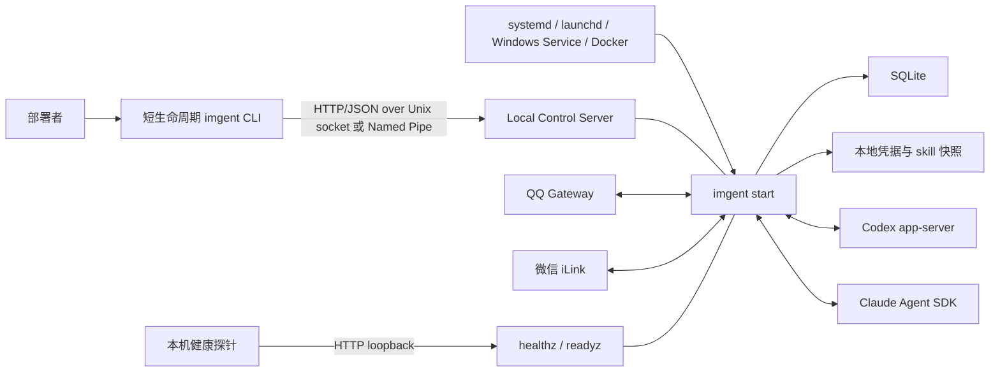
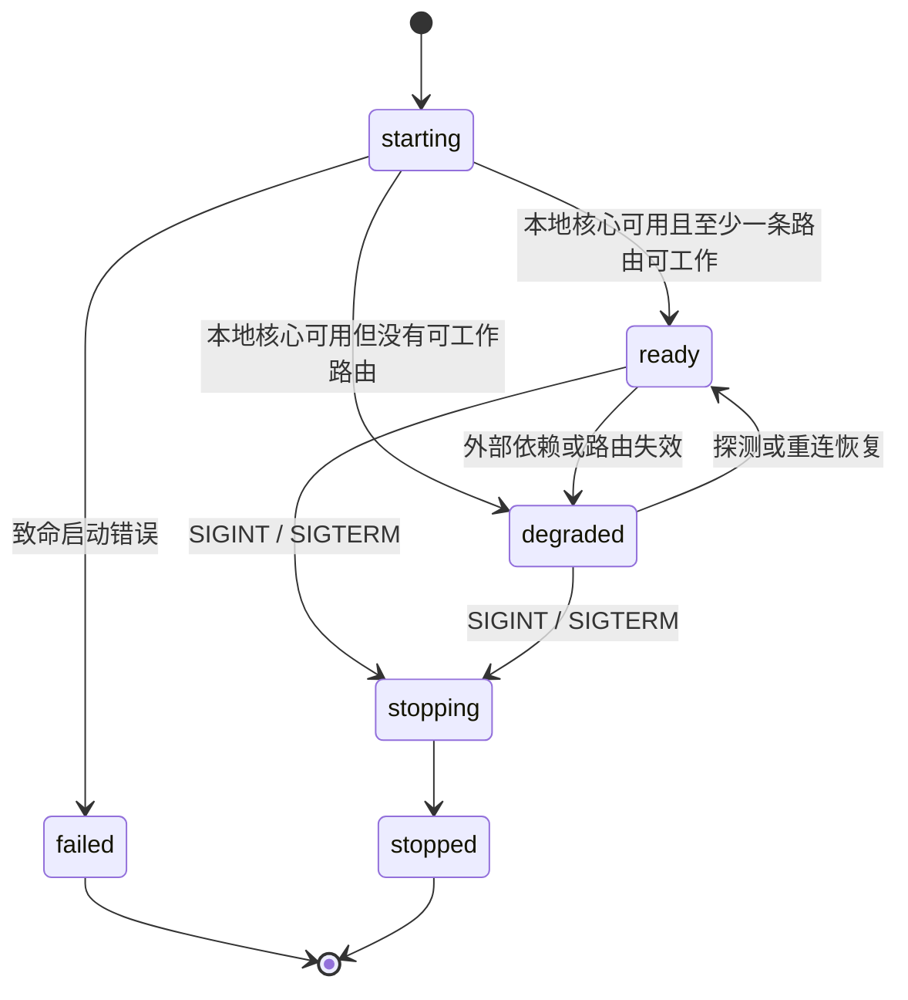
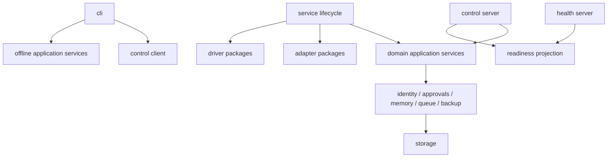

# IMGent CLI 与常驻服务架构

> 状态：v0.4 已实现架构基线
> 日期：2026-07-25
> 适用范围：v1 单机部署与 Docker 单容器
> 实现进度以 [implementation-status.md](implementation-status.md) 为准。

本文细化 [IMGent 产品设计与落地指南](imgent-product-design.md) 中的运行形态。
它定义进程模型、CLI 与服务的边界、本地控制面、状态所有权、落地项目结构和迁移
记录。文中的 v1 边界已在当前代码实现；未来能力仍以明确标注的“未来”或“非目标”
为准。

## 1. 架构决定

IMGent 保持一个 npm 根包、一个 `imgent` 可执行入口和一个部署单元，但包含两类
不同生命周期的进程：

- `imgent start` 是常驻服务入口，前台运行并持有全部在线状态。
- 其他 `imgent <command>` 是短生命周期 CLI；需要访问运行态时，通过受保护的
  本地控制面调用常驻服务。

v1 不增加 `imgentd` 二进制，不让 `imgent start` 自行后台化，也不开放公网管理
API。systemd、launchd、Windows Service 或 Docker 负责拉起、重启、日志收集和
停止进程。

一句话边界：

> CLI 表达部署者意图；常驻服务拥有运行中事实。

## 2. 当前实现与调整结果

当前实现已经完成 CLI 与常驻服务分层：

- `imgent start` 由 `IMGentService` 组装 Application、Control Server 与 Health
  Server，并等待退出信号；QQ 仍使用 Gateway WebSocket，微信仍使用 HTTP long
  polling。
- Control Server 在 Unix socket 或 Windows Named Pipe 上承载 `/v3` 管理协议；
  Health Server 在 loopback TCP 上只提供 `/healthz` 与 `/readyz`。
- `status`、在线 `doctor`、identity/group/skill 查询和在线备份通过 Control
  Client 查询同一 `instanceId`，不再创建第二个 Application。
- `pair`、`identity workspace set` 与 `group authorize` 在服务内执行；online
  route 不直接打开 SQLite。
- offline/online/dual capability 是显式命令矩阵。配置、凭据、skill 与恢复命令
  在活动实例存在时拒绝，dual 命令只有确认 endpoint 不存在才进入离线路径。
- Control endpoint 负责单实例互斥；CLI 可以区分 stopped、协议不兼容、实例不
  匹配和 endpoint 失联，config hash 差异则单独显示为 drift。

SQLite 支持多个连接并不等于允许多进程共享运行态。实现选择让服务成为唯一在线
owner；停服后的 dual/offline 命令才可使用受限本地数据路径。

## 3. 目标与非目标

### 3.1 目标

- 保持 `imgent` 单入口、单进程服务和单 SQLite 的部署简单性。
- 明确在线命令、离线命令和可双模式命令。
- 常驻服务运行时成为 SQLite、凭据、Adapter、Driver、队列和 skill 快照的唯一
  在线所有者。
- CLI 查询到真实的服务状态，而不是重新构造一套近似状态。
- 配置变更、备份、恢复和停服要求具有明确且可测试的行为。
- 本机控制接口默认不经过 TCP，不暴露到局域网或公网。
- 服务在外部依赖暂时不可用时仍能提供诊断，而不是所有 readiness 问题都导致
  进程退出。
- 为未来的 Web 管理界面或远程控制保留协议边界，但不在 v1 实现它们。

### 3.2 非目标

- 不拆出可独立发布或独立版本化的 `imgentd`。
- 不支持多节点、主从、远程 fleet 管理或多部署者并发管理。
- 不把本地控制面变成第三方插件 API。
- 不支持 CLI 绕过服务直接修改运行中的数据库。
- 不在 v1 实现任意配置热更新。
- 不由 IMGent 自己实现后台守护、PID 管理器或日志轮转器。

## 4. 进程与通信拓扑



这里存在两个不同的服务面：

1. **Control Server**：面向本机 CLI，承载管理操作，只监听本地 socket/pipe。
2. **Health Server**：面向 Docker、systemd 或监控探针，只监听配置的 loopback
   TCP 地址，只提供 liveness/readiness。

二者不能共用“开放一个 TCP 管理端口”的安全假设。未来如需远程管理，应另行设计
认证、授权、TLS、审计和版本兼容。

## 5. 服务生命周期

### 5.1 状态机



`ready` 和 `degraded` 都表示进程与本地核心正在运行；区别是是否至少有一条
BotInstance → AgentProfile 路由可以服务。`degraded` 不是崩溃态。

### 5.2 启动顺序

`imgent start` 按以下顺序执行：

1. 解析配置路径，严格校验配置和数据目录权限。
2. 绑定本地控制 endpoint，取得该数据目录的单实例所有权。
3. 写入本次实例元数据，状态为 `starting`。
4. 打开凭据与 SQLite，执行迁移和完整性检查。
5. 加载不可变的配置和 skill 启动快照。
6. 组装 Driver、Adapter、Scheduler、Outbound、Memory 和审批服务。
7. 启动 health server、队列恢复、定时维护和平台连接。
8. 根据路由 readiness 进入 `ready` 或 `degraded`。

控制面在本地数据库成功打开后即可返回启动进度；业务 mutation 只有在对应模块
完成初始化后才可接受。

### 5.3 致命与非致命错误

以下错误属于致命启动错误，进程退出并交给 supervisor：

- 配置语法或 schema 无效。
- 数据目录、控制 endpoint 或敏感文件权限不安全。
- 同一数据目录已有活动实例。
- Control Server 或 Health Server 无法绑定，或 Control Server 在运行中意外失效。
- 凭据主密钥不可读。
- SQLite 无法打开、迁移失败、完整性失败或必需的 FTS5 不可用。
- 内置 skill 包损坏，无法形成可信启动快照。

以下错误使服务进入 `degraded`，但控制面和 health server 保持可用：

- 没有可用的 Bot → Agent 路由。
- QQ/微信临时网络失败、限流或平台服务不可用。
- 平台凭据失效，需要部署者重新授权。
- Codex/Claude CLI 缺失、版本不兼容、未登录或临时不可用。
- 单个 Adapter、Driver 或 Profile 不可用。

`/healthz` 只回答进程和本地核心是否存活；`/readyz` 在 `degraded` 时返回 503 和
脱敏原因。这样部署者仍可执行 `imgent status`、`imgent doctor` 或修复操作。

### 5.4 停止顺序

收到 `SIGINT` 或 `SIGTERM` 后：

1. 状态切换为 `stopping`，停止接受新的管理 mutation。
2. 停止接收新的平台事件。
3. 等待有界时间让当前数据库事务和可安全完成的出站发送收口。
4. 停止 Scheduler、Curator、Adapter 和 Driver。
5. 关闭 health server、SQLite 和凭据句柄。
6. 关闭并清理控制 endpoint，状态成为 `stopped`。

第二次退出信号可以缩短等待，但仍应尽力关闭 SQLite 和移除本次实例的 endpoint。

## 6. CLI 命令模型

### 6.1 三类命令

| 类型     | 数据路径                               | 服务运行时行为         | 命令                                                                                                           |
| -------- | -------------------------------------- | ---------------------- | -------------------------------------------------------------------------------------------------------------- |
| 离线配置 | 直接读取/原子写入配置、凭据或 skills   | 明确拒绝，提示停止服务 | `init`、`profile add`、`bot add`、`bot authorize`、`skills init`、`restore`                                    |
| 在线管理 | 只通过本地控制面                       | 服务未运行时明确失败   | `pair`、`identity workspace set`、`group authorize`、`conversation list`、`schedule *`                         |
| 双模式   | 运行时走控制面；停服时使用受限离线路径 | 不做不透明降级         | `doctor`、`status`、`identity list`、`group list`、`memory status/list/show`、`skills list/validate`、`backup` |

双模式命令必须在输出中声明 `mode: "online" | "offline"`：

- online 返回常驻进程的实时状态。
- offline 只能返回持久化事实和本机环境探测，不得伪装成 Adapter/Driver 实时状态。
- offline `doctor` 可探测 Agent 命令/登录协议以及平台凭据是否齐备，但不会启动
  Adapter；输出以 `environmentReadiness` 和 `liveReadinessAvailable: false` 区分。
- CLI 已连接到 endpoint 但握手或请求失败时，不得自动回退成直接打开 SQLite。

`status` 在服务未运行时返回 `service.state = "stopped"`，可附带安全的持久化摘要，
但不得构造并启动第二套 Adapter 或 Driver。

`memory status/list/show` 是只读双模式命令。在线时由常驻服务查询其 SQLite
启动快照；停服时 CLI 取得 ownership lease 后打开数据库。列表使用
`(updatedAt, id)` 倒序的不透明游标，默认 50、最多 100 条，服务端必须重新
校验 scope/origin/status/limit/cursor，不能信任 Commander 的客户端校验。

### 6.2 命令路由算法

每个命令显式声明 `offline`、`online` 或 `dual` capability。CLI 执行时：

1. 从已解析的 `configPath` 得到 `dataDir` 和控制 endpoint。
2. 尝试 `GET /v3/meta` 握手。
3. 握手成功时，online/dual 命令走 Control Client；offline 命令返回
   `RUNTIME_SERVICE_MUST_STOP`。
4. endpoint 确认不存在时，offline/dual 命令走离线路径；online 命令返回
   `RUNTIME_SERVICE_NOT_RUNNING`。
5. endpoint 存在但握手超时、协议不兼容或实例不匹配时返回明确错误，不猜测状态。

进入离线路径前，CLI 会在同一 endpoint 上取得短生命周期 ownership lease，并在
命令退出时释放。服务把该 lease 视为实例冲突，因此“确认 stopped”与“打开
SQLite/credential store”之间不存在另一个 `imgent start` 抢占的 TOCTOU 窗口。
并发 CLI 看到 lease 时也不会把它误判为服务或回退访问数据。

磁盘配置 hash 与活动实例不一致表示 configuration drift，不等同于连接了错误实例。
只读 online 命令继续查询活动实例并显式返回 drift；offline 命令仍被拒绝。CLI
不能因为 drift 回退到离线数据库访问。

### 6.3 配置变更语义

v1 配置和用户 skills 是启动快照：

- `profile add`、`bot add`、`bot authorize`、`skills init` 只允许停服执行。
- 修改后下一次 `imgent start` 生效。
- v1 不实现自动文件监听或通用热重载。
- 未来的 `reload` 只能支持经过逐项定义的字段，不能等同于重新启动整个应用对象。

这比“CLI 写完文件，再提示可能需要重启”更严格，但能保证配置文件、运行内存和
实际连接始终对应同一个快照。

### 6.4 定时任务语义

计划是 SQLite 中的运行事实，因此创建、修改、暂停、恢复、删除、立即运行与历史
查询都是 online 命令。CLI 先通过 `conversation list` 选择已发现的
ConversationSpace；服务再按当前 Adapter 的
`capabilities.supportsProactiveSend` 校验是否能在没有近期入站消息时投递。

常驻 `SchedulePlanner` 每秒查询到期索引，并在单个事务中推进计划和创建
schedule run/task。幂等键为 `scheduleId + scheduledFor`。服务停机错过多个 cron
时间点时只产生一次 catch-up；前一轮仍未终结时跳过本轮并累计计数，不形成补跑
队列。

名称、prompt 或上下文模式等元数据更新保持计划当前状态；只有显式修改执行时间或
执行 `resume` 才会重新激活计划。`remove` 使用软删除，计划不再触发或出现在列表
中，但 `history` 仍可按原 ID 查询既有运行和投递记录。

计划 task 明确拆分三个 key：

- `conversationKey`：目标 IM、Principal、审批、记忆和聊天取消的边界。
- `executionKey`：计划自己的 FIFO/互斥边界，不阻塞目标会话中的普通聊天。
- `sessionKey`：`fresh` 不设置并以 ephemeral turn 执行；`series` 使用
  `schedule:<id>`，永不隐式复用普通聊天 session。

计划结果、审批和 Agent 问题不携带 `replyTo` 或 `replyContext`，统一走 proactive
send。调度、能力检查、幂等与上下文隔离均由宿主保证，不新增内置 skill。

## 7. 本地控制面

### 7.1 Transport

- 每个实例用“规范化 dataDir + 操作系统用户”生成稳定 `instanceKey`。
- Linux/macOS：固定使用
  `/tmp/imgent-<uid>/<instanceKey>.sock`，不读取 `XDG_RUNTIME_DIR` 或调用进程的临时
  目录环境变量；resolver 必须校验平台 socket 路径长度。
- UID 专属父目录权限为 `0700`；普通文件、符号链接或 owner/mode 不符时拒绝使用。
- Windows：用户范围 Named Pipe，名称包含当前用户 SID 派生值与 `instanceKey`。
- Unix socket 权限为 `0600`，父目录权限为 `0700`。
- Windows 发布基线要求 Named Pipe ACL 只允许运行 IMGent 的操作系统用户和显式
  授予的管理员；当前 Node transport 不接受显式 ACL 参数，因此必须由对应部署
  账户与 Windows 平台 smoke 共同验证，未通过时不视为受支持部署。
- TCP 管理监听默认不存在，也不能通过 `server.host` 间接开启。

控制 endpoint 的绑定是单实例与数据 owner 主锁：常驻服务长期持有，离线命令只在
执行本地数据操作期间短暂持有 lease。服务绑定前先探测 endpoint：

- 任意活动监听者能够接受连接：视为已有服务或 ownership lease，启动失败且不删除
  endpoint；CLI 另通过 `/v3/meta` 区分真实服务和不可达控制面。
- 无活动监听者：只有确认是当前用户拥有的 socket 特殊文件时，才可清理 stale
  endpoint。
- 普通文件、符号链接、其他用户拥有的路径一律拒绝删除。

`<dataDir>/run/instance.json` 只用于发现和诊断，不作为唯一锁。它以 `0600` 保存
resolver 得到的 endpoint：

```json
{
  "instanceId": "uuid",
  "pid": 1234,
  "startedAt": "2026-07-24T00:00:00.000Z",
  "appVersion": "0.1.0",
  "protocolVersion": 2,
  "instanceKey": "stable-hash",
  "endpoint": "<redacted-runtime-endpoint>",
  "configPath": "<redacted-or-relative>",
  "configHash": "sha256"
}
```

`configHash` 来自严格校验后、排除 secret 的规范化配置，而不是原始 JSON 字节；
空白和 key 顺序变化不产生 drift。CLI 不只依赖 PID 判断实例是否存活，避免 stale
PID 和 PID 重用。

### 7.2 协议

控制面使用 HTTP/1.1 + JSON，原因是：

- Node.js 原生 HTTP 模块和测试工具可以直接复用。
- Unix socket 与 Named Pipe 都能承载 HTTP。
- 路由、状态码、超时和请求体上限容易审计。
- 将来可以为 Web UI 复用 application service，但不承诺直接暴露相同 transport。

所有路径带协议版本 `/v3`。握手响应至少包含：

```json
{
  "ok": true,
  "data": {
    "protocolVersion": 2,
    "appVersion": "0.1.0",
    "instanceId": "uuid",
    "state": "ready",
    "startedAt": "2026-07-24T00:00:00.000Z",
    "configHash": "sha256"
  }
}
```

控制面错误返回稳定 `ErrorDescriptor`，不返回本地化文本、cause、stack、SQL、
完整路径、消息正文或平台原始响应。CLI 负责按 `--locale` 渲染文本并映射现有
退出码。CLI 的公开 `--json` envelope 保持：

```json
{
  "ok": false,
  "locale": "zh-CN",
  "error": {
    "code": "RUNTIME_SERVICE_NOT_RUNNING",
    "message": "...",
    "action": "...",
    "retry": {},
    "incidentId": "..."
  }
}
```

新增控制面错误遵守现有 `DOMAIN_SUBJECT_REASON` 命名：

| ErrorCode                              | 语义                          |
| -------------------------------------- | ----------------------------- |
| `RUNTIME_SERVICE_NOT_RUNNING`          | online 命令没有发现活动实例   |
| `RUNTIME_SERVICE_MUST_STOP`            | 活动实例阻止 offline 命令     |
| `RUNTIME_CONTROL_UNREACHABLE`          | endpoint 存在但无法完成握手   |
| `RUNTIME_CONTROL_PROTOCOL_UNSUPPORTED` | CLI 与服务协议版本不兼容      |
| `RUNTIME_INSTANCE_CONFLICT`            | 同一 dataDir 已有活动实例     |
| `RUNTIME_INSTANCE_MISMATCH`            | endpoint 不属于请求的 dataDir |
| `MEMORY_RECORD_NOT_FOUND`              | 审计目标记忆不存在            |

服务端和 CLI 都要设置请求体上限、响应超时和每次请求的 `requestId`。CLI 不自动
重试 mutation；需要重试的 mutation 必须先在业务层定义幂等键或幂等终态。

### 7.3 v3 路由

| Method | Path                         | 用途                                     |
| ------ | ---------------------------- | ---------------------------------------- |
| `GET`  | `/v3/meta`                   | 握手、版本与实例身份                     |
| `GET`  | `/v3/status`                 | 运行状态与缓存的 runtime readiness       |
| `GET`  | `/v3/readiness`              | 缓存的 runtime readiness 快照            |
| `POST` | `/v3/diagnostics`            | 显式执行平台、账号和模型深度探测         |
| `GET`  | `/v3/identities`             | 身份映射列表                             |
| `POST` | `/v3/pairings/:code/confirm` | 消费一次性配对码                         |
| `GET`  | `/v3/groups`                 | QQ 群空间和授权状态                      |
| `POST` | `/v3/groups/:id/authorize`   | 由指定 Principal 授权群                  |
| `GET`  | `/v3/conversations`          | 可主动投递的会话与 Principal             |
| `GET`  | `/v3/memory-records`         | 过滤和游标分页的本机记忆审计列表         |
| `GET`  | `/v3/memory-records/:id`     | 单条记忆正文、生命周期与来源             |
| `GET`  | `/v3/memory-curation-status` | 记忆计数、outbox 与最近整理结果          |
| `GET`  | `/v3/schedules`              | 计划列表                                 |
| `POST` | `/v3/schedules`              | 创建计划                                 |
| `GET`  | `/v3/schedules/:id/history`  | 计划运行历史                             |
| `POST` | `/v3/schedules/:id/:action`  | 更新、暂停、恢复、删除、运行或重置上下文 |
| `GET`  | `/v3/skills`                 | 当前活动的 skill 启动快照                |
| `POST` | `/v3/skills/validate`        | 在服务 owner 内校验磁盘与 Profile 引用   |
| `POST` | `/v3/backups`                | 由服务创建一致性备份                     |

`reload`、`shutdown`、实时日志、任务取消和 dead-letter 管理只有在明确产品语义与
权限后再增加；它们不是为了显得“像完整 API”而预留空路由。

### 7.4 健康接口

健康接口继续使用配置中的 loopback TCP 地址：

- `GET /healthz`：只返回进程、本地核心和生命周期状态。
- `GET /readyz`：只投影最近一次 runtime readiness；失败时为 503，不触发外部
  网络、账号或模型请求。

它们不能执行 mutation，不能返回身份、队列明细、配置、平台 ID 或本机路径。
`imgent status` 使用控制面并同样读取缓存快照；只有 `imgent doctor` 通过
`POST /v3/diagnostics` 主动执行深度探测。

## 8. 状态与数据所有权

### 8.1 所有权矩阵

| 资源                    | 服务运行时所有者       | 停服时允许的 CLI           |
| ----------------------- | ---------------------- | -------------------------- |
| 配置文件                | 不可变启动快照         | 配置命令原子写入           |
| SQLite                  | 常驻服务唯一在线访问者 | offline/dual 命令受限访问  |
| credential store        | 常驻服务               | 授权和恢复命令             |
| Adapter/Driver 连接     | 常驻服务               | 不允许构造伪实时状态       |
| Scheduler/审批/出站状态 | 常驻服务               | 只读维护工具需显式设计     |
| memory records/outbox   | 常驻服务               | `memory status/list/show`  |
| skill registry          | 常驻服务启动快照       | `skills init/validate`     |
| 控制 endpoint           | 当前常驻实例           | CLI 连接；离线操作短暂租用 |
| health TCP endpoint     | 当前常驻实例           | CLI 不监听                 |

在线时不允许 CLI 直接打开 SQLite，即使操作是只读。这样保证查询与 mutation 都
经过同一 application service、权限检查、审计和事务边界。

### 8.2 配置与数据库的职责

配置文件保存部署拓扑和静态策略：

- AgentProfile、BotInstance、Route。
- 工作区与权限上限。
- 非敏感平台标识和 credential reference。
- health server 地址。

SQLite 保存运行事实：

- 身份、配对、群授权和审计。
- 会话、任务、审批、outbound 和 dead letter。
- checkpoint、记忆、FTS 与清理状态。

不要同时把同一个可变字段的“真实值”放在配置和 SQLite。若历史实现已有重复，
迁移时必须选定权威来源并一次性收敛。

### 8.3 备份与恢复

`imgent backup` 是双模式命令：

- 服务在线：通过 `/v3/backups` 请求服务执行 SQLite backup，并在同一配置快照下
  收集配置、凭据和用户 skills。
- 服务离线：CLI 可以直接执行同一 backup application service。

两种模式都生成 `imgent-backup/v2` archive、manifest 和校验和；backup v1
明确拒绝恢复。CLI 不在控制请求中传递任意
服务端输出路径；默认由服务写入数据目录下的受控临时文件，再通过安全的文件移动或
流式响应交付到 CLI 指定位置。当前 `/v3/backups` 只返回受控 artifact 名称和
统计，不返回服务端绝对路径；CLI 在已知 backup 目录内解析、校验 owner/mode 后
复制并原子落到目标路径。

`restore` 始终要求目标实例停止，并验证目标目录、控制 endpoint、manifest、
schema version、权限和 SQLite integrity。当前 schema v7 只允许空数据目录初始化；
其他版本保持不变并返回 `STORAGE_SCHEMA_UNSUPPORTED`。`--force` 不能绕过活动实例检查。

## 9. 安全边界

- 控制面信任来自操作系统文件权限，不信任 loopback TCP 即等同于本机部署者。
- Unix socket 和 Named Pipe 的身份必须映射到部署者权限；未来多管理员场景需要
  单独的授权模型。
- 控制请求只接受 JSON，严格 schema 校验，拒绝未知字段。
- pairing/group mutation 继续写领域审计；Control Server 另以脱敏结构化日志记录
  requestId、路由模板、结果和失败 incidentId。
- 控制面不接收 Agent OAuth token，也不代理 Codex app-server 或 Claude SDK wire
  message。
- 配置路径、workspace、SQL、平台 token、replyContext 和完整消息正文不出现在
  默认控制响应。
- 记忆审计路由是上述默认摘要规则的显式例外：它可以向同一操作系统部署用户返回
  记忆正文和来源 task/message ID，但不能返回平台原始用户 ID、replyContext、
  凭据或厂商 wire 数据。
- health server 和控制 server 使用不同路由注册与不同响应 DTO，避免未来误把管理
  路由暴露到 TCP。

## 10. 落地项目结构

仍保持一个根包，不为了目录整洁拆出新的 workspace package：

```text
imgent/
├─ package.json
├─ pnpm-workspace.yaml
├─ src/
│  ├─ cli/
│  │  ├─ command-capability.ts
│  │  ├─ control-client.ts
│  │  ├─ main.ts
│  │  ├─ program.ts
│  │  └─ presentation.ts
│  ├─ service/
│  │  ├─ admin-queries.ts
│  │  ├─ admin-service.ts
│  │  ├─ application.ts
│  │  ├─ instance.ts
│  │  ├─ lifecycle.ts
│  │  ├─ offline-admin-service.ts
│  │  ├─ offline-lease.ts
│  │  └─ readiness.ts
│  ├─ control/
│  │  ├─ protocol.ts
│  │  └─ server.ts
│  ├─ health/
│  │  └─ server.ts
│  ├─ runtime/
│  │  ├─ host-tools.ts
│  │  ├─ logger.ts
│  │  └─ outbound.ts
│  ├─ config/
│  ├─ storage/
│  │  ├─ database.ts
│  │  ├─ media.ts
│  │  ├─ migrations.ts
│  │  └─ store.ts
│  ├─ queue/
│  ├─ schedule/
│  ├─ identity/
│  ├─ approvals/
│  ├─ memory/
│  ├─ skills/
│  ├─ security/
│  └─ backup/
├─ packages/
│  ├─ contracts/
│  ├─ im-adapters/
│  └─ agent-drivers/
├─ tests/
└─ docs/
```

目录职责：

- `cli/` 只负责参数解析、command capability、Control Client、离线入口和输出。
  `main.ts` 只保留可执行入口，命令注册集中在 `program.ts`；出现独立演进需求时
  再按 capability 拆文件，不预建 command context 抽象。
- `service/` 负责进程生命周期、依赖组装、状态机、readiness 聚合和在线/离线管理
  application service；两种管理入口复用 `admin-queries.ts` 的只读查询。
- `control/` 负责本地协议、transport 和薄路由，不含业务 SQL。v2 路由数量有限，
  因此集中在一个 server 模块中。
- `health/` 只用 `node:http` 投影无副作用的 health/readiness 缓存。
- `storage/` 中 `database.ts` 管打开和 schema 校验，`media.ts` 管保留清理，
  `store.ts` 保留事务性领域操作；不增加 repository interface 层。
- `runtime/` 保存消息运行期通用能力，不再同时承担进程组装和管理 server。
- 领域目录负责业务规则；在线/离线管理入口都位于 service 层，并复用相同领域与
  backup service，不把 SQL 放进 control route。
- `packages/contracts` 继续只保存跨 workspace 的 IM/Agent 领域协议；本机控制协议
  不作为外部包发布，先留在根包 `src/control/protocol.ts`。

### 10.1 依赖方向



禁止的依赖：

- Control route 直接拼 SQL。
- CLI online command 直接 import `IMGentStore`。
- Domain service import Commander、Node HTTP request/response 或终端输出。
- Adapter/Driver package import 根包 control protocol。
- Health route 复用带敏感字段的 status DTO。

## 11. 部署模型

### 11.1 本机服务

- `imgent start` 始终前台运行。
- systemd/launchd/Windows Service 配置 restart policy、工作目录、环境变量和日志。
- CLI 由同一部署用户运行，通过本地 endpoint 管理服务。
- 不提供 `imgent start --daemon`。

### 11.2 Docker

- 容器主进程仍为 `imgent start`。
- control socket 位于容器 runtime namespace；宿主通常只使用 health probe，不
  默认挂载 control socket。
- 需要在容器内执行 CLI 管理时，使用同一容器 namespace 和部署用户。
- Compose 只暴露 health 端口；不得映射 control endpoint 为公网 TCP。

### 11.3 构建与发行

- 仓库由 pnpm workspace 管理，TypeScript project references 通过 `tsc -b`
  做类型检查、测试编译并为 workspace 产出 ESM JavaScript。
- npm 发布前由 esbuild 将内部 `@imgent/*` workspace 包合并到
  `dist/src/cli/main.js`；第三方运行时依赖保持 external，由 npm 正常安装。
- `package.json#bin`、`pnpm imgent` 和 `pnpm start` 最终都进入同一个 CLI
  composition root；是否常驻由命令决定，不由构建产物决定。
- CLI/Service 的代码分层不会生成两套 npm 包或两个二进制。Docker 与本机安装也
  复用同一个产物，外部 supervisor 只改变进程托管方式。

esbuild 只收敛 npm 发布边界，不改变运行时模块边界。只有出现跨平台原生可执行
文件等明确需求时，才评估 SEA 或安装器。

### 11.4 未来拆分条件

只有出现以下事实之一，才评估 `imgent` / `imgentd` 独立发行：

- CLI 需要从另一台机器管理服务。
- daemon 需要显著更高或不同的操作系统权限。
- CLI 与服务需要独立升级周期。
- 多实例/fleet 管理成为正式产品目标。
- 桌面 GUI 需要独立管理后台组件。

拆分二进制不应改变 control protocol 和状态所有权，因此属于部署演进，而不是领域
架构重写。

## 12. 实施记录

以下四个阶段均已完成；保留顺序用于解释依赖关系和后续回归范围。

### 阶段 A（已完成）：生命周期与控制面骨架

- 引入 `service/lifecycle`、状态机和实例元数据。
- 拆分 health server 与 control server。
- 实现 Unix socket/Named Pipe endpoint、`GET /v3/meta` 和单实例保护。
- 先建立协议、权限与单实例测试，再迁移命令。

完成标准：第二个 `imgent start` 被可靠拒绝；CLI 可以区分 starting、ready、
degraded、stopping、stopped 和协议不兼容。

### 阶段 B（已完成）：只读在线命令

- 将 `status`、在线 `doctor`、`identity list`、`group list` 和 skill 启动快照查询
  迁移到控制面。
- 停止通过 `IMGentApplication.create()` 构造第二套运行状态。
- 输出显式标记 online/offline mode。

完成标准：服务运行时执行这些命令不会由 CLI 打开 SQLite、Adapter 或 Driver。

### 阶段 C（已完成）：在线 mutation 与数据所有权

- 将 `pair`、`identity workspace set`、`group authorize` 迁移到 control
  application service。
- online mutation 写审计并具备幂等终态。
- offline 配置命令在活动实例存在时明确拒绝。
- 移除 online command 对 `openAdminContext()` 的依赖。

完成标准：服务运行期间只有常驻进程访问 SQLite 和 credential store。

### 阶段 D（已完成）：备份、退化运行与目录收敛

- online backup 通过控制面协调，restore 强制停服。
- 将外部依赖失败从“统一启动失败”拆成 fatal/degraded。
- 按目标目录移动 composition、control 和 health 代码。
- 删除过渡 adapter 和重复状态投影。

完成标准：外部平台或 Agent 不可用时，服务仍可被诊断；备份/恢复和项目结构符合
本文边界。

## 13. 测试与验收

### 13.1 自动化测试

- Control protocol 版本不兼容、实例不匹配、endpoint 失联和“不得离线回退”。
- Unix socket 与 instance metadata 的权限、同一 dataDir 单实例和当前用户 stale
  socket 安全处理，以及 service/CLI 的 `XDG_RUNTIME_DIR` 不同时 endpoint 仍一致。
- canonical config hash drift；drift 不影响只读 online 查询。
- offline/online/dual 代表命令、online pairing/group mutation 和 offline mutation
  拒绝。
- 外部 Adapter 认证失败进入 degraded；本地 health 绑定失败是 fatal 且清理
  control endpoint。
- POSIX dataDir owner/mode 不安全时以本地 storage fatal 拒绝启动。
- health DTO 与 control status DTO 分离。
- 真实 SIGTERM 有序关闭、endpoint 清理、停服 status。
- 在线/离线 backup 生成同格式 archive；运行中 restore（包括 `--force`）被拒绝，
  停服后 restore 通过完整性校验。

Windows Named Pipe 的实际 ACL 与 Windows Service 身份属于对应平台发布前 smoke；
Linux CI 只验证跨平台名称派生逻辑，不能替代 Windows ACL 验证。未完成该 smoke
时只能确认代码路径存在，不能宣称 Windows 权限边界已验收。

### 13.2 两进程验收

当前真实子进程测试包含：

1. 启动 `imgent start`，等待 `/v3/meta`。
2. 在第二进程执行 online `status`，并验证 lifecycle 与 readiness。
3. 验证第二个 `start` 被拒绝，所有 online 输出携带同一 `instanceId`。
4. 执行 pairing 和 group authorization mutation，并验证服务内数据库事实。
5. 验证离线配置和 restore 命令被拒绝。
6. 发送 SIGTERM，确认任务收口、SQLite 关闭和 endpoint 清理。
7. 对 online/offline backup 和停服 restore 做 archive 与权限验收。

### 13.3 v1 架构验收

- 用户仍只需安装并理解一个 `imgent` 命令。
- `imgent start` 是唯一常驻业务进程。
- supervisor 管理生命周期，IMGent 不自行后台化。
- 服务运行时，CLI 只读取磁盘配置以派生 endpoint 和 config hash；不直接访问
  SQLite/credential store，也不修改运行中配置。
- 管理 mutation 只能通过受保护的本地控制面。
- health TCP 表面没有管理能力。
- 配置变更和 restore 具有明确停服要求。
- config hash 不一致作为 configuration drift 显示，不把活动实例误判为 stopped。
- 实现状态文档与本架构基线保持一致。

## 14. 关键取舍

| 取舍       | 选择                                   | 代价                           |
| ---------- | -------------------------------------- | ------------------------------ |
| 发行物     | 一个 `imgent` 入口                     | CLI 与服务仍需在代码内严格分层 |
| 服务进程   | 单进程、单 SQLite                      | 不支持水平扩展                 |
| 在线管理   | 本地 socket/pipe 控制面                | 增加协议和两进程测试           |
| TCP        | 只保留 health/readiness                | 远程管理需另行设计             |
| 配置       | v1 启动快照，变更要求停服              | 暂无通用热更新                 |
| 数据所有权 | 服务是唯一在线 owner                   | CLI 需要 online/offline 路由   |
| 后台化     | 交给操作系统或容器 supervisor          | 本机安装需提供 service 示例    |
| 目录       | 根包内新增 service/control/health 边界 | 根包模块数量增加               |

该方案优先解决当前已经存在的状态边界问题，不提前引入远程控制、Web UI、多节点或
独立 daemon 发行物。
