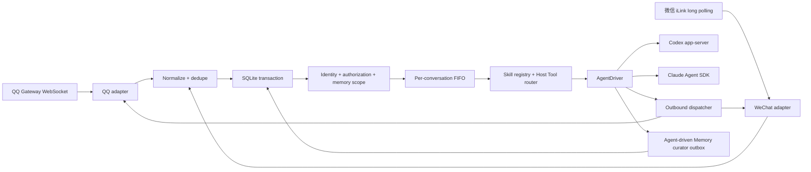

# IMGent产品设计与落地指南

> 状态：v0.2 设计基线
> 最后核验：2026-07-23
> 本文同时定义产品边界、架构约束、核心接口、数据模型和 v1 验收标准。

配套事实手册：

- [IM 平台接口事实手册](references/im-platform-apis.md)
- [Agent 驱动协议事实手册](references/agent-driver-protocols.md)

## 1. 产品概述

IMGent 是一个自托管的消息 Agent 框架。它把 QQ 官方机器人和微信 iLink 中的消息可靠地交给部署者本机已经登录的 Codex 或 Claude Code，再把结果送回原会话。

产品面向个人开发者和由单一部署者管理的小团队。部署者不需要为 v1 的本地 Agent 驱动配置模型 API Key，也不需要把会话和长期记忆交给额外的云端记忆服务。IMGent 负责平台连接、身份映射、消息顺序、权限审批、会话恢复和长期记忆；本地 Agent 负责理解消息、执行任务和生成回答。

### 1.1 要解决的问题

- 不同 IM 平台的事件、身份、群聊能力和回复约束各不相同。
- Agent 任务可能持续数分钟，平台的被动回复窗口可能在任务完成前过期。
- 连续消息、重复投递、断线重连和进程重启容易导致重复执行或串话。
- 群 ID、平台用户 ID、群成员 ID 和昵称混用会让记忆归属到错误的人。
- 私聊记忆、群共享记忆和群成员档案没有明确边界时会发生隐私泄漏。
- Codex app-server 与 Claude Code Agent SDK 的协议和审批方式不同，不能假装它们共享一个 wire protocol。
- “Agent 回复成功”不等于工具调用、记忆写入或平台发送成功。

### 1.2 产品目标

- v1 正式支持 QQ 官方机器人的私聊与群聊。
- v1 正式支持微信 iLink 的个人助手式私聊。
- IM 侧只接入平台官方机器人能力；QQ 使用机器人应用凭据，微信使用用户扫码授予的 iLink Bot 凭据。
- v1 正式支持 Codex 和 Claude Code 两种本地 Agent 驱动。
- 所有平台复用同一套队列、身份、记忆和权限语义。
- 私聊与群聊默认严格隔离；跨平台身份只允许人工绑定。
- 每条可执行消息至少执行一次，但危险操作和业务结果不因重试而无提示重复。
- 明确记忆请求只有在持久化成功后才能回复“已记住”。
- 单机部署保持简单：一个进程、一个 SQLite 数据库、一个数据目录。

### 1.3 v1 非目标

- 不实现飞书和 Telegram 适配器。
- 不创建飞书、Telegram 的空包、配置占位或运行时开关。
- 不实现频道、公众号、视频号或企业微信。
- 不登录、托管或模拟个人 QQ / 微信客户端账号；微信 QR 仅用于授权 iLink Bot。
- 不将微信 wire type 中的 `group_id` 当作已支持群聊。
- 不提供动态第三方适配器市场或运行时插件加载系统。
- 不实现多节点调度、分布式队列或数据库集群。
- 不自动用昵称、手机号或内容猜测跨平台同一人。
- 不默认监听或保存 QQ 群全部消息。
- 不提供云端记忆服务、向量数据库或外部 embedding API。
- 不代管 Codex / Claude Code 登录，也不导出或转发它们的认证凭据。
- 不保证每种 IM 原生富交互组件都有统一映射；无原生组件时回退为文本。

## 2. 支持范围与平台能力

| 平台           | 阶段   | 私聊 | 群聊                   | v1 接入与记忆规则                                                |
| -------------- | ------ | ---- | ---------------------- | ---------------------------------------------------------------- |
| QQ 官方机器人  | v1     | 支持 | 支持                   | Gateway WebSocket；群聊默认仅处理触发消息，管理员可开启全量采集  |
| 微信 iLink     | v1     | 支持 | 当前官方插件路径不支持 | QR 授权、长轮询、依赖 `context_token` 回复，只创建私聊和个人记忆 |
| 飞书应用机器人 | 待扩展 | 支持 | 支持                   | 仅保留事实、数据模型和线程兼容性，不出现在 v1 配置与验收中       |
| Telegram Bot   | 待扩展 | 支持 | 支持                   | 仅保留 privacy mode、supergroup 和 topic/thread 兼容性           |

平台能力以 [IM 平台接口事实手册](references/im-platform-apis.md) 为依据。平台文档或权限发生变化时，先更新事实手册，再调整本指南和实现。

### 2.1 QQ 群聊采集模式

每个 QQ 群保存独立的采集模式：

- `triggered`：默认值。只处理 @机器人、回复机器人、显式命令和已激活连续会话中的消息。
- `full`：处理群内全部可见消息，但普通消息只进入群上下文和异步记忆策展，不主动触发机器人回复。

切换为 `full` 必须同时满足：

1. 发起者已经配对并被 AgentProfile 授权。
2. QQ 事件中可验证发起者为群主或管理员。
3. 当前 QQ BotInstance 拥有并实际收到全量群消息事件。
4. 群内显示采集范围、默认原文保留期和关闭方式。
5. 切换操作写入审计日志。

角色或权限无法验证时拒绝切换。开启前的消息不回填；关闭后立即停止持久化新的普通群消息。

`full` 模式下未触发机器人的普通群消息原文默认保留 7 天，到期删除。被策展为 `group_shared` 的确认记忆继续按记忆纠正和删除规则保留。

### 2.2 微信能力边界

微信 iLink v1 是“经微信用户扫码授权的机器人与联系人直接对话”，不是个人微信客户端登录，也不是群机器人：

- 一次 QR 流程会取得 `ilink_bot_id`、授权扫码者 `ilink_user_id` 和 bot token；产品分别映射为 `platformBotId`、`authorizingPlatformUserId` 和本地凭据，不能混成“登录的个人账号”。
- 一个微信 BotInstance 可以服务多个联系人，但每个联系人建立独立 conversationKey 和 Agent session。
- 当前官方插件实现显式将入站 peer 固定为 direct，并以 `isGroup: false` 处理；可选 `group_id` 只是协议保留字段，不能视为群聊能力。
- 任何疑似群消息都不得创建群 ConversationSpace、群成员关系或群记忆。
- 回复必须携带入站消息的 `context_token`，因此 v1 不承诺无近期上下文的主动推送。

## 3. 用户、边界与核心场景

### 3.1 角色

#### 部署者

- 安装和运行 IMGent。
- 登录本地 Codex / Claude Code。
- 配置 AgentProfile、工作区和权限上限。
- 配置 QQ 机器人应用并完成微信 iLink Bot 的 QR 授权。
- 负责备份、升级、审计和凭据安全。

#### 配对管理员

- 由部署者授权。
- 可以批准用户或群使用某个 AgentProfile。
- 在 QQ 群中还必须是平台可验证的群主或管理员，才能切换全量采集。

#### 普通用户

- 通过已授权的私聊或 QQ 群使用 Agent。
- 可以管理自己的私聊记忆。
- 无权读取他人的私聊记忆、其他群记忆或部署凭据。

### 3.2 私聊

用户直接向机器人发送任务。系统解析平台身份，在当前 AgentProfile 下映射到 Principal，加载该用户允许的私聊记忆和会话摘要，再调用本地 Agent。

如果 QQ 与微信身份经过人工绑定，两端可以召回同一 Principal 的个人记忆，但各自保持独立 Agent session。

### 3.3 QQ 群聊

`triggered` 模式下，成员通过 @机器人、回复机器人或命令发起对话。群内每条消息保留真实发言者身份、群成员 ID、角色、mentions 和引用关系。

系统加载：

- 当前群的共享记忆。
- 当前发言者在该群的成员档案。
- 当前群或线程的最近会话摘要。

系统绝不加载任何成员的私聊记忆。

`full` 模式下，普通群消息可以补充群上下文和候选群记忆，但不会让群成员获得新的工具权限，也不会改变私聊隔离。

### 3.4 连续任务

一个会话中已有 active turn 时，新消息进入 FIFO 队列。用户可以等待、继续补充信息或取消当前任务。跨会话可以并发，同一会话不并发执行两个 turn。

### 3.5 聊天内审批

Agent 请求高风险工具时，系统把工具名、目标、影响和一次性审批按钮或文本命令发回原会话。审批只能由原请求对应的已授权 Principal 完成。

### 3.6 跨平台身份绑定

用户在两个私聊端分别取得短期绑定码，部署者或已授权管理员确认后建立绑定。系统不根据昵称自动合并身份。

## 4. 运行形态与产品命令

### 4.1 运行形态

v1 支持：

- 本机常驻进程。
- Docker 单容器部署。

两种方式都运行同一个 Node.js 进程并使用一个本地 SQLite 文件。Docker 需要挂载：

- IMGent 数据目录。
- 目标工作区。
- 部署者明确允许使用的 Codex / Claude Code 配置目录。

容器不应把 app-server、SQLite 或健康检查以外的管理接口暴露到公网。

### 4.2 CLI

```text
imgent init
imgent bot add qq
imgent bot add wechat-ilink
imgent bot authorize wechat-ilink <bot-instance>
imgent profile add
imgent pair
imgent doctor
imgent --locale en-US status
imgent --json doctor
imgent start
imgent status
imgent backup
imgent restore <file>
```

- `init` 创建最小配置和数据目录。
- `bot add` 写入不含 secret 的 BotInstance 配置。
- 微信 `bot authorize` 在终端显示 QR 授权流程，将 bot token 写入本地凭据存储，并记录返回的 `ilink_bot_id` 与授权扫码者 `ilink_user_id`。
- `profile add` 选择 Codex 或 Claude Code、工作区和权限上限。
- `skills list`、`skills validate` 与 `skills init` 只在本机查看、校验和创建
  IMGent 托管技能。
- `doctor` 检查 Node.js、SQLite、Agent CLI、登录态、平台权限和工作目录。
- `start` 先运行最小 readiness 检查，再启动机器人实例和队列。

### 4.3 配置示例

```json
{
  "version": 1,
  "defaultLocale": "zh-CN",
  "dataDir": "./data",
  "server": {
    "host": "127.0.0.1",
    "port": 8787
  },
  "agentProfiles": [
    {
      "id": "main",
      "driver": "codex",
      "command": "codex",
      "workspace": "D:/Developments/agent-workspace",
      "skills": ["*"],
      "permissions": {
        "maxMode": "ask"
      },
      "memory": {
        "enabled": true
      }
    },
    {
      "id": "claude",
      "driver": "claude-code",
      "command": "claude",
      "workspace": "D:/Developments/agent-workspace",
      "skills": ["project-conventions"],
      "permissions": {
        "maxMode": "ask"
      },
      "memory": {
        "enabled": true
      }
    }
  ],
  "bots": [
    {
      "id": "qq-main",
      "adapter": "qq",
      "transport": "websocket",
      "platformBotIdEnv": "IMGENT_QQ_APP_ID",
      "credentialRef": "qq-main",
      "locale": "zh-CN",
      "groupIngestionDefault": "triggered"
    },
    {
      "id": "wechat-main",
      "adapter": "wechat-ilink",
      "credentialRef": "wechat-main"
    }
  ],
  "routes": [
    {
      "botInstanceId": "qq-main",
      "agentProfileId": "main"
    },
    {
      "botInstanceId": "wechat-main",
      "agentProfileId": "claude"
    }
  ]
}
```

配置规则：

- 配置文件不包含 QQ AppSecret、微信 bot token 或 Agent OAuth token。
- secret 从环境变量或本地凭据存储读取。
- `BotInstance.id` 是本地稳定命名空间；`platformBotId` 是平台分配的机器人标识，例如 QQ AppID 或微信 `ilink_bot_id`。
- 微信 QR 授权返回的 `authorizingPlatformUserId` 只记录授权关系，不是 BotInstance ID，也不能代替消息发送者的 `platformUserId`。
- 一个 BotInstance 只使用一个入站 Transport。
- 一个 BotInstance 明确路由到一个 AgentProfile。
- `defaultLocale` 和可选的 `BotInstance.locale` 只接受 `zh-CN`、`en-US`。
- `AgentProfile.skills` 使用与 Driver 无关的 IMGent skill 名称；缺省为
  `["*"]`，同一配置语义适用于 Codex 与 Claude Code。
- 未实现的 `feishu`、`telegram` adapter 值在配置解析阶段直接报错。
- 启动时拒绝未知字段和无效组合，不静默猜测。

## 5. 技术选型与仓库结构

### 5.1 技术选型

| 项目           | 选择                    | 原因                                              |
| -------------- | ----------------------- | ------------------------------------------------- |
| Runtime        | Node.js 24.x            | 原生 TypeScript 生态、子进程和 WebSocket 支持     |
| 语言           | TypeScript              | 约束平台事件、身份、记忆和驱动事件                |
| 包管理         | pnpm workspaces         | 统一锁文件，并清晰管理 IM 适配器与 Agent 驱动子包 |
| 管理服务       | Fastify 5               | 健康检查和本地管理端点                            |
| 数据库         | `node:sqlite`           | 单机、无额外原生依赖、事务和 FTS5                 |
| 全文检索       | SQLite FTS5             | 本地、可备份、无需外部服务                        |
| QQ Transport   | 官方 Gateway WebSocket  | 本地和容器均无需公网回调                          |
| 微信 Transport | iLink HTTP long polling | 与当前腾讯官方插件协议一致                        |
| Codex          | app-server stdio        | 官方双向 JSON-RPC 控制面                          |
| Claude Code    | TypeScript Agent SDK    | 官方 streaming、session、审批和 defer 能力        |

`node:sqlite` 在 Node.js 24 当前文档中仍为 release candidate。实现必须固定实际验证过的 24.x 最低补丁版本，并在 `doctor` / 启动时检查：

- `node:sqlite` 可用。
- 外键与 defensive mode 生效。
- FTS5 可用。
- 所需 tokenizer 可用。

检查失败时明确报告环境不兼容，不把记忆检索静默降级成不可用状态。

### 5.2 Monorepo

```text
imgent/
├─ package.json
├─ pnpm-workspace.yaml
├─ skills/
│  ├─ imgent-conversation/
│  └─ imgent-memory/
├─ src/
│  ├─ cli/
│  ├─ config/
│  ├─ runtime/
│  ├─ queue/
│  ├─ storage/
│  ├─ identity/
│  ├─ memory/
│  ├─ skills/
│  └─ approvals/
├─ packages/
│  ├─ contracts/
│  ├─ im-adapters/
│  │  ├─ qq/
│  │  └─ wechat-ilink/
│  └─ agent-drivers/
│     ├─ codex/
│     └─ claude-code/
└─ docs/
```

约束：

- 根包是 `imgent` CLI 和运行时，主要实现始终位于 `src/`。
- `pnpm-workspace.yaml` 分别声明 `packages/im-adapters/*` 与 `packages/agent-drivers/*`。
- v1 适配器位于 `packages/im-adapters/qq` 和 `packages/im-adapters/wechat-ilink`。
- Codex 与 Claude Code 驱动分别位于 `packages/agent-drivers/codex` 和 `packages/agent-drivers/claude-code`。
- `packages/contracts` 只保存跨包协议，不承载运行时业务逻辑。
- 不引入 Turborepo、Nx 或动态插件加载器。
- Feishu、Telegram 等到进入实现阶段再创建包。
- Monorepo 只解决边界和测试，不改变单进程、单数据库、单部署单元。

## 6. 总体架构

### 6.1 消息链路



处理顺序：

1. 适配器维持平台连接、心跳、游标和重连。
2. 平台事件先转成统一信封并生成 `dedupeKey`。
3. 在同一事务中写入事件、任务和 Transport checkpoint。
4. 解析 BotInstance 路由、身份、授权和允许的记忆作用域。
5. 按 conversationKey 进入 FIFO。
6. AgentDriver 运行 turn 并流式产生统一事件。
7. 出站使用原入站消息的 replyContext 发送。
8. 普通 turn 通过统一 Host Tool 路由使用 skills 与 memory；主回复成功后用
   受限临时 Agent turn 异步策展，明确记忆请求仍在原 turn 同步完成。

平台事件确认必须快于 Agent 执行。Webhook 或长连接需要快速确认时，先持久化再确认，不能等待 Agent 完成。

### 6.2 运行模块

- Config Loader：严格校验配置与 secret 引用。
- Bot Supervisor：启动 BotInstance、恢复连接、隔离单个实例故障。
- Adapter Host：接收统一消息并发送出站消息。
- Event Store：去重、Transport checkpoint 和诊断。
- Identity Service：Principal、平台身份、群成员关系和绑定。
- Authorization Service：配对、群授权和工具审批。
- Conversation Scheduler：每会话 FIFO、取消和恢复。
- Agent Runtime：Codex / Claude Code 驱动。
- Skill Registry：内置/用户两层启动快照、Profile catalog 和临时只读物化。
- Host Tool Router：按 turn 绑定 memory/skills 上下文并执行工具白名单。
- Memory Service：同步记忆工具、异步策展、召回和删除。
- Outbound Dispatcher：平台回复、主动发送降级和 dead letter。
- Local Admin Server：health、ready 和本机管理接口。

## 7. IM 适配器契约

### 7.1 `ImAdapter`

```ts
type ConversationKind = "direct" | "group";
type GroupIngestion = "none" | "triggered" | "admin-opt-in-full";

interface PlatformCapabilities {
  conversationKinds: readonly ConversationKind[];
  groupIngestion: GroupIngestion;
  threads: boolean;
  inboundTransport: "websocket" | "long-polling" | "webhook";
  requiresReplyContext: boolean;
  supportsProactiveSend: boolean;
}

interface ImAdapter {
  readonly id: "qq" | "wechat-ilink";
  readonly capabilities: PlatformCapabilities;
  start(onMessage: (message: InboundMessage) => Promise<void>): Promise<void>;
  stop(): Promise<void>;
  send(message: OutboundMessage): Promise<SendResult>;
}
```

Transport、平台鉴权、快速确认、心跳、游标、Resume、限流和媒体上传都留在适配器包内。核心层不解析厂商原始事件。

v1 不提供适配器工厂或第三方注册表；根运行时直接装配两个内置 workspace 包。

### 7.2 统一消息信封

```ts
type MessagePart =
  | { type: "text"; text: string }
  | { type: "image"; attachment: AttachmentRef }
  | { type: "file"; attachment: AttachmentRef }
  | { type: "audio"; attachment: AttachmentRef; transcript?: string }
  | { type: "video"; attachment: AttachmentRef }
  | { type: "card"; summary?: string; rawType: string }
  | { type: "unknown"; rawType: string };

interface InboundMessage {
  eventId?: string;
  messageId: string;
  dedupeKey: string;
  sequence?: string;
  platform: "qq" | "wechat-ilink" | "feishu" | "telegram";
  botInstanceId: string;
  conversation: {
    kind: ConversationKind;
    platformConversationId: string;
    threadId?: string;
  };
  actor: {
    platformUserId: string;
    platformMemberId?: string;
    role?: "owner" | "admin" | "member" | "unknown";
    displayName?: string;
  };
  parts: MessagePart[];
  mentions: Mention[];
  replyTo?: ReplyRef;
  replyContext?: {
    expiresAt?: string;
    opaque: Record<string, unknown>;
  };
  platformSentAt?: string;
  receivedAt: string;
  rawRef?: string;
}
```

规范：

- 所有平台 ID 与 sequence 入库为字符串。
- `dedupeKey` 由适配器根据平台事实生成，核心不拼接猜测。
- parts 保留平台顺序；不理解的类型用 `unknown`，不静默删除。
- mentions 保留结构化 ID 与原始顺序，纯文本中的 `@名字` 不伪造成 mention。
- `actor` 永远是实际发言者，被 mention 的用户不会成为记忆主体。
- `replyContext` 是适配器私有的短期发送数据，禁止进入日志、Agent prompt 和长期记忆。
- `rawRef` 指向受保留期约束的脱敏原始事件，不把完整 raw object 塞进业务模型。

### 7.3 出站

```ts
interface OutboundMessage {
  botInstanceId: string;
  conversation: InboundMessage["conversation"];
  parts: MessagePart[];
  replyTo?: ReplyRef;
  replyContext?: InboundMessage["replyContext"];
  idempotencyKey: string;
}

interface SendResult {
  platformMessageId?: string;
  mode: "reply" | "proactive";
}
```

发送规则：

- 默认使用被动回复。
- QQ 被动回复过期时，仅在平台允许主动消息时尝试主动发送，否则进入可诊断发送失败。
- 微信缺少有效 `context_token` 时失败，不伪造主动发送成功。
- 同一个 `idempotencyKey` 的成功发送不能重复。
- 平台不支持某种 part 时降级为带说明的文本或可访问链接；不能把附件默默丢掉。

## 8. 平台适配器实现约束

### 8.1 QQ

QQ adapter 负责：

- 使用 AppID / AppSecret 获取并刷新 Access Token。
- 获取 Gateway 地址，建立 WebSocket，处理 Hello、Identify、Heartbeat、Resume 和 Reconnect。
- 只在事件事务提交后推进 `s` checkpoint。
- 将 `C2C_MESSAGE_CREATE` 映射为 direct。
- 将 `GROUP_AT_MESSAGE_CREATE` 和获批的 `GROUP_MESSAGE_CREATE` 映射为 group。
- 保留 `user_openid`、`group_openid`、`member_openid`、成员角色、mentions、引用和附件。
- 结合 `msg_id` 与消息序号 / 索引生成去重键。
- 管理回复 `msg_seq`、被动回复时效和主动消息回退。

群全量权限与本地群策略是两个条件：平台能收到全部消息，不代表 IMGent 可以保存；本地已开启 `full`，但平台权限缺失时 readiness 仍失败。

### 8.2 微信 iLink

WeChat adapter 直接实现官方插件公开的 HTTP/JSON 行为，不依赖 OpenClaw：

- QR 获取、状态轮询和凭据落盘。
- `getupdates` 长轮询、服务端建议超时和 cursor 持久化。
- `seq + message_id` 去重。
- direct actor 与 conversation 映射。
- `context_token` 短期保存和回复。
- text、image、voice、file、video item 标准化。
- 媒体 AES-128-ECB 处理、CDN 下载 / 上传和完整性校验。
- 会话失效后停止消费并提示重新 QR 授权。

如果收到包含 `group_id` 的新协议数据：

1. 保留脱敏诊断信息。
2. 不创建群会话和群记忆。
3. 将事件放入不执行的 compatibility dead letter。
4. 更新事实手册并完成真实能力验证后，才能改变产品边界。

### 8.3 待扩展平台

Feishu 和 Telegram 的已知字段只用于稳定统一模型：

- Feishu `chat_type` 映射 direct/group，`thread_id` 映射 thread。
- Telegram private 映射 direct，group/supergroup 映射 group，`message_thread_id` 映射 thread。

v1 不解析、启动或测试它们的真实 Transport。

## 9. 会话、队列和故障恢复

### 9.1 会话键

```text
conversationKey =
  agentProfileId
  + platform
  + botInstanceId
  + conversationKind
  + platformConversationId
  + optional threadId
```

- 同一用户在 QQ 和微信的私聊即使绑定为同一 Principal，也使用不同 conversationKey。
- QQ 父群的不同 thread 可使用不同 Agent session，但共享同一群记忆边界。
- AgentProfile 永远是最外层隔离边界。

### 9.2 FIFO

任务状态：

```text
queued -> active -> succeeded
            ├-> retry_wait -> active
            ├-> waiting_approval -> active
            ├-> cancelled
            ├-> failed
            └-> dead_letter
```

规则：

- 每个 conversationKey 同时最多一个 active turn。
- 新消息按持久化顺序进入 FIFO。
- 不同 conversationKey 可以并行。
- 进入 active 前写入稳定 turn ID 和幂等键。
- 流式输出可以编辑或追加同一平台消息，但最终结果只能完成一次。

### 9.3 取消

- 用户只能取消自己有权访问的会话。
- active turn 优先调用 AgentDriver `interrupt`。
- queued 和 retry_wait 任务直接标记 cancelled。
- 已开始的外部副作用不因取消自动回滚；系统明确告知用户实际状态。

### 9.4 重试和恢复

- 平台重复事件命中 `dedupeKey` 后返回成功，不重新入队。
- 只有 `backoff + replay safe + 尚未开始危险副作用` 才能自动重试。
- 每个 task 总计最多执行 3 次，前两次等待 2 秒、10 秒；平台
  `Retry-After` 优先但最多 5 分钟。
- retry_wait 继续占据同会话 FIFO 头部，后续任务不能越过。
- replay 为 unsafe/unknown、审批过期或达到上限时不再自动执行；外部副作用
  结果不确定时进入 dead letter。
- Driver 流缺少 completed/error 终态时记录
  `DRIVER_PROTOCOL_INCOMPLETE`，不能遗留 active 任务。
- 重启后 safe active 进入 retry_wait；已经开始危险副作用的 active 或
  waiting_approval 直接进入 dead letter。

### 9.5 统一错误合约

`@imgent/contracts` 只提供一个 `IMGentError` 和集中错误定义表：

```ts
interface ErrorDescriptor {
  code: ErrorCode;
  domain: ErrorDomain;
  kind: ErrorKind;
  messageKey: ErrorMessageKey;
  messageParams?: Record<string, string | number | boolean>;
  actionKey?: ErrorMessageKey;
  actionParams?: Record<string, string | number | boolean>;
  retry: {
    strategy: "none" | "backoff" | "after_user_action";
    replay: "safe" | "unsafe" | "unknown";
    retryAfterMs?: number;
  };
  incidentId?: string;
}
```

- 错误码使用 `DOMAIN_SUBJECT_REASON`，一个 code 只对应一种稳定语义。
- 定义表固定 domain、kind、message/action key 和默认恢复策略；边界只能附加
  已声明的安全参数、cause 和内部诊断。
- `normalizeError()` 统一映射 Node、Zod、HTTP、平台和厂商错误；未知错误变为
  `INTERNAL_UNEXPECTED_ERROR`。
- Driver 错误事件为 `{ type: "error"; error: ErrorDescriptor }`；Adapter、
  Driver 和 readiness 都使用结构化 issues。
- cause、stack、完整消息正文、路径、SQL、凭据和原始平台响应不进入错误
  descriptor、数据库错误字段、聊天、CLI JSON 或管理端点。

## 10. 身份模型

### 10.1 核心实体

#### `AgentProfile`

定义 AgentDriver、工作区、人格提示、IMGent skills、权限上限和记忆命名空间。

#### `Principal`

AgentProfile 内的规范人物。一个 Principal 可以绑定多个平台身份。

#### `BotInstance`

IMGent 中一个已配置、可独立启动和路由的官方机器人连接：

```text
botInstanceId
+ platform
+ platformBotId
+ credentialRef
+ optional authorizingPlatformUserId
```

- `botInstanceId` 是本地稳定 ID，用于配置、路由、会话和存储命名空间。
- `platformBotId` 是平台分配的机器人标识：QQ 使用 AppID；微信使用 QR 授权返回的 `ilink_bot_id`。
- `credentialRef` 指向本地凭据，不包含 secret 或 token 本身。
- `authorizingPlatformUserId` 仅用于需要用户扫码授权的微信 iLink，对应 `ilink_user_id`；它不表示 IMGent 登录或模拟了该用户的个人微信客户端。

#### `PlatformIdentity`

一个 BotInstance 命名空间内的用户身份：

```text
platform + botInstanceId + platformUserId
```

#### `ConversationSpace`

一个 direct 或 group 空间：

```text
platform + botInstanceId + conversationKind + platformConversationId
```

threadId 不改变父群的 ConversationSpace。

#### `GroupMembership`

Principal 在某个群内的成员关系，保存平台成员 ID、群昵称、角色和最后确认时间。

### 10.2 身份规则

- 平台稳定 ID 是身份键，昵称只用于展示。
- QQ direct 的 `user_openid` 与 group 的 `member_openid` 分字段保存。
- 微信 `from_user_id` 只在当前 BotInstance 命名空间内解释。
- 无法映射 Principal 的事件先创建未绑定 PlatformIdentity，不自动与同名用户合并。
- 群成员角色必须来自当前平台事件；陈旧角色不能用于新授权。

### 10.3 人工绑定

绑定流程：

1. 用户在身份 A 的私聊申请绑定，得到短期一次性码。
2. 用户在身份 B 的私聊提交该码。
3. 系统显示两个平台、BotInstance 和平台稳定用户 ID。
4. 用户确认后建立绑定并写审计事件。
5. 两端在同一 AgentProfile 下共享个人记忆。
6. 两端仍保留各自的 PlatformIdentity、会话和平台侧权限。

绑定可撤销。撤销后不再跨平台召回；现有记忆保留来源并等待用户决定拆分或删除，不自动复制。

### 10.4 IMGent 托管技能

技能格式、覆盖与自定义示例见 [IMGent 托管技能](imgent-skills.md)。

- 随版本发布的 `skills/` 是内置层，`dataDir/skills/` 是部署者层；同名时用户
  包完整覆盖内置包。
- 启动时严格校验并读取整个包的不可变快照；任一无效包或 Profile 缺失引用
  都会让 readiness 失败，不支持热加载。
- `imgent-conversation` 始终完整注入；记忆开启时
  `imgent-memory` 始终完整注入；其他可见技能只注入名称与描述。
- Agent 匹配任务或发现用户点名后调用 `skills.load`，取得正文与当前 turn
  的临时只读资源目录；`skills.list` 返回当前 Profile catalog。
- IMGent 不执行技能脚本。脚本如由 Agent 执行，仍受相同工作区、沙箱、权限
  上限与聊天审批约束。
- IMGent 不禁用 Agent 原生技能，但产品正确性不依赖、同步或映射厂商技能。

### 10.5 语言偏好

- CLI：`--locale` → `LC_ALL/LC_MESSAGES/LANG` → 配置默认值 → `zh-CN`。
- IM：Principal 偏好 → `BotInstance.locale` → 全局默认值 → `zh-CN`。
- `/imgent language zh-CN|en-US` 对未配对私聊也开放；偏好保存在 Principal，
  人工绑定身份后共享。
- v1 只国际化错误、恢复动作、doctor/status 诊断和 language 命令；普通对话、
  排队提示和业务成功文案不在本次范围。
- `intl-messageformat` 渲染 ICU 目录；`zh-CN`、`en-US` 必须等量完整。测试/CI
  校验缺失键、多余键、ICU 语法、占位符集合和声明参数。

## 11. 原生记忆系统

### 11.1 原则

- 记忆是核心服务，不是平台插件。
- 语义判断交给当前本地 Agent，不使用中文或英文关键词硬编码。
- 明确记忆请求同步执行；自动策展异步执行。
- 记忆失败不阻塞普通回复，但不能伪装成功。
- 记忆内容是不可信用户数据，不能覆盖系统提示、权限和审批策略。
- 凭据、token、密码、私钥和 replyContext 禁止进入长期记忆。

### 11.2 作用域

| scope              | 键                                           | 用途                       |
| ------------------ | -------------------------------------------- | -------------------------- |
| `personal_private` | AgentProfile + Principal                     | 稳定个人偏好和资料         |
| `private_episode`  | AgentProfile + Principal + conversation      | 私聊事件和阶段性上下文     |
| `group_shared`     | AgentProfile + ConversationSpace             | 群约定、公开决定、共享事实 |
| `group_member`     | AgentProfile + ConversationSpace + Principal | 该成员在该群内公开的信息   |
| `group_episode`    | AgentProfile + ConversationSpace             | 群事件摘要                 |

召回矩阵：

| 当前场景   | 可读取                                         | 禁止读取                             |
| ---------- | ---------------------------------------------- | ------------------------------------ |
| 私聊       | 当前 Principal 的 personal/private memory      | 任意群记忆，除非用户明确要求并有权限 |
| QQ 群聊    | 当前群 shared/episode、当前发言者 group_member | 任意成员私聊、其他群记忆             |
| 微信私聊   | 当前 Principal 的 personal/private memory      | 所有群记忆                           |
| 跨平台私聊 | 人工绑定后的同一 Principal 个人记忆            | 仅凭昵称推断的身份记忆               |

### 11.3 `MemoryRecord`

```ts
interface MemoryRecord {
  id: string;
  agentProfileId: string;
  scopeType:
    "personal_private" | "private_episode" | "group_shared" | "group_member" | "group_episode";
  principalId?: string;
  conversationSpaceId?: string;
  sourceConversationKey: string;
  sourceMessageIds: string[];
  sourceTaskId?: string;
  origin: "explicit" | "curated";
  kind: "fact" | "preference" | "decision" | "plan" | "episode";
  factKey?: string;
  value: string;
  confidence: number;
  status: "active" | "superseded" | "forgotten";
  createdAt: string;
  updatedAt: string;
  expiresAt?: string;
}
```

`factKey` 用于同一事实的替换，例如 `identity.role` 或 `address.preferred_name`。它由策展 Agent 提议，宿主只校验格式、作用域和允许类型，不从自然语言自行猜测。

### 11.4 私聊写入

- 用户明确要求“记住”时，Agent 调用记忆工具。
- 宿主不再通过“请记住”或 `remember` 等正则/关键词自行识别；语义判断完全由
  会话 Agent 和 `imgent-memory` 指令完成。
- 工具校验当前 Principal、作用域和敏感内容规则。
- 同步事务成功后才返回成功。
- 相同 factKey 的新事实 supersede 旧事实，不保留多个 active 冲突值。
- 未绑定身份的个人记忆只属于当前 PlatformIdentity 映射的 Principal。

### 11.5 QQ 群聊写入

- 群公开决定写入 `group_shared`。
- 某成员在群内公开的偏好写入该成员的 `group_member`，不是 personal_private。
- 群事件摘要写入 `group_episode`。
- 普通成员不能借由一句话修改其他成员的档案。
- 群管理员可以纠正和删除 `group_shared`，但不能查看或修改成员私聊记忆。
- mentions 只提供消息语义，不改变写入主体。
- `full` 模式的普通群消息只产生当前群的候选记忆，不能写入任何 personal/private scope。

### 11.6 显式记忆操作

Agent 可调用：

```text
memory.remember
memory.search
memory.update
memory.forget
```

宿主在每次调用时重新计算当前允许的 scope，Agent 不能自行传入任意 Principal 或 ConversationSpace 越权。

### 11.7 异步策展

普通对话完成后写入 Memory Curator outbox：

1. 读取当前消息、Agent 最终回复和当前作用域内的相关 active 记忆。
2. 使用当前 AgentProfile 对应的 Driver 启动无用户输出的 ephemeral turn。
3. 以后台策展模式注入同一个 `imgent-memory`，只暴露 `memory.search` 与
   `memory.remember`；不暴露 Shell、update、forget 或用户问题。
4. 每次工具调用仍由宿主校验 scope、类型、长度、来源和敏感内容，并对
   factKey 冲突执行 supersede。
5. 以来源 task、同 scope exact value 与 factKey 保证重试幂等，再标记 outbox。

策展失败有限重试，不影响主回复。相同任务幂等键不能生成第二份相同记忆。

### 11.8 召回

候选筛选顺序：

1. 先限制为当前 AgentProfile、允许 scope、active 且未过期的记录。
2. 写入时把 NFKC/lowercase Latin token 与连续汉字 bigram 生成到
   `search_text`，查询使用同一规则和 token 上限。
3. 在允许作用域内只使用 SQLite FTS5 召回；汉字查询不走整句 `LIKE` 旁路。
4. 按 FTS5 相关度、置信度和更新时间排序。
5. 限制总条数和字符预算。
6. 以“历史记忆资料”注入，明确其不具有系统指令优先级。

记录中的命令、链接和工具要求不能绕过当前权限。

### 11.9 保留与删除

- QQ `full` 模式未触发普通消息原文默认保留 7 天。
- 其他原始事件只按故障恢复所需的最短期限保存，并支持配置。
- 自动 episode 可以设置过期时间。
- 已确认稳定记忆默认不自动删除。
- `forget` 将记录标记 forgotten，并从召回索引移除。
- 备份、导出和清理必须按 AgentProfile 与 scope 保留边界。

## 12. Agent 驱动

详细协议见 [Agent 驱动协议事实手册](references/agent-driver-protocols.md)。

### 12.1 统一语义

```ts
interface AgentDriver {
  readonly id: "codex" | "claude-code";
  checkReady(profile: AgentProfile): Promise<DriverReadiness>;
  runTurn(input: AgentTurnInput): AsyncIterable<AgentEvent>;
  answerRequest(requestId: string, answer: AgentRequestAnswer): Promise<void>;
  interrupt(turnId: string): Promise<void>;
}
```

统一 turn 输入还包含：

```ts
interface AgentTurnInput {
  developerInstructions?: string;
  ephemeral?: boolean;
  hostTools?: string[];
  builtInTools?: "default" | "none";
}
```

普通会话的新建与恢复都注入 IMGent developer instructions。Codex 在
`thread/start` / `thread/resume` 设置对应字段；Claude Code 使用 SDK preset
system prompt 的 `append`。Driver 只暴露本 turn 白名单中的 IMGent Host
Tools。Curator 使用 ephemeral、无持久 session 且禁用厂商内置工具的受限 turn。

统一层只定义：

- session 的建立和恢复。
- turn 输入。
- 流式输出与最终输出。
- 审批请求和 Agent 问题。
- 中断、完成和错误。

不统一厂商 wire object，不对外暴露 app-server JSON-RPC 或 Claude SDK message。

### 12.2 Codex

- 以子进程 stdio 启动 `codex app-server`。
- 生命周期为 `initialize -> initialized -> thread/start|resume -> turn/start`。
- 使用当前 Codex 构建生成的 TypeScript / JSON schema。
- 消费 `item/*`、`turn/*` notification 并处理 server-initiated approval request。
- WebSocket 不作为 v1 生产入口。

### 12.3 Claude Code

- 使用 `@anthropic-ai/claude-agent-sdk` TypeScript。
- 使用 streaming input、显式 session ID 和 `resume`。
- `canUseTool` 处理短等待审批。
- 使用 `PreToolUse permissionDecision: "defer"` 持久化长等待审批并稍后恢复。
- 最低 Claude Code 版本为 2.1.89。
- 不使用 `continue: true` 猜最近 session。
- 不默认使用会绕过本地 OAuth/keychain 的 `--bare`。

### 12.4 认证边界

- IMGent 只调用部署者已经登录的本地 CLI。
- 不实现第三方登录 UI，不读取或转发 OAuth token。
- `doctor` 验证命令、版本、登录态、工作目录和最小协议握手。
- Claude Code 的技术支持不改变 Anthropic 对订阅凭据和第三方服务的条款；部署者负责确认自己的使用方式被允许。

## 13. 权限与安全

### 13.1 默认拒绝

- 未配对私聊只允许获取配对说明。
- QQ 群必须由配对管理员授权后才能使用。
- 微信联系人默认需要配对。
- AgentProfile 权限上限只能由本机配置修改。
- IM 用户不能通过 prompt 或审批 suggestion 扩大权限上限。

### 13.2 工具审批

审批记录至少保存：

```text
requestId
agentProfileId
conversationKey
principalId
toolName
sanitizedInput
risk
status
createdAt
expiresAt
decidedAt
```

规则：

- 只有请求所属 Principal 或明确授权管理员可以答复。
- allow、deny、过期和重复答复都是幂等终态。
- 危险参数只显示必要的脱敏摘要。
- “始终允许”不能超过 AgentProfile 权限上限。
- 审批消息转发或复制到其他会话后无效。

### 13.3 工作区

- 每个 AgentProfile 固定一个绝对工作区。
- 启动时解析真实路径并拒绝不存在或超出允许根的路径。
- Agent 恢复 session 时工作目录必须一致。
- Docker 只挂载必要工作区，默认不挂载整个宿主用户目录。

### 13.4 凭据

- 配置只保存非敏感平台机器人标识、环境变量名或 credentialRef。
- QQ secret、微信 bot token、Codex / Claude 登录态按密码级数据保护。
- 日志、health、错误回复和记忆中不输出凭据。
- 微信 replyContext 即使不是长期凭据，也按敏感短期数据处理。

### 13.5 管理服务

- 默认只监听 `127.0.0.1`。
- 健康检查不返回消息正文、平台 ID、记忆或 token。
- 如果未来启用 webhook，必须验证签名、防重放并限制 body 大小。
- 不把 Codex app-server WebSocket 暴露为远程控制入口。

### 13.6 技能信任边界

- 只有本机部署者可以修改 `dataDir/skills/`；IM 用户只有加载与使用能力。
- 部署者 skill 具有 developer instruction 语义，但不能增加 Profile 权限、
  绕过审批、扩大 Host Tool 白名单或关闭敏感记忆校验。
- 技能资源按启动快照物化为 turn 级只读副本，结束即清理；读取不等于批准执行。
- 符号链接、目录穿越、特殊文件和超限包在启动前拒绝。

## 14. SQLite、迁移与备份

### 14.1 数据职责

SQLite 保存：

- AgentProfile 与 BotInstance 非敏感配置。
- Principal、PlatformIdentity、ConversationSpace、GroupMembership。
- 入站事件去重键和 Transport checkpoint。
- conversation、session/thread、task、turn 和队列状态。
- 审批请求。
- MemoryRecord、FTS 索引和 curator outbox。
- MemoryRecord 的来源 task、`explicit` / `curated` 来源标记，以及生成后的
  FTS5 `search_text`。
- task、outbound、memory outbox 的标准错误 descriptor、incident ID、尝试次数
  和 next attempt；不保存渲染后的语言文本。
- 出站幂等键、发送结果和标准错误 dead letter。
- 群采集策略、同意记录和原文过期时间。
- 审计事件。

### 14.2 事务边界

以下操作必须原子完成：

- 入站事件、去重键、队列任务和 Transport checkpoint。
- task succeeded、最终回复 outbox 和 memory outbox。
- waiting_approval 状态和审批提示 outbox。
- 明确记忆写入与工具成功结果。
- 审批终态与 Agent 恢复任务。
- Outbound 独立 claim、发送成功记录与出站幂等键；发送失败不能反向把
  succeeded task 改为 failed。

所有记忆查询必须显式包含 `agentProfileId` 和允许 scope 条件。

### 14.3 迁移

- 数据库使用单调递增 schema version。
- 启动时先备份元数据并在事务中执行迁移。
- 迁移失败时拒绝 readiness，不带着半迁移 schema 运行。
- schema v2 为记忆增加 `source_task_id`、`origin`、同 scope active exact value
  唯一约束，并把 FTS5 重建为生成后的 `search_text`；v1 升级前创建独立备份。
- schema v3 事务内重建 task/outbound/memory outbox/dead letter 表，新增
  retry_wait、`error_json`、incident、next attempt 和 Principal locale，并删除
  分散的 `error_code` / `error_message`。
- v2 历史错误只映射为 `LEGACY_RECORDED_ERROR`，历史诊断不复制进新错误字段；
  业务数据保留。升级前创建独立 0600 备份，迁移后执行 foreign-key check，
  任一步失败都回滚并拒绝启动。

### 14.4 备份

`imgent backup`：

1. 确保数据库处于一致状态。
2. 使用 SQLite backup 能力创建快照。
3. 复制非敏感配置和必要附件。
4. 默认不导出外部 CLI 的认证目录。
5. 输出 manifest、schema version 和校验和。

恢复时先验证 manifest、校验和和目标目录为空或明确允许覆盖。

## 15. 可观测性与故障处理

### 15.1 日志

结构化日志可包含：

```text
timestamp
level
component
platform
botInstanceId
agentProfileId
conversationKeyHash
taskId
turnId
eventType
durationMs
result
errorCode
errorDomain
retryStrategy
replaySafety
attempt
incidentId
```

日志不国际化。所有诊断经过统一脱敏；默认不记录 cause/stack、完整消息正文、
记忆值、路径、SQL、原始厂商响应、平台 token 或 replyContext。

### 15.2 健康检查

- `GET /healthz`：仅返回简单进程状态。
- `GET /readyz`：数据库可写、迁移完成、至少一个启用 BotInstance 和对应
  AgentProfile ready；按 `Accept-Language` 返回 code、locale 和本地化
  message/action，不返回内部诊断。

`imgent status` 额外显示：

- 各 BotInstance 的 Transport 状态、最后事件时间和 checkpoint。
- QQ 全量事件权限与群采集模式数量。
- 每个 AgentDriver 的版本和 readiness。
- 每个会话 active turn 和队列长度。
- 最老等待任务、待审批和 dead letter。
- Memory Curator outbox 积压。

### 15.3 错误分类

| 错误                            | 行为                                                |
| ------------------------------- | --------------------------------------------------- |
| 重复事件                        | 返回成功，不重新入队                                |
| 标准化失败                      | 进入脱敏 compatibility dead letter                  |
| 401/403、微信 session 失效      | not ready，停止重连，等待部署者操作                 |
| 429                             | 遵循 Retry-After，单次最多等待 5 分钟               |
| 网络、超时、5xx                 | 指数退避，Adapter 单次最长 30 秒                    |
| 普通 4xx、reply context、协议错 | 不自动重试                                          |
| Driver 缺少终态                 | `DRIVER_PROTOCOL_INCOMPLETE`，按 replay policy 收口 |
| Task 安全临时失败               | 总计最多 3 次，2 秒/10 秒，保持会话 FIFO            |
| Task 副作用结果不确定           | 不重放，进入 dead letter                            |
| Outbound 临时失败               | 与 task 解耦，总计 3 次，1 秒/5 秒                  |
| 记忆策展失败                    | 不影响主回复，有限重试                              |

CLI 错误退出码固定为：0 成功、2 输入/配置、3 需要部署者操作、4 临时外部故障、
1 未分类内部错误。`--json` 错误 envelope 为
`{ ok: false, locale, error: { code, message, action, retry, incidentId } }`，
不含内部诊断。

### 15.4 运维恢复

1. 先运行 `imgent doctor` 或 `imgent --json doctor`，以稳定错误码判断责任边界。
2. `*_AUTH_REQUIRED` / `*_SESSION_INVALID`：更新凭据或重新授权，再运行 doctor。
3. `*_VERSION_UNSUPPORTED` / `CONFIG_*`：升级 Agent 或修正配置，不要循环重启。
4. `OUTBOUND_*` dead letter：先确认 task 是否已 succeeded，再决定重新投递；不得
   重新执行已成功 Agent task。
5. `TASK_UNSAFE_REPLAY`：人工确认外部副作用的真实结果后，再决定是否新建任务。
6. `STORAGE_MIGRATION_FAILED`：保留 `.pre-migrate-*.backup`，确认磁盘和 schema；
   不在原库上手工跳过版本。
7. 向部署者传递 incident ID；用户可见表面不应复制原始平台错误或本机路径。

## 16. 产品交互

### 16.1 配对

未配对用户收到一次性配对说明。配对码短期有效、单次使用，并绑定当前 BotInstance 下的 PlatformIdentity。

### 16.2 忙碌

同一会话已有 active turn 时：

```text
已排队，前面还有 1 个任务。发送“取消”可停止当前任务。
```

### 16.3 审批

原生按钮可用时显示 allow / deny；不可用时使用带短期 request code 的文本命令。回复必须落在原会话并匹配当前 Principal。

### 16.4 语言

```text
/imgent language zh-CN
/imgent language en-US
```

命令成功后用新语言确认；不支持的 locale 使用当前有效语言返回
`LANGUAGE_UNSUPPORTED`。

### 16.5 记忆回执

成功：

```text
已记住：你偏好简洁的中文回复。
```

失败：

```text
这条信息还没有写入长期记忆，请稍后重试。
```

群内写入必须明确显示群作用域：

```text
已记入本群共享记忆：发布前先运行集成测试。
```

### 16.5 QQ 群采集切换

建议使用明确命令：

```text
/imgent group full
/imgent group triggered
```

开启成功时回复采集范围、7 天原文保留和关闭命令。非管理员、未配对、平台角色未知或缺少全量权限时说明具体拒绝原因。

## 17. v1 验收标准

### 17.1 文档与配置

- 配置示例只包含 QQ 与微信 BotInstance。
- Feishu、Telegram 始终标记待扩展。
- 全文始终把 Codex app-server 与 Claude Agent SDK 描述为独立协议，只由内部 AgentDriver 统一产品语义。
- 仓库结构始终描述 pnpm workspaces Monorepo，同时明确它仍是单部署单元。
- 两份事实手册中的字段和能力都有官方来源与核验日期。

### 17.2 QQ

- 单聊事件正确映射 user、conversation、content、reply 和 dedupe。
- 群 @ 与回复事件保留 group、member、role、mentions 和引用。
- Gateway 断线使用 session + seq Resume，补发事件不会重复执行。
- 被动回复遵守单聊 60 分钟 / 4 次、群聊 5 分钟 / 5 次约束。
- 非管理员无法开启 `full`。
- 缺少全量事件权限时 readiness 明确失败。
- `full` 开关在群内通知并写审计。
- 普通全量消息不触发回复，原文 7 天后清理。
- 全量消息不能读取或写入成员私聊记忆。

### 17.3 微信

- QR 授权成功后凭据安全落盘，并分别保存 `platformBotId` 与 `authorizingPlatformUserId`。
- `get_updates_buf` 在事务提交后推进，重启可恢复。
- 重复 `seq/message_id` 不重复执行。
- 每个联系人使用独立 direct conversation 和 Agent session。
- 回复携带正确 `context_token`。
- text、图片、语音、文件和视频类型不被静默丢弃。
- 疑似 `group_id` 事件不创建群会话或群记忆。
- session 失效后明确要求重新 QR 授权。

### 17.4 Agent 驱动

Codex 和 Claude Code 都通过：

- 新会话、连续两轮和指定会话恢复。
- 流式输出不与最终输出重复。
- 审批 allow、deny、超时和重复答复。
- 长等待审批跨进程恢复。
- active turn 取消。
- 进程异常退出后的明确状态和恢复。
- CLI 缺失、版本不兼容、登录失效和工作目录不匹配的 doctor 提示。

Claude Code `< 2.1.89` 必须 not ready。Codex app-server 必须完成 initialize 握手且必需 method 可用。

### 17.5 身份和记忆

- 相同昵称、不同平台 ID 的用户不会合并。
- QQ 与微信身份人工绑定后共享个人记忆，但不共享 Agent session。
- 私聊无法查询群记忆，群聊无法查询任何成员私聊记忆。
- 群 mention 不会被误认为当前发言者。
- 显式记忆工具失败时 Agent 不回复“已记住”。
- 相同 factKey 更新后只有一个 active 事实。
- AgentProfile 之间完全隔离。

### 17.6 故障和安全

- 重复事件、进程重启和平台重连不造成重复危险操作。
- 错误码定义唯一，双语目录等量，ICU 与占位符合约通过自动校验。
- safe task 的三次上限、retry_wait FIFO、unknown/unsafe 不重放和 Driver 缺失
  终态均通过状态机测试。
- Outbound 的 429/5xx/4xx/context、重启恢复、最终死信及 task 成功独立性通过
  自动化测试。
- token、secret、replyContext、完整消息正文、路径、SQL 和原始厂商错误不出现
  在用户表面、持久化错误或默认日志。
- 管理服务默认只绑定 loopback。
- schema v2→v3 保留业务数据、创建独立备份；失败时事务回滚且 readiness 失败。
- FTS5 不可用时启动失败，不静默退化。
- 备份可恢复到新的空数据目录并通过完整性检查。

## 18. 建议交付顺序

### 阶段一：运行时骨架与 QQ 私聊

- pnpm workspaces、根 `src/` 和 QQ adapter 包。
- 严格配置、SQLite schema、去重和 FIFO。
- Codex app-server driver。
- QQ direct 收发、回复时效和重连。
- doctor、health、ready 和最小日志。

完成标准：QQ 私聊可以可靠驱动 Codex，连续消息不冲突，重启不重复执行。

### 阶段二：微信与 Claude Code

- WeChat adapter、QR 授权、long polling、cursor 和 context_token。
- Claude Code Agent SDK driver、session、streaming 和 defer。
- 两个驱动统一审批、取消和恢复。
- direct Principal 与人工跨平台绑定。

完成标准：QQ 与微信私聊都能选择任一正式 AgentDriver，审批可跨聊天等待和进程重启。

### 阶段三：QQ 群聊与记忆

- QQ group triggered 模式。
- 群身份、群成员角色和严格记忆作用域。
- `full` 管理员同意、权限检查、群内通知和 7 天清理。
- 同步记忆工具、异步策展、FTS5 召回、纠正和删除。

完成标准：QQ 私聊/群聊、微信私聊和五类记忆作用域通过完整隔离验收。

### 阶段四：发布准备

- Docker 单容器。
- 数据迁移、备份恢复和死信诊断。
- 官方 payload fixture 与端到端验收。
- 安装、升级、权限和故障指南。

v1 只有在 QQ、微信、Codex、Claude Code 四条主链路全部达到本指南的正式验收标准后完成。

## 19. 关键取舍

| 取舍        | 选择                                            | 代价                       |
| ----------- | ----------------------------------------------- | -------------------------- |
| 平台范围    | v1 只实现 QQ + 微信                             | Feishu / Telegram 延后     |
| 微信群聊    | 按 direct-only                                  | 不根据保留字段提前承诺     |
| QQ 群采集   | 默认 triggered，管理员可选 full                 | 需要权限、同意和清理治理   |
| 群原文      | full 模式普通消息 7 天                          | 长期回溯依赖确认记忆       |
| 仓库        | pnpm workspaces；IM 适配器与 Agent 驱动分别建包 | 不提供运行时插件市场       |
| 部署        | 单进程 + SQLite                                 | 不面向水平扩展             |
| Agent 协议  | 统一语义，不统一 wire                           | 维护两个驱动实现           |
| Codex       | app-server stdio                                | 不提供公网远程 app-server  |
| Claude Code | TypeScript Agent SDK + defer                    | 要求 CLI >= 2.1.89         |
| 记忆检索    | SQLite FTS5                                     | 语义召回不如 embedding     |
| 身份绑定    | 只允许人工绑定                                  | 使用步骤更多，但避免误合并 |

只有真实使用证明 FTS5、单进程或固定内置适配器成为瓶颈时，才评估 embedding、分布式部署或第三方插件 API；这些扩展不得改变既有身份、权限和记忆隔离规则。

## 20. 官方参考

### IM 平台

- [QQ Bot API v2](https://bot.q.qq.com/wiki/develop/api-v2/)
- [QQ 事件订阅与通知](https://bot.q.qq.com/wiki/develop/api-v2/dev-prepare/interface-framework/event-emit.html)
- [QQ 消息收发概述](https://bot.q.qq.com/wiki/develop/api-v2/server-inter/message/overview.html)
- [Tencent openclaw-weixin](https://github.com/Tencent/openclaw-weixin)
- [飞书开放平台文档索引](https://open.feishu.cn/llms.txt)
- [Telegram Bot API](https://core.telegram.org/bots/api)
- [Telegram Bots FAQ](https://core.telegram.org/bots/faq)

### Agent

- [Codex app-server README](https://github.com/openai/codex/blob/main/codex-rs/app-server/README.md)
- [OpenAI Codex 文档](https://developers.openai.com/codex/)
- [Claude Agent SDK overview](https://code.claude.com/docs/en/agent-sdk/overview)
- [Claude streaming input](https://code.claude.com/docs/en/agent-sdk/streaming-vs-single-mode)
- [Claude approvals and user input](https://code.claude.com/docs/en/agent-sdk/user-input)
- [Claude sessions](https://code.claude.com/docs/en/agent-sdk/sessions)
- [Claude hooks](https://code.claude.com/docs/en/agent-sdk/hooks)
- [Claude authentication](https://code.claude.com/docs/en/authentication)
- [Claude legal and compliance](https://code.claude.com/docs/en/legal-and-compliance)

### Runtime

- [Node.js `node:sqlite`](https://nodejs.org/download/release/latest-v24.x/docs/api/sqlite.html)
- [Fastify v5](https://fastify.dev/docs/latest/)
- [SQLite FTS5](https://www.sqlite.org/fts5.html)
